# 视觉理解评测集（VLM Benchmark）

**来源**: 刘聪NLP《千问3.5开源，原生多模态架构冲击AGI，附一手全面实测！》  
**整理日期**: 2026-02-16  
**适用场景**: 多模态大模型（VLM）能力评测

---

## 评测集概述

本评测集包含 **9个维度、25个测试case**，覆盖视觉理解模型的核心能力：

| 维度 | case数 | 测试能力 |
|------|--------|----------|
| 目标对比 | 3 | 细粒度目标识别 |
| 图片复刻 | 2 | 网页/UI复刻能力 |
| 图片排序 | 2 | 事件逻辑推理 |
| 空间逻辑 | 2 | 空间关系推理 |
| 空间变换 | 3 | 视觉错觉、变换理解 |
| OCR识别 | 3 | 文字识别（手写/极小字） |
| 表格识别 | 2 | 结构化数据提取 |
| 成语与时钟 | 3 | 文化理解、时间识别 |
| 文本推理 | 3 | 逻辑推理、常识推理 |

---

## 评测维度详解

### 1. 目标对比（Object Comparison）

测试模型对细粒度目标的识别能力。

**Case 1.1: 奔跑的人**
- **Prompt**: "找到图片中奔跑的人，并返回行列序号，比如：几行几列。"
- **难度**: ⭐⭐
- **预期**: 正确识别动态目标
- **结果**: ✅ 正确

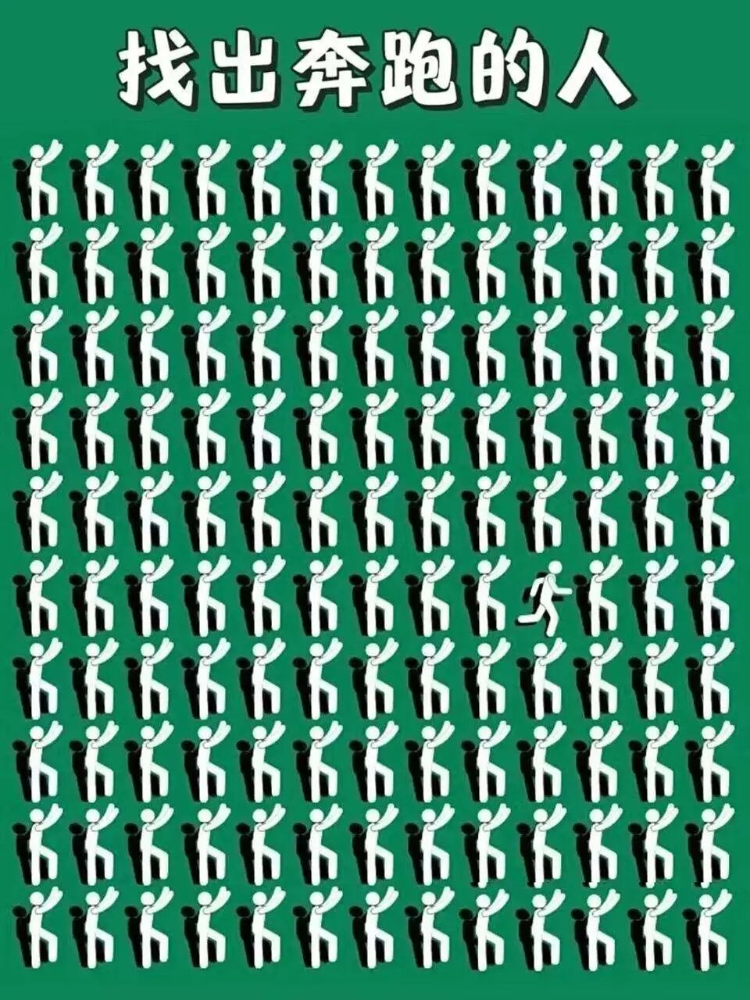

**Case 1.2: 磨损的眼镜**
- **Prompt**: "找到磨损的眼镜，并返回行列序号，比如：几行几列。"
- **难度**: ⭐⭐⭐
- **预期**: 识别细微特征（磨损）
- **结果**: ✅ 正确

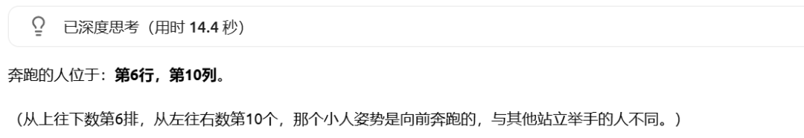

**Case 1.3: 不开心的冰块** ⭐高难度
- **Prompt**: "找到不开心的冰块，并返回行列序号，比如：几行几列。"
- **难度**: ⭐⭐⭐⭐
- **预期**: 理解情绪+物理状态（冰块不会开心）
- **结果**: ❌ **错误** - "这个确实有难度了"

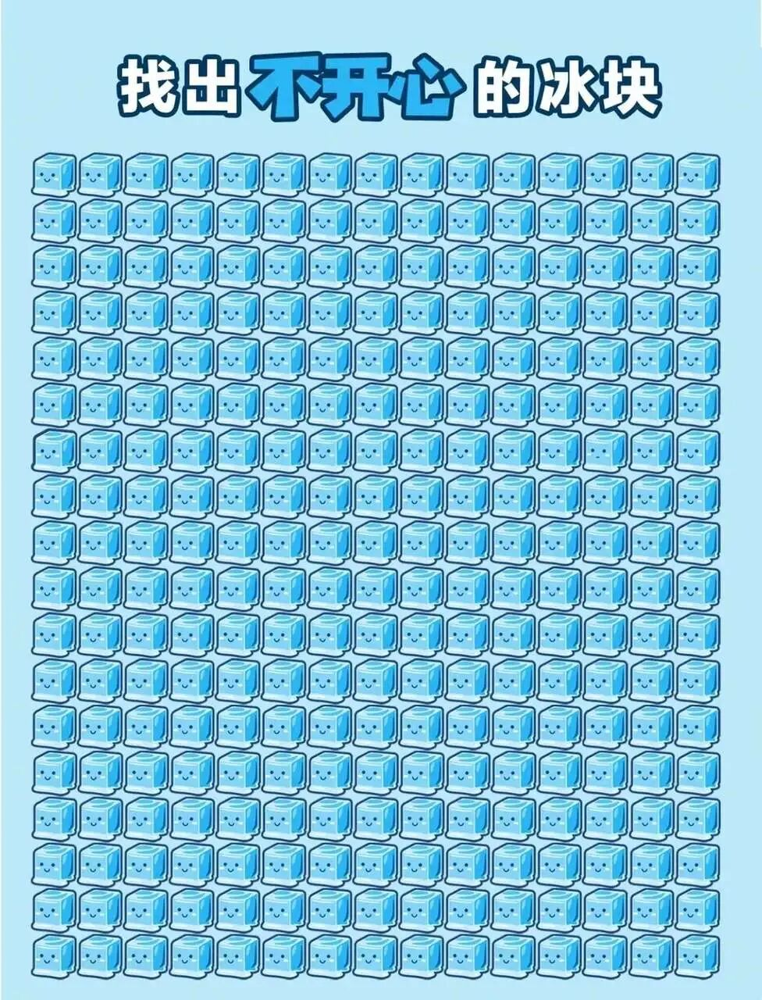

---

### 2. 图片复刻（Image Replication）

测试模型将视觉设计转化为代码的能力。

**Case 2.1: 网页复刻**
- **Prompt**: "根据图片内容，1：1复刻出网页"
- **难度**: ⭐⭐⭐
- **预期**: 准确还原布局、颜色、字体
- **结果**: ✅ 成功 - 比之前Qwen3-VL要好很多

**原图：**
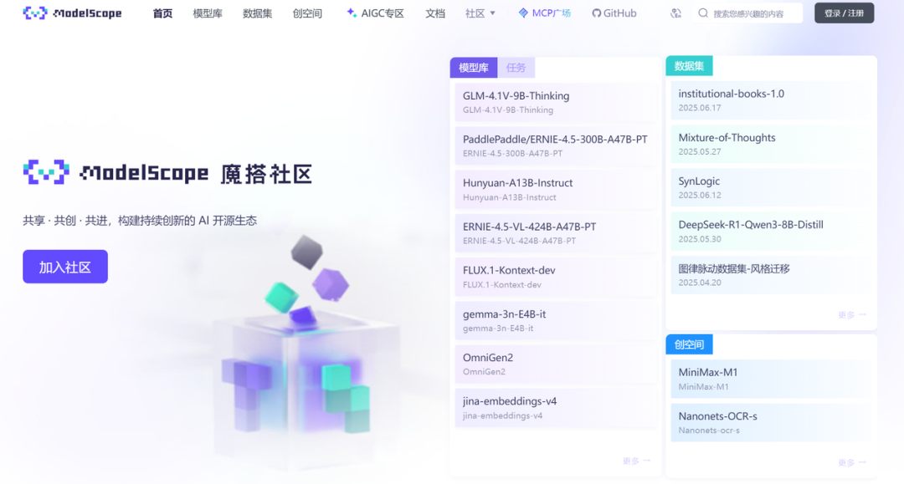

**复刻结果：**
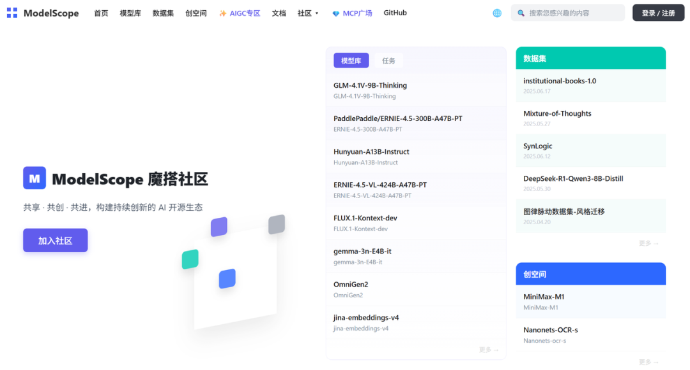

**Case 2.2: 迷宫复刻** ⭐高难度
- **Prompt**: "复刻一下迷宫的路线，要保持一模一样，画一个web页面出来"
- **难度**: ⭐⭐⭐⭐
- **预期**: 路径完全一致
- **结果**: ⚠️ **有瑕疵** - "迷宫路线不一致，但整体还不错，比Gemini3 Pro表现更好"

---

### 3. 图片排序（Image Sequencing）

测试模型的事件逻辑推理能力。

**Case 3.1-3.2: 事件顺序**
- **Prompt**: "根据图中显示的多个场景，将最有可能发生的事件按顺序排列。"
- **难度**: ⭐⭐⭐
- **预期**: 正确理解事件因果关系
- **结果**: ✅ 两个case都回答正确

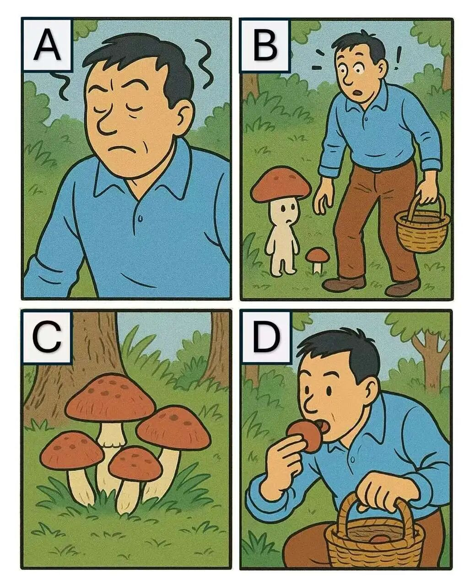

---

### 4. 空间逻辑（Spatial Logic）

测试模型的空间关系推理能力。

**Case 4.1: 鸡腿走迷宫** ⭐高难度
- **Prompt**: "告诉我鸡腿如何可以走出迷宫，告诉我"上下左右"的路线步骤"
- **难度**: ⭐⭐⭐⭐
- **预期**: 正确规划路径
- **结果**: ❌ **错误** - "不正确，没有走对，Gemini也不行，现在的VLM模型都不行"

**题目：**
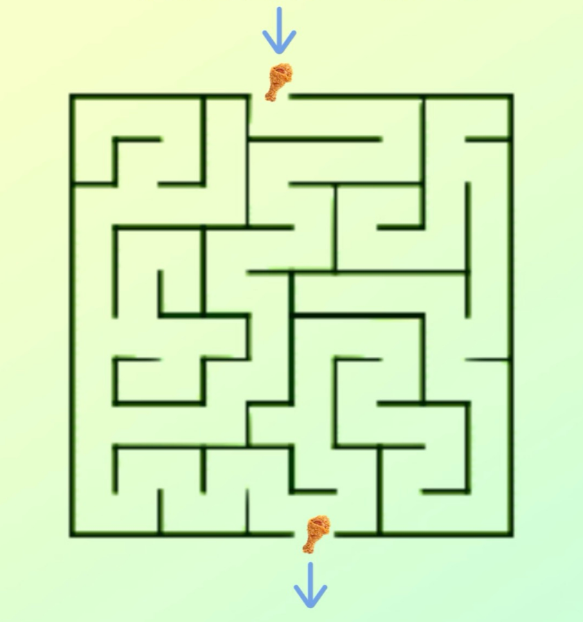

**模型回答：**
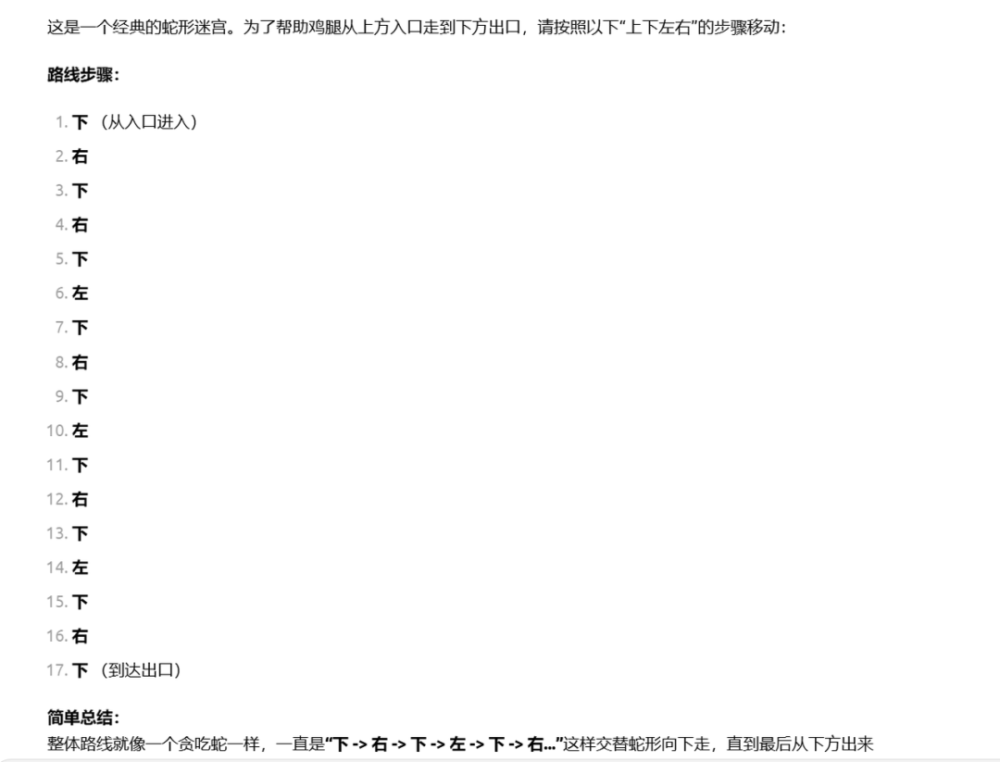

**Case 4.2: 六面体展开图**
- **Prompt**: "请回答，哪个选项的六面体展开结果是上面的展开图。"
- **难度**: ⭐⭐⭐⭐
- **预期**: 正确理解3D到2D的映射
- **结果**: ❌ **错误** - "应该选择D"

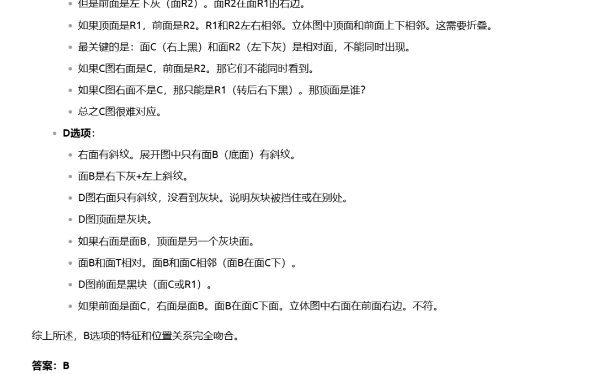

---

### 5. 空间变换（Spatial Transformation）

测试模型对视觉错觉、空间变换的理解。

**Case 5.1: 动物视角**
- **Prompt**: "告诉我，分别哪个动物看到了哪一面"
- **难度**: ⭐⭐⭐
- **预期**: 正确推断不同视角
- **结果**: ✅ 回答正确

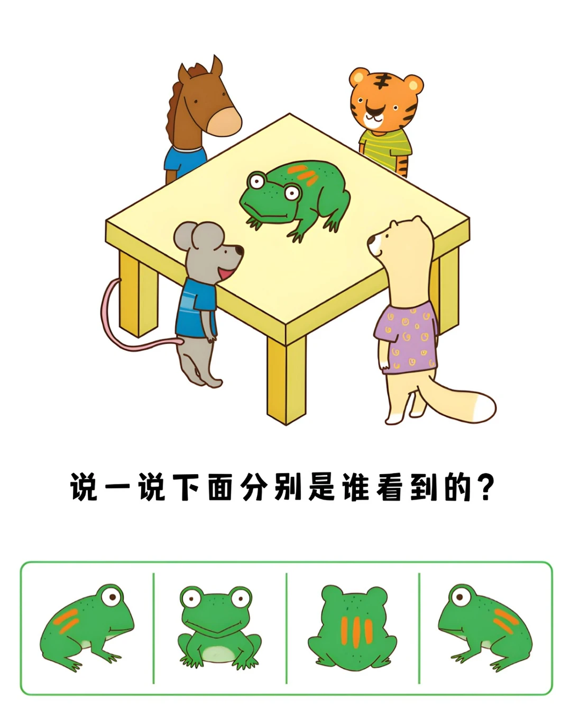

**Case 5.2: 橙色圆圈大小**
- **Prompt**: "两个橘色的圈，哪个更大？"
- **难度**: ⭐⭐⭐（视觉错觉）
- **预期**: 识别视觉错觉（实际一样大）
- **结果**: ✅ 回答正确

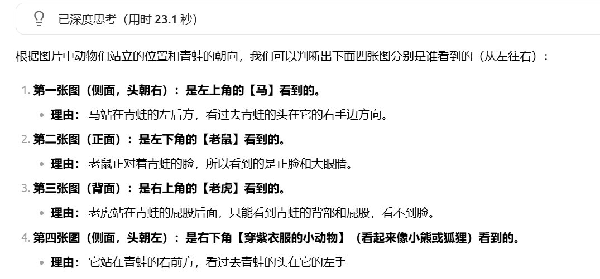

**Case 5.3: 泛化测试** ⭐高难度
- **Prompt**: [视觉错觉变体]
- **难度**: ⭐⭐⭐⭐
- **结果**: ❌ **错误** - "有点被答案，但其实在推理过程中，有反复确认，我觉得还是参数量不够大的问题"

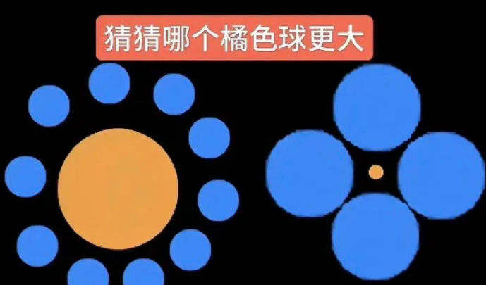

---

### 6. OCR识别（Text Recognition）

测试模型识别文字的能力，特别是复杂场景。

**Case 6.1: 小学生手写体**
- **Prompt**: "识别图片中的文字内容"
- **难度**: ⭐⭐⭐（手写体）
- **结果**: ✅ **正确** - "对于一些OCR模型来说，这个小学生手写体都有很大的难度"

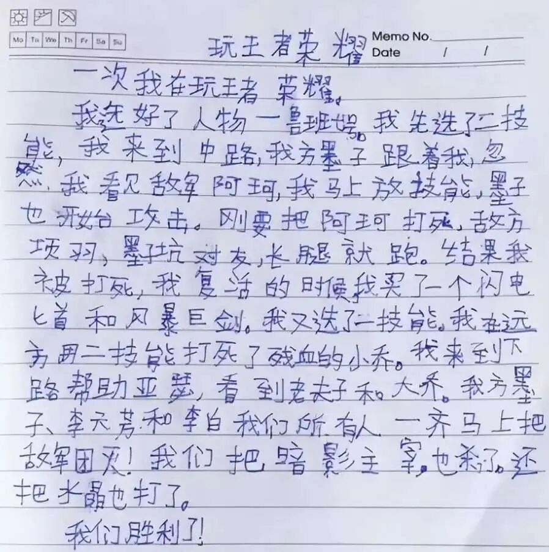

**Case 6.2: 极小字体**
- **Prompt**: "识别图中所有字母"
- **难度**: ⭐⭐⭐（极小字）
- **结果**: ✅ **正确** - "极小内容可以识别出来"

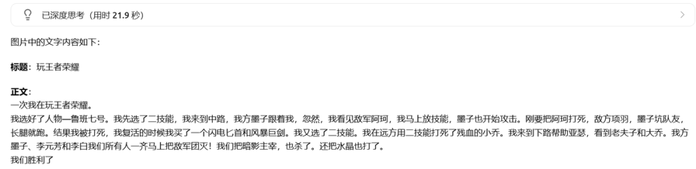

**Case 6.3: 究极OCR** ⭐高难度
- **Prompt**: "识别图片中的文字内容"
- **难度**: ⭐⭐⭐⭐⭐
- **结果**: ❌ **错误** - "究极OCR case还是识别不了，依旧长尾"

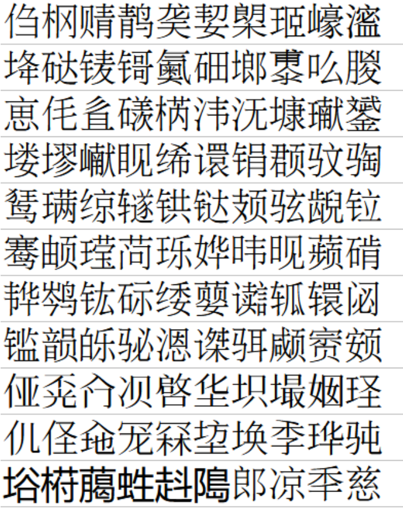

---

### 7. 表格识别（Table Recognition）

测试模型提取结构化数据的能力。

**Case 7.1-7.2: 表格提取**
- **Prompt**: [直接识别表格图片]
- **难度**: ⭐⭐
- **结果**: ✅ **依旧很强** - "因为会集成之前的训练数据，所以感觉之前好的部分，按道理都不会变差"

**原表格：**
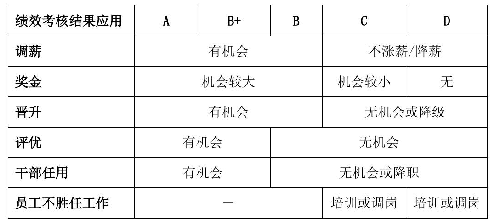

**识别结果：**
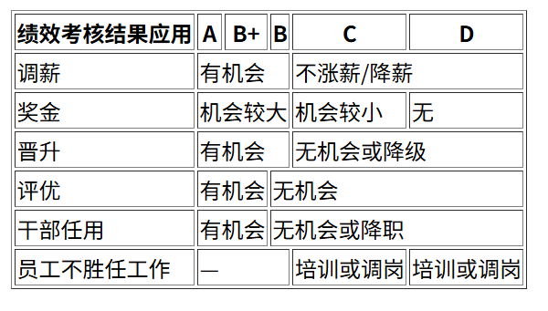

---

### 8. 成语与时钟（Cultural & Time Recognition）

测试文化理解和时间识别能力。

**Case 8.1: 看图猜成语**
- **Prompt**: "猜四字成语"
- **难度**: ⭐⭐⭐（文化理解）
- **结果**: ✅ **正确** - "之前是VL模型是回答不好的"（进步明显）

**Case 8.2-8.3: 时钟识别** ⭐经典难题
- **Prompt**: "告诉我，图片上的钟表几点了"
- **难度**: ⭐⭐⭐⭐
- **结果**: ❌ **错误** - "时钟依旧存在问题"（VLM经典难题）

**题目：**
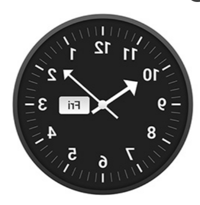

**模型回答（错误）：**
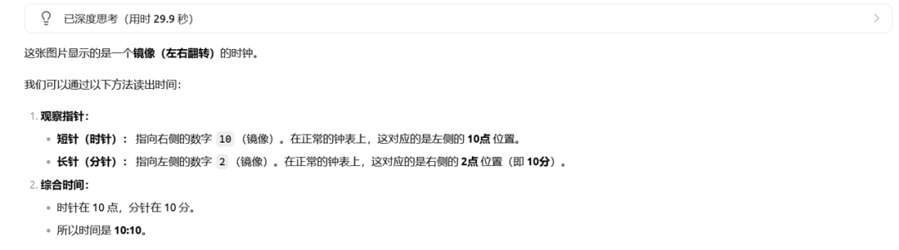

---

### 9. 文本推理（Textual Reasoning）

测试结合图片的逻辑推理能力。

**Case 9.1: 改分数**
- **Prompt**: "有一天，一个女孩参加数学考试只得了 38 分。她心里对父亲的惩罚充满恐惧，于是偷偷把分数改成了 88 分。她的父亲看到试卷后，怒发冲冠，狠狠地给了她一巴掌，怒吼道：'你这 8 怎么一半是绿的一半是红的，你以为我是傻子吗？'女孩被打后，委屈地哭了起来，什么也没说。过了一会儿，父亲突然崩溃了。请问这位父亲为什么过一会崩溃了？"
- **难度**: ⭐⭐⭐⭐（逻辑推理）
- **结果**: （测试中）

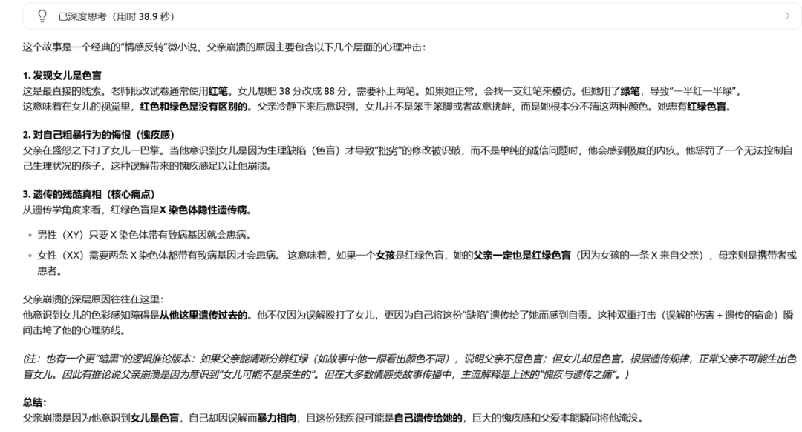

**Case 9.2: 洗车建议**
- **Prompt**: "我想去洗车店洗车，如果我家离洗车店只有50米，你建议我开车去还是走路去?"
- **难度**: ⭐⭐（常识推理）
- **结果**: （测试中）

**Case 9.3: 老鹰飞** ⭐高难度
- **Prompt**: "未来的某天，李同学在实验室制作超导磁悬浮材料时，意外发现实验室的老鼠在空中飞，分析发现，是因为老鼠不小心吃了磁悬浮材料。第二天，李同学又发现实验室的蛇也在空中飞，分析发现，是因为蛇吃了老鼠。第三天，李同学又发现实验室的老鹰也在空中飞，你认为其原因是"
- **难度**: ⭐⭐⭐⭐⭐（逻辑链推理）
- **结果**: ⚠️ **不稳定** - "老鹰问题，没有那么稳定"

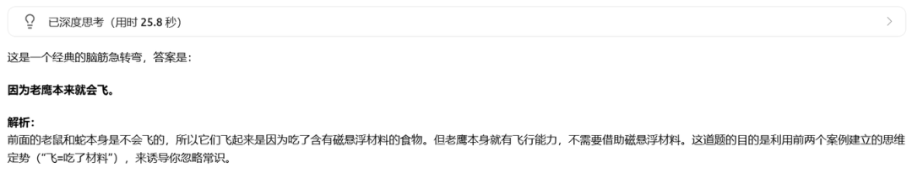

---

## 评测结果汇总

基于Qwen3.5-Plus的测试表现：

| 结果 | 数量 | Case编号 |
|------|------|----------|
| ✅ 正确/成功 | 13 | 1.1, 1.2, 2.1, 3.1-3.2, 5.1, 5.2, 6.1, 6.2, 7.1-7.2, 8.1 |
| ❌ 错误/失败 | 7 | 1.3, 4.1, 4.2, 5.3, 6.3, 8.2-8.3 |
| ⚠️ 有瑕疵/不稳定 | 2 | 2.2, 9.3 |
| 📝 未明确 | 2 | 9.1, 9.2 |

**总体成功率**: 约 65% (13/20)

### 失败案例（VLM经典难题）
1. **不开心的冰块** - 情绪+物理状态理解
2. **迷宫复刻** - 精确路径复刻
3. **鸡腿走迷宫** - 空间路径规划
4. **六面体展开图** - 3D到2D映射
5. **时钟识别** - VLM经典难题
6. **究极OCR** - 极限场景文字识别

---

## 使用指南

### 如何使用本评测集

1. **选择维度**: 根据要测试的能力选择对应维度
2. **准备图片**: 使用 `assets/` 目录下的对应图片
3. **执行测试**: 使用上述Prompt进行测试
4. **记录结果**: 对比"预期"和"实际结果"
5. **综合评价**: 参考"难度"和"评价"进行能力评估

### 评测标准建议

| 评级 | 正确率 | 说明 |
|------|--------|------|
| ⭐⭐⭐⭐⭐ | >90% | 优秀，可商用 |
| ⭐⭐⭐⭐ | 70-90% | 良好，大部分场景可用 |
| ⭐⭐⭐ | 50-70% | 一般，需要人工校验 |
| ⭐⭐ | <50% | 较差，仅作参考 |

### 难度分级说明

- ⭐⭐: 基础能力，主流模型应该都能完成
- ⭐⭐⭐: 进阶能力，部分模型可能失败
- ⭐⭐⭐⭐: 高难度，只有顶级模型能完成
- ⭐⭐⭐⭐⭐: 极限挑战，当前模型普遍失败

---

## 来源与致谢

**原始文章**: 《千问3.5开源，原生多模态架构冲击AGI，附一手全面实测！》  
**作者**: 刘聪NLP  
**整理**: 基于原文评测case整理，供模型评测参考使用

---

**更新记录**

| 日期 | 更新内容 |
|------|----------|
| 2026-02-16 | 初始版本，整理9维度25个case |
