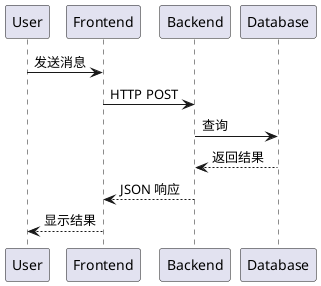
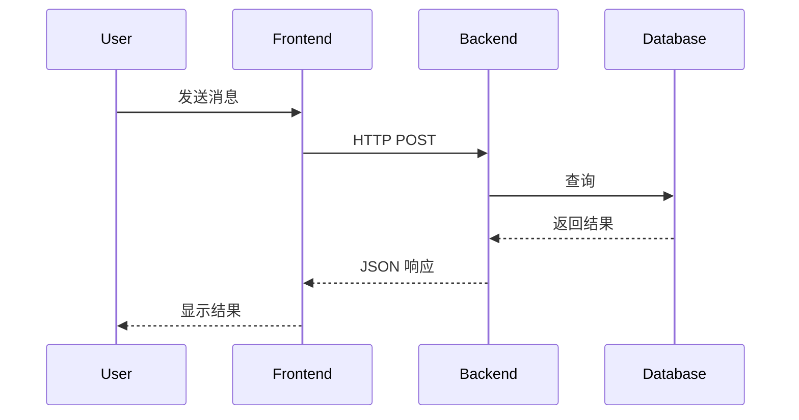
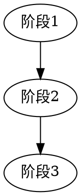
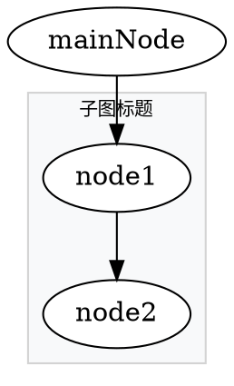
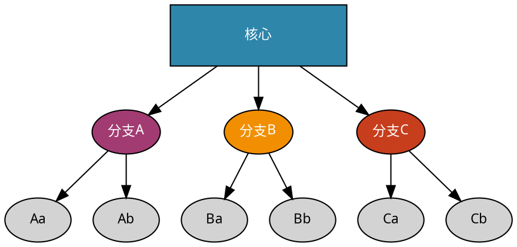
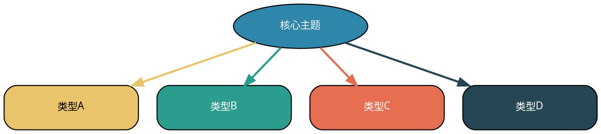

# Graphviz 最佳实践

**用途**: 创建高质量的 Graphviz 图表，避免常见显示问题  
**环境**: Windows + Graphviz 14.x

---

## 快速开始

### 安装检查

```powershell
# 检查是否安装
where dot
dot -V

# 生成 SVG
dot -Tsvg input.dot -o output.svg
```

### 基本命令

```powershell
# DOT 转 SVG
dot -Tsvg file.dot -o file.svg

# DOT 转 PNG（高 DPI）
dot -Tpng -Gdpi=300 file.dot -o file.png

# 调整布局引擎
# dot: 层次布局（默认，适合流程图）
# neato: 力导向布局（适合网络图）
# circo: 环形布局
# fdp: 力导向布局（另一种）
neato -Tsvg file.dot -o file.svg
```

---

## 常见问题与解决方案

###  不要用 Graphviz 画时序图

**原因**:
- Graphviz 的节点布局算法不适合时序图的 lifeline 结构
- 时序图通常很长，会导致 SVG 横向/纵向过度拉伸
- 文字变得极小，根本无法阅读
- 参与者（Participant）排列不直观

**替代方案**:
```markdown
<!--  推荐：使用 PlantUML -->


<!--  推荐：使用 Mermaid -->


<!--  推荐：使用文字描述步骤 -->
1. User 发送消息到 Frontend
2. Frontend 发送 HTTP POST 到 Backend
3. Backend 查询 Database
4. Database 返回结果
5. Backend 返回 JSON 响应
6. Frontend 显示结果给用户
```

### 问题1：SVG 显示不全（只有左上角）

**现象**: 生成的 SVG 在浏览器/Obsidian 中只显示部分内容，看起来像被裁剪了。

**原因**: Graphviz 默认生成的 viewBox 过大或有偏移。

**错误示例**:
```dot
//  错误：size 参数导致比例失调
graph [size="10,10"]

//  错误：节点过多、边过复杂
node [width=3, height=2]  // 节点太大
```

**正确做法**:
```dot
//  正确：不设置 size，让 Graphviz 自动计算
graph [margin=0]  // 只设置边距

//  正确：控制节点大小
node [width=1.2, height=0.5, fontsize=10]

//  正确：简化复杂图，拆分多个子图
```

### 问题2：SVG 尺寸过大（几MB）

**原因**: 节点过多、字体嵌入、复杂样式。

**优化方案**:
```dot
// 减少节点数量（控制在 20-30 个以内）
// 使用子图（cluster）组织复杂结构
// 简化节点样式

//  推荐的节点设置
node [shape=box, style="rounded,filled", fontsize=10, width=1.2, height=0.5]
```

### 问题3：中文显示乱码

**解决方案**:
```dot
graph {
    fontname = "Microsoft YaHei"  // Windows 常用中文字体
    node [fontname = "Microsoft YaHei"]
    edge [fontname = "Microsoft YaHei"]
}
```

---

## 最佳实践

### 1. 控制图表复杂度

| 指标 | 建议值 | 说明 |
|------|--------|------|
| 节点数 | 15-25 | 超过则考虑拆分或子图 |
| 边数 | 20-40 | 过多会使图混乱 |
| 节点大小 | width=1.2, height=0.5 | 不要过大 |
| 字体大小 | 9-12 | 太小了看不清 |

### 2. 颜色使用规范

```dot
// 主色调（用于重要节点）
#2E86AB  // 深蓝
#E63946  // 红色
#2A9D8F  // 青绿

// 辅助色（用于次要节点）
#A8DADC  // 浅蓝
#F1FAEE  // 浅绿
#FAD7A0  // 浅橙

// 背景色
#E8F4F8  // 极浅蓝
#FFF8E1  // 极浅黄
#FCE8E6  // 极浅红
```

### 3. 布局方向选择

#### 决策原则

| 布局方向 | 适用场景 | 示例 |
|---------|---------|------|
| **横向 (LR)** | 流程递进、阶段发展、时间线 | 修炼路径、演化阶段、步骤流程 |
| **纵向 (TB)** | 层级结构、上下关系、金字塔 | 组织架构、Y模型、层次图 |
| **纵向 (BT)** | 从基础到应用、底层到上层 | 技术架构、依赖关系 |

#### 横向布局 (rankdir=LR) - 适合"阶段"和"流程"

**什么时候用**：
- 展示**阶段递进**（70分→85分→95分）
- 展示**时间线**或**演化过程**
- 展示**步骤流程**（第一步→第二步→第三步）
- 展示**对比关系**（A vs B）

**示例**：
```dot
//  修炼路径 - 三阶段横向递进
digraph {
    rankdir=LR;
    70分 -> 85分 -> 95分;
}

//  演化阶段 - 时间线
A [label="初创期"] -> B [label="成长期"] -> C [label="成熟期"];
```

#### 纵向布局 (rankdir=TB) - 适合"层级"和"结构"

**什么时候用**：
- 展示**上下层级**（总部→部门→小组）
- 展示**Y模型类结构**（底部→中部→顶部）
- 展示**金字塔结构**（底层基础→上层应用）
- 展示**分类关系**（中心→分支）

**示例**：
```dot
//  Y模型 - 底部到顶部
digraph {
    rankdir=TB;
    真实问题 -> 认知模型 -> 理论;
    认知模型 -> 验证;
}

//  组织架构 - 从上到下
CEO -> 部门经理 -> 员工;
```

#### 常见错误



#### 快速决策表

| 你要表达的关系 | 推荐方向 | 理由 |
|--------------|---------|------|
| 阶段1 → 阶段2 → 阶段3 | **LR** | 像时间线一样自然阅读 |
| 底部 → 中部 → 顶部 | **TB** | 符合空间认知（下为基础）|
| 总部 → 分部 → 小组 | **TB** | 层级结构的传统表达 |
| 方案A vs 方案B | **LR** | 左右对比直观 |
| 输入 → 处理 → 输出 | **LR** | 流程的自然方向 |

### 4. 删除重复的 ASCII 图

**原则**: 一旦有了 Graphviz 生成的图片，就删除文档中原有的 ASCII 图，避免重复。

**原因**:
- ASCII 图在 Markdown 中占用大量空间，可读性差
- Graphviz 图片更清晰、专业
- 维护两份图会增加维护成本

**正确做法**:
```markdown
<!--  正确：只保留 Graphviz 图片 -->
### 1.1 整体架构图


<!-- 删除下面的 ASCII 图 -->
```

**错误做法**:
```markdown
<!--  错误：同时保留 Graphviz 和 ASCII -->
### 1.1 整体架构图


```
┌─────────────────────────────────────────┐
│              ASCII 图                   │
│    （这一大段应该删除）                  │
└─────────────────────────────────────────┘
```
```

### 5. 子图（Cluster）使用



---

## 推荐模板

### 模板1：流程图（四字诀类）


### 模板2：层次图（三环模型类）



### 模板3：对比图（四大追求类）



---

## 调试技巧

### 1. 查看 SVG 尺寸

```powershell
# 快速查看 SVG 尺寸
Get-Content file.svg -First 10 | Select-String "width=.*height="
```

### 2. 合理尺寸范围

| 用途 | 建议宽度 | 建议高度 |
|------|----------|----------|
| 笔记嵌入 | 500-800pt | 200-400pt |
| PPT 演示 | 800-1200pt | 400-600pt |
| 网页展示 | 600-1000pt | 300-500pt |

### 3. 如果还是显示不全

```dot
// 尝试添加缩放
group [transform="scale(0.8)"]

// 或者减少节点
// 或者改用 PNG 格式
dot -Tpng -Gdpi=150 file.dot -o file.png
```

---

## 完整示例

### 演化模型（A-F阶段）


---

## 相关工具

- **在线编辑器**: [Edotor](https://edotor.net/)
- **VS Code 插件**: Graphviz Preview
- **Obsidian 插件**: Graphviz

---

## 更新记录

| 日期 | 更新内容 |
|------|----------|
| 2026-02-03 | 创建，记录 SVG 尺寸问题和解决方案 |
| 2026-02-04 | 补充布局方向选择指南（横向 vs 纵向的决策原则） |

---

**核心原则**: 保持简洁，控制节点数，不强制设置 size，让 Graphviz 自动计算最佳布局。
