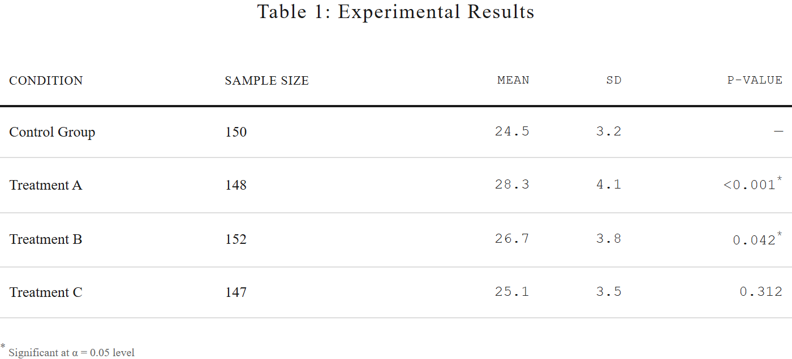
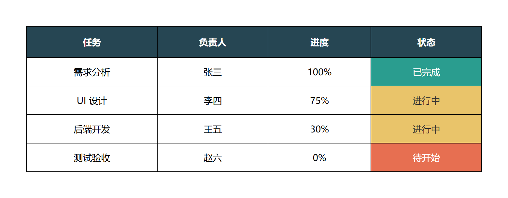
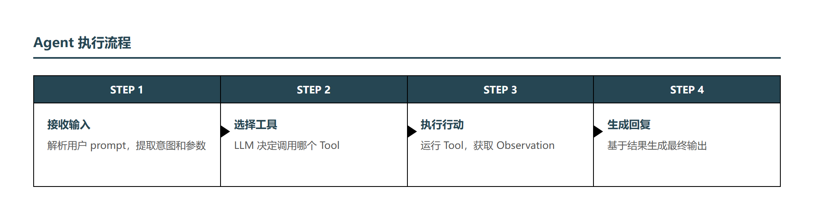
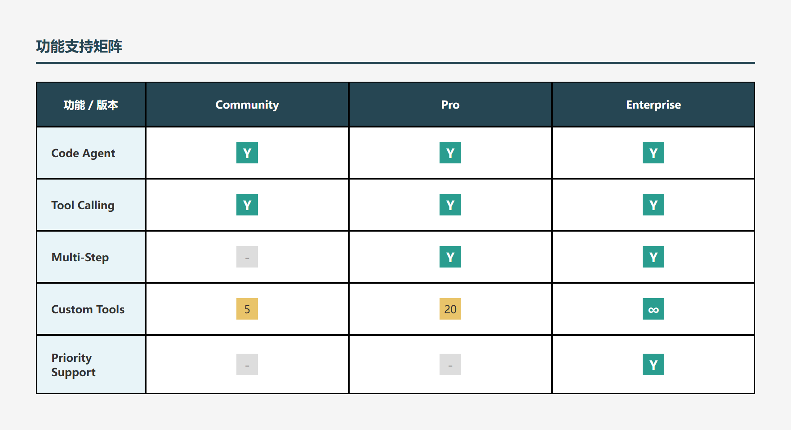

# HTML 表格模板库

**50 个风格化表格模板**，用于文章配图、技术文档、数据可视化。

>  **风格范围**: 学术极简、技术制图、编辑设计、现代风格  
>  **数量**: 50 个模板  
>  **格式**: HTML + PNG

---

## 快速开始

### 查看模板

```bash
cd .agents/skills/html-table-templates/previews
ls *.png
```

### 使用模板

1. 复制 `sources/XX-模板名.html`
2. 编辑内容（修改数据、文字）
3. 浏览器打开 → 截图 或 使用转换工具生成 PNG

---

## 模板分类

| 序号 | 分类 | 数量 | 风格特点 |
|------|------|------|----------|
| 01-37 | 基础笔记风格 | 37 | 学术、日式、自然、深色、终端、清单等 |
| 49-63 | 技术文档图表 | 8 | Graphviz风格、API文档、流程图、矩阵、树形、时间线 |
| 69-73 | 编辑设计风格 | 5 | 杂志、包豪斯、侘寂、蓝图、论文 |
| 74-79 | 现代风格 | 6 | 瑞士网格、粗野主义、北欧、工业、金融、终端 |

### 精选推荐

| 模板 | 场景 | 预览 |
|------|------|------|
| 01-学术极简 | 论文数据 |  |
| 52-Graphviz精准复刻 | 技术文档 |  |
| 59-横向步骤流程 | 教程步骤 |  |
| 60-卡片式功能矩阵 | 功能对比 |  |

---

## 设计规范

### 配色系统

| 用途 | 颜色 | 色值 |
|------|------|------|
| 主色/头部 | 深青绿 | `#264653` |
| 成功/启用 | 青绿 | `#2A9D8F` |
| 警告/进行中 | 暖黄 | `#E9C46A` |
| 错误/危险 | 橙红 | `#E76F51` |

### 禁用风格

-  蓝紫色调（`#667eea`, `#764ba2`）
-  左侧彩色边框
-  渐变色背景

### 核心原则

-  极简风格
-  科学感/专业感
-  清晰可读
-  功能性优先

---

## HTML 转 PNG

### 方法 1: 浏览器截图

直接打开 HTML 文件，使用浏览器截图工具。

### 方法 2: Puppeteer 脚本

```javascript
const puppeteer = require('puppeteer');

async function convert(htmlFile, pngFile) {
    const browser = await puppeteer.launch();
    const page = await browser.newPage();
    await page.goto('file://' + htmlFile);
    await page.screenshot({ path: pngFile, fullPage: true });
    await browser.close();
}
```

---

## 目录结构

```
html-table-templates/
├── SKILL.md              # 本文件
├── sources/              # 50 个 HTML 源文件
│   ├── 01-学术极简.html
│   ├── 52-Graphviz精准复刻.html
│   └── ...
└── previews/             # 50 个 PNG 预览图
    ├── 01-学术极简.png
    └── ...
```

---

## 来源

本 Skill 由项目 `2026-02-彩色表格生成方式探索` 归档整理而来。

---

## 关联文档

- [[obsidian-markdown-formatter]]: 笔记排版规范
- [[agent-collaboration/01-写作规范]]: 写作规范
