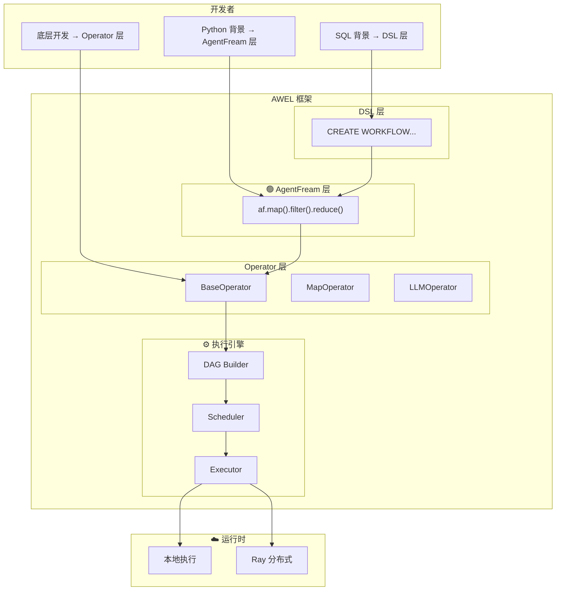
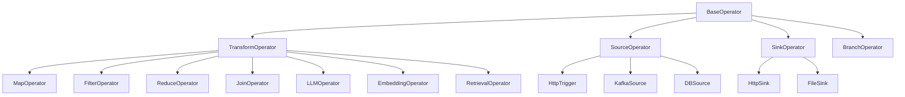
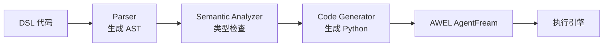
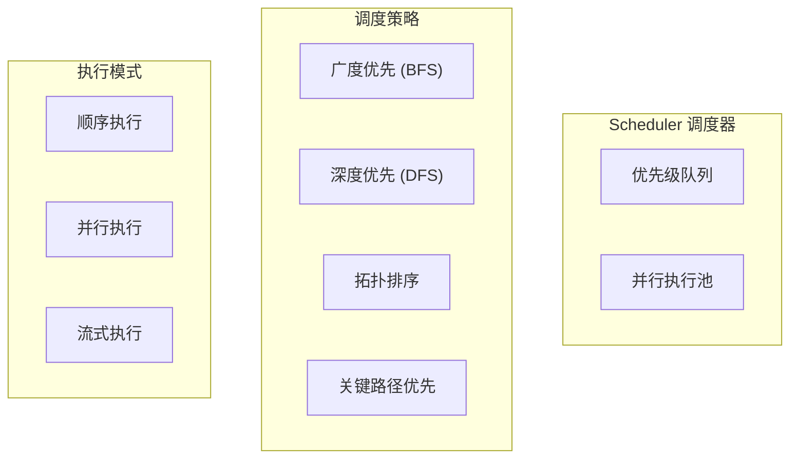

# 01-AWEL 整体架构与设计哲学

**分析对象**: DB-GPT AWEL (Agentic Workflow Expression Language)  
**版本**: v0.7.4  
**分析日期**: 2026-02-08

---

## TL;DR

AWEL 是 DB-GPT 自研的**三层渐进式 Agent 工作流框架**：
- **Operator 层**: 基础计算原子 (Embedding、LLM、Retrieval)
- **AgentFream 层**: 链式算子组合 (函数式编程风格)
- **DSL 层**: 声明式工作流定义 (SQL-like 语法)

核心设计理念：**让大模型应用开发从"编程"变为"编排"**。

---

## 1. 为什么自研 AWEL?

### 1.1 现有框架的痛点

| 框架 | 痛点 | AWEL 解决方式 |
|------|------|---------------|
| **LangChain** | 链式过于简单，难以表达复杂 DAG | DAG 原生支持 |
| **AutoGen** | 对话式难以控制执行流程 | 声明式 DSL |
| **smolagents** | 单 Agent 为主，扩展性有限 | 多层抽象 |
| **Prefect/Airflow** | 非 LLM 专用，集成复杂 | LLM 原生算子 |

### 1.2 DB-GPT 的需求

```
数据应用特点:
├── 多数据源集成 (DB、Excel、Warehouse)
├── 复杂数据处理流程
├── RAG + Text2SQL + 数据分析混合
├── 企业级可观测性要求
└── 需要灵活扩展

→ 需要: 声明式 + 可编排 + 可观测 + 可扩展
→ 结论: 自研 AWEL
```

---

## 2. 三层架构详解

### 2.1 架构全景图



### 2.2 三层职责分离

| 层级 | 职责 | 用户 | 类比 |
|------|------|------|------|
| **DSL** | 声明式定义工作流 | 业务人员/数据分析师 | SQL |
| **AgentFream** | 链式组合算子 | Python 开发者 | Pandas/Spark |
| **Operator** | 实现基础算子 | 框架开发者 | 数据库算子 |

---

## 3. Operator 层: 计算原子

### 3.1 核心抽象

```python
# 伪代码：BaseOperator 设计
class BaseOperator(Generic[T, R]):
    """
    T: 输入类型
    R: 输出类型
    """
    
    def __init__(self):
        self._upstream: List[BaseOperator] = []
        self._downstream: List[BaseOperator] = []
        self._config: OperatorConfig = OperatorConfig()
    
    @abstractmethod
    async def execute(self, input_data: T) -> R:
        """执行算子逻辑"""
        pass
    
    def connect(self, downstream: BaseOperator) -> BaseOperator:
        """连接下游算子"""
        self._downstream.append(downstream)
        downstream._upstream.append(self)
        return downstream  # 支持链式调用
    
    # 重载 >> 操作符
    def __rshift__(self, other: BaseOperator) -> BaseOperator:
        return self.connect(other)
```

### 3.2 算子类型体系



### 3.3 流式算子支持

```python
class StreamOperator(BaseOperator[T, AsyncIterator[R]]):
    """流式算子基类"""
    
    async def execute_stream(self, input_data: T) -> AsyncIterator[R]:
        """流式执行，产出中间结果"""
        pass

# 示例：LLM 流式生成
class LLMStreamOperator(StreamOperator[str, str]):
    async def execute_stream(self, prompt: str) -> AsyncIterator[str]:
        async for chunk in llm.generate_stream(prompt):
            yield chunk.content
```

---

## 4. AgentFream 层: 链式编排

### 4.1 设计理念

借鉴 **Pandas/Spark 的链式 API**，让数据流处理直观可读。

```python
# Pandas 风格
(df
 .filter(df['age'] > 18)
 .groupby('city')
 .agg({'salary': 'mean'})
 .sort_values('salary', ascending=False))

# AWEL AgentFream 风格
(af
 .source(HttpSource("/api/data"))
 .filter(lambda x: x['score'] > 0.8)
 .llm(model="gpt-4", prompt_template=" summarize: {text}")
 .map(extract_entities)
 .reduce(merge_results))
```

### 4.2 AgentFream 实现机制

```python
class AgentFream:
    """AgentFream: 链式工作流构建器"""
    
    def __init__(self, source: SourceOperator):
        self._head: SourceOperator = source
        self._tail: BaseOperator = source
        self._dag: DAG = DAG()
        self._dag.add_node(source)
    
    def map(self, func: Callable[[T], R]) -> AgentFream:
        """映射操作"""
        op = MapOperator(func)
        self._add_node(op)
        return self
    
    def filter(self, predicate: Callable[[T], bool]) -> AgentFream:
        """过滤操作"""
        op = FilterOperator(predicate)
        self._add_node(op)
        return self
    
    def llm(self, model: str, prompt_template: str, **kwargs) -> AgentFream:
        """LLM 调用"""
        op = LLMOperator(
            model=model,
            prompt_template=prompt_template,
            **kwargs
        )
        self._add_node(op)
        return self
    
    def reduce(self, reducer: Callable[[T, T], T]) -> AgentFream:
        """归约操作"""
        op = ReduceOperator(reducer)
        self._add_node(op)
        return self
    
    def _add_node(self, op: BaseOperator):
        """内部：添加节点到 DAG"""
        self._tail.connect(op)
        self._dag.add_node(op)
        self._dag.add_edge(self._tail, op)
        self._tail = op
    
    def execute(self, input_data: Any = None) -> Any:
        """执行工作流"""
        executor = DAGExecutor(self._dag)
        return executor.run(input_data)
    
    def write_to_sink(self, sink: SinkOperator) -> None:
        """设置输出"""
        self._add_node(sink)
```

### 4.3 类型推导

```python
# AWEL 支持类型推导，在链式调用中保持类型安全
af: AgentFream[str, Document] = (
    AgentFream(HttpSource())        # Input: HTTP Request
    .map(parse_request)             # str -> Dict
    .filter(validate_input)         # Dict -> Dict (filtered)
    .llm(model="gpt-4")             # Dict -> str (LLM output)
    .map(parse_json)                # str -> Document
)
# 最终输出类型: Document
```

---

## 5. DSL 层: 声明式编程

### 5.1 设计目标

让 **非程序员** 也能定义 LLM 工作流。

### 5.2 DSL 语法设计

```sql
-- 工作流定义
CREATE WORKFLOW <name> AS
BEGIN
    -- 数据源
    DATA <var> = RECEIVE REQUEST FROM <source>;
    
    -- 数据转换
    DATA <var> = TRANSFORM <input> USING <operator>(<params>);
    
    -- 数据检索
    DATA <var> = RETRIEVE DATA FROM <store>(<params>);
    
    -- LLM 调用
    DATA <var> = APPLY LLM <model> WITH DATA <input> AND PARAMETERS (<params>);
    
    -- 分支控制
    IF <condition> THEN
        DATA <var> = ...;
    ELSE
        DATA <var> = ...;
    END IF;
    
    -- 错误处理
    ON ERROR <action>;  -- RETRY n TIMES / FAIL / LOG
    
    -- 响应
    RESPOND TO <source> WITH <data>;
END;
```

### 5.3 DSL 执行流程



### 5.4 DSL 示例: RAG 工作流

```sql
CREATE WORKFLOW RAG_CHAT AS
BEGIN
    -- 1. 接收用户请求
    DATA user_request = RECEIVE REQUEST FROM 
        http_source("/api/chat", method = "POST");
    
    -- 2. 提取查询内容
    DATA query = EXTRACT query FROM user_request;
    
    -- 3. 向量化
    DATA query_embedding = TRANSFORM query 
        USING embedding(model = "text2vec");
    
    -- 4. 检索相关文档
    DATA retrieved_docs = RETRIEVE DATA
        FROM vstore(
            database = "chromadb",
            collection = "docs",
            key = query_embedding,
            top_k = 5
        )
        ON ERROR RETRY 3 TIMES;
    
    -- 5. 构建提示词
    DATA prompt = CONSTRUCT PROMPT 
        TEMPLATE "rag_template" 
        WITH query AND retrieved_docs;
    
    -- 6. 调用 LLM
    DATA response = APPLY LLM "gpt-4"
        WITH DATA prompt
        AND PARAMETERS (
            temperature = 0.7,
            max_tokens = 2000
        )
        ON ERROR FAIL;
    
    -- 7. 返回响应
    RESPOND TO http_source WITH response
        ON ERROR LOG "Failed to respond";
END;
```

---

## 6. 执行引擎: DAG 调度

### 6.1 DAG 构建

```python
class DAG:
    """有向无环图"""
    
    def __init__(self, name: str):
        self.name = name
        self.nodes: Set[BaseOperator] = set()
        self.edges: Dict[BaseOperator, Set[BaseOperator]] = defaultdict(set)
        self.in_degree: Dict[BaseOperator, int] = defaultdict(int)
    
    def add_node(self, op: BaseOperator) -> None:
        self.nodes.add(op)
    
    def add_edge(self, from_op: BaseOperator, to_op: BaseOperator) -> None:
        self.edges[from_op].add(to_op)
        self.in_degree[to_op] += 1
    
    def topological_sort(self) -> List[BaseOperator]:
        """拓扑排序，确定执行顺序"""
        queue = deque([n for n in self.nodes if self.in_degree[n] == 0])
        result = []
        
        while queue:
            node = queue.popleft()
            result.append(node)
            
            for neighbor in self.edges[node]:
                self.in_degree[neighbor] -= 1
                if self.in_degree[neighbor] == 0:
                    queue.append(neighbor)
        
        return result
```

### 6.2 调度策略



---

## 7. 设计哲学总结

### 7.1 核心原则

| 原则 | 说明 | 体现 |
|------|------|------|
| **渐进式抽象** | 三层 API 满足不同用户需求 | DSL/AF/Operator |
| **数据流为中心** | 一切皆数据流 | DAG 执行模型 |
| **声明式优先** | 描述"做什么"而非"怎么做" | DSL 层 |
| **可观测性** | 每个节点可追溯 | DAG 可视化 |
| **可扩展性** | 自定义算子即插即用 | Operator 基类 |

### 7.2 与 AIASys 的架构差异

```
AWEL (DB-GPT):
静态 DAG 编排 → 声明式定义 → 批量数据流 → 企业级工作流
     ↓              ↓             ↓              ↓
   预定义图      SQL-like      数据处理       复杂ETL+LLM

AIASys:
动态 Agent 协作 → 命令式编程 → 交互式对话 → 轻量快速响应
     ↓              ↓             ↓              ↓
   Host-Worker    Python类      实时流式       单轮分析
```

---

## 8. 下一步分析

- [[02-Operator层深度分析]] - 深入算子实现细节
- [[03-AgentFream层实现机制]] - 链式 API 设计模式
- [[04-DSL层与解析器]] - 语法解析和代码生成

---

*分析完成于 2026-02-08*
