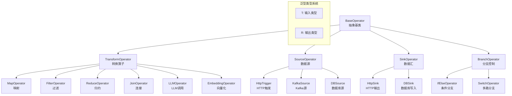

# 02-Operator 层深度分析

**分析对象**: AWEL Operator 层实现  
**分析日期**: 2026-02-08

---

## TL;DR

Operator 层是 AWEL 的**计算原子层**，采用**强类型泛型设计** (`BaseOperator[T, R]`)，支持**异步执行**、**流式处理**和**分布式扩展**。核心算子包括：Transform、Source、Sink、Branch 四大类。

---

## 1. Operator 核心抽象

### 1.1 类层次结构



### 1.2 BaseOperator 设计

```python
from abc import ABC, abstractmethod
from typing import Generic, TypeVar, List, Dict, Any, Optional, AsyncIterator
import asyncio
from dataclasses import dataclass
from enum import Enum

T = TypeVar('T')  # 输入类型
R = TypeVar('R')  # 输出类型

class ExecutionMode(Enum):
    """执行模式"""
    SYNC = "sync"           # 同步执行
    ASYNC = "async"         # 异步执行
    STREAM = "stream"       # 流式执行
    BATCH = "batch"         # 批量执行

@dataclass
class OperatorConfig:
    """算子配置"""
    name: Optional[str] = None
    description: Optional[str] = None
    execution_mode: ExecutionMode = ExecutionMode.ASYNC
    retry_count: int = 3
    timeout: float = 30.0
    parallel_degree: int = 1
    cache_enabled: bool = False

class BaseOperator(Generic[T, R], ABC):
    """
    AWEL Operator 抽象基类
    
    类型参数:
        T: 输入数据类型
        R: 输出数据类型
    """
    
    def __init__(self, config: Optional[OperatorConfig] = None):
        self.config = config or OperatorConfig()
        self._upstream: List[BaseOperator] = []
        self._downstream: List[BaseOperator] = []
        self._metadata: Dict[str, Any] = {}
        self._state: OperatorState = OperatorState.CREATED
        
    # ========== 核心抽象方法 ==========
    
    @abstractmethod
    async def execute(self, input_data: T) -> R:
        """
        执行算子核心逻辑
        
        Args:
            input_data: 输入数据，类型为 T
            
        Returns:
            输出数据，类型为 R
        """
        pass
    
    # ========== 流式支持 ==========
    
    async def execute_stream(self, input_data: T) -> AsyncIterator[R]:
        """
        流式执行，产出中间结果
        
        默认实现：将 execute 结果包装为单元素流
        子类可重写以实现真正的流式处理
        """
        result = await self.execute(input_data)
        yield result
    
    # ========== 连接管理 ==========
    
    def connect(self, downstream: BaseOperator) -> BaseOperator:
        """
        连接下游算子
        
        Returns:
            下游算子，支持链式调用
        """
        self._downstream.append(downstream)
        downstream._upstream.append(self)
        return downstream
    
    def __rshift__(self, other: BaseOperator) -> BaseOperator:
        """
        重载 >> 操作符，用于链式连接
        
        Example:
            op1 >> op2 >> op3
        """
        return self.connect(other)
    
    # ========== 生命周期管理 ==========
    
    async def setup(self) -> None:
        """初始化资源"""
        self._state = OperatorState.READY
        
    async def teardown(self) -> None:
        """释放资源"""
        self._state = OperatorState.CLOSED
        
    async def __aenter__(self):
        await self.setup()
        return self
        
    async def __aexit__(self, exc_type, exc_val, exc_tb):
        await self.teardown()

class OperatorState(Enum):
    """算子生命周期状态"""
    CREATED = "created"
    READY = "ready"
    RUNNING = "running"
    COMPLETED = "completed"
    FAILED = "failed"
    CLOSED = "closed"
```

---

## 2. TransformOperator: 转换算子

### 2.1 MapOperator

```python
class MapOperator(TransformOperator[T, R]):
    """
    映射算子：对输入数据的每个元素应用转换函数
    
    类似 Python 的 map() 函数
    """
    
    def __init__(
        self, 
        transform_fn: Callable[[T], R],
        config: Optional[OperatorConfig] = None
    ):
        super().__init__(config)
        self._transform_fn = transform_fn
    
    async def execute(self, input_data: T) -> R:
        """执行映射转换"""
        # 支持异步转换函数
        if asyncio.iscoroutinefunction(self._transform_fn):
            return await self._transform_fn(input_data)
        else:
            # 在线程池中执行同步函数
            loop = asyncio.get_event_loop()
            return await loop.run_in_executor(
                None, self._transform_fn, input_data
            )
    
    async def execute_stream(self, input_data: List[T]) -> AsyncIterator[R]:
        """流式执行：逐个处理列表元素"""
        for item in input_data:
            yield await self.execute(item)
```

### 2.2 FilterOperator

```python
class FilterOperator(TransformOperator[T, T]):
    """
    过滤算子：根据条件筛选数据
    
    注意：输入输出类型相同，只是数量可能减少
    """
    
    def __init__(
        self,
        predicate: Callable[[T], bool],
        config: Optional[OperatorConfig] = None
    ):
        super().__init__(config)
        self._predicate = predicate
    
    async def execute(self, input_data: List[T]) -> List[T]:
        """过滤列表数据"""
        results = []
        for item in input_data:
            # 支持异步条件函数
            if asyncio.iscoroutinefunction(self._predicate):
                keep = await self._predicate(item)
            else:
                keep = self._predicate(item)
            
            if keep:
                results.append(item)
        return results
```

### 2.3 ReduceOperator

```python
class ReduceOperator(TransformOperator[List[T], T]):
    """
    归约算子：将多个元素合并为单个结果
    
    类似 functools.reduce()
    """
    
    def __init__(
        self,
        reducer: Callable[[T, T], T],
        initial: Optional[T] = None,
        config: Optional[OperatorConfig] = None
    ):
        super().__init__(config)
        self._reducer = reducer
        self._initial = initial
    
    async def execute(self, input_data: List[T]) -> T:
        """执行归约操作"""
        from functools import reduce
        
        if not input_data:
            if self._initial is not None:
                return self._initial
            raise ValueError("Cannot reduce empty list without initial value")
        
        # 对于异步 reducer，需要逐个处理
        if asyncio.iscoroutinefunction(self._reducer):
            result = self._initial if self._initial is not None else input_data[0]
            start_idx = 1 if self._initial is None else 0
            
            for item in input_data[start_idx:]:
                result = await self._reducer(result, item)
            return result
        else:
            # 同步 reducer
            if self._initial is not None:
                return reduce(self._reducer, input_data, self._initial)
            else:
                return reduce(self._reducer, input_data)
```

### 2.4 JoinOperator

```python
class JoinOperator(TransformOperator[Tuple[List[T1], List[T2]], List[R]]):
    """
    连接算子：合并两个数据流
    
    类似 SQL 的 JOIN 操作
    """
    
    def __init__(
        self,
        left_key: Callable[[T1], Any],
        right_key: Callable[[T2], Any],
        join_type: str = "inner",  # inner, left, right, outer
        config: Optional[OperatorConfig] = None
    ):
        super().__init__(config)
        self._left_key = left_key
        self._right_key = right_key
        self._join_type = join_type
    
    async def execute(
        self, 
        input_data: Tuple[List[T1], List[T2]]
    ) -> List[Dict[str, Any]]:
        """执行连接操作"""
        left_data, right_data = input_data
        
        # 构建右表索引
        right_index: Dict[Any, List[T2]] = defaultdict(list)
        for item in right_data:
            key = self._right_key(item)
            right_index[key].append(item)
        
        # 执行连接
        results = []
        matched_right = set()
        
        for left_item in left_data:
            left_key_val = self._left_key(left_item)
            right_matches = right_index.get(left_key_val, [])
            
            if right_matches:
                for right_item in right_matches:
                    results.append({
                        "left": left_item,
                        "right": right_item,
                        "join_key": left_key_val
                    })
                    matched_right.add(id(right_item))
            elif self._join_type in ("left", "outer"):
                results.append({
                    "left": left_item,
                    "right": None,
                    "join_key": left_key_val
                })
        
        # 处理右表未匹配的记录
        if self._join_type in ("right", "outer"):
            for right_item in right_data:
                if id(right_item) not in matched_right:
                    results.append({
                        "left": None,
                        "right": right_item,
                        "join_key": self._right_key(right_item)
                    })
        
        return results
```

---

## 3. LLM 专用算子

### 3.1 LLMOperator

```python
class LLMOperator(TransformOperator[str, str]):
    """
    LLM 调用算子
    
    封装大语言模型调用，支持同步/流式/批量模式
    """
    
    def __init__(
        self,
        model: str,
        prompt_template: Optional[str] = None,
        temperature: float = 0.7,
        max_tokens: Optional[int] = None,
        streaming: bool = False,
        config: Optional[OperatorConfig] = None
    ):
        super().__init__(config)
        self._model = model
        self._prompt_template = prompt_template
        self._temperature = temperature
        self._max_tokens = max_tokens
        self._streaming = streaming
        self._llm_client = None
    
    async def setup(self) -> None:
        """初始化 LLM 客户端"""
        await super().setup()
        self._llm_client = await create_llm_client(self._model)
    
    async def execute(self, input_data: str) -> str:
        """执行 LLM 调用"""
        # 应用提示词模板
        if self._prompt_template:
            prompt = self._prompt_template.format(input=input_data)
        else:
            prompt = input_data
        
        # 调用 LLM
        response = await self._llm_client.generate(
            prompt=prompt,
            temperature=self._temperature,
            max_tokens=self._max_tokens
        )
        
        return response.content
    
    async def execute_stream(self, input_data: str) -> AsyncIterator[str]:
        """流式执行 LLM 调用"""
        if self._prompt_template:
            prompt = self._prompt_template.format(input=input_data)
        else:
            prompt = input_data
        
        async for chunk in self._llm_client.generate_stream(
            prompt=prompt,
            temperature=self._temperature,
            max_tokens=self._max_tokens
        ):
            yield chunk.content
```

### 3.2 EmbeddingOperator

```python
class EmbeddingOperator(TransformOperator[str, List[float]]):
    """
    文本向量化算子
    
    将文本转换为向量表示
    """
    
    def __init__(
        self,
        model: str = "text2vec",
        batch_size: int = 32,
        config: Optional[OperatorConfig] = None
    ):
        super().__init__(config)
        self._model = model
        self._batch_size = batch_size
        self._embedding_client = None
    
    async def execute(self, input_data: str) -> List[float]:
        """单文本向量化"""
        result = await self._embedding_client.embed(
            texts=[input_data],
            model=self._model
        )
        return result[0]
    
    async def execute_batch(self, input_data: List[str]) -> List[List[float]]:
        """批量向量化"""
        results = []
        for i in range(0, len(input_data), self._batch_size):
            batch = input_data[i:i + self._batch_size]
            embeddings = await self._embedding_client.embed(
                texts=batch,
                model=self._model
            )
            results.extend(embeddings)
        return results
```

### 3.3 RetrievalOperator

```python
class RetrievalOperator(TransformOperator[List[float], List[Document]]):
    """
    向量检索算子
    
    从向量数据库检索相关文档
    """
    
    def __init__(
        self,
        vector_store: str,
        collection: str,
        top_k: int = 5,
        score_threshold: Optional[float] = None,
        config: Optional[OperatorConfig] = None
    ):
        super().__init__(config)
        self._vector_store = vector_store
        self._collection = collection
        self._top_k = top_k
        self._score_threshold = score_threshold
        self._store_client = None
    
    async def execute(self, input_data: List[float]) -> List[Document]:
        """执行向量检索"""
        results = await self._store_client.similarity_search(
            embedding=input_data,
            collection=self._collection,
            top_k=self._top_k
        )
        
        # 应用分数阈值过滤
        if self._score_threshold is not None:
            results = [
                r for r in results 
                if r.score >= self._score_threshold
            ]
        
        return results
```

---

## 4. Source/Sink 算子

### 4.1 HttpTrigger (Source)

```python
class HttpTrigger(SourceOperator[Request]):
    """
    HTTP 触发器
    
    作为工作流的入口点，接收 HTTP 请求
    """
    
    def __init__(
        self,
        path: str,
        methods: List[str] = None,
        request_body: Optional[Type] = None,
        config: Optional[OperatorConfig] = None
    ):
        super().__init__(config)
        self._path = path
        self._methods = methods or ["GET"]
        self._request_body = request_body
    
    async def execute(self, input_data: None) -> Request:
        """
        HTTP Trigger 的执行逻辑由 Web 框架调用
        这里只是接口定义
        """
        raise NotImplementedError(
            "HttpTrigger should be invoked by web framework"
        )
    
    def get_route_config(self) -> Dict[str, Any]:
        """获取路由配置，用于注册到 Web 框架"""
        return {
            "path": self._path,
            "methods": self._methods,
            "handler": self._handle_request
        }
    
    async def _handle_request(self, request: Request) -> Response:
        """实际 HTTP 处理函数"""
        # 解析请求体
        if self._request_body:
            data = self._request_body.parse_obj(await request.json())
        else:
            data = await request.json()
        
        # 触发下游算子
        results = []
        for downstream in self._downstream:
            result = await downstream.execute(data)
            results.append(result)
        
        return Response(json=results[0] if results else {})
```

### 4.2 HttpSink

```python
class HttpSink(SinkOperator[T]):
    """
    HTTP 输出算子
    
    将结果发送到 HTTP 端点
    """
    
    def __init__(
        self,
        url: str,
        method: str = "POST",
        headers: Optional[Dict[str, str]] = None,
        config: Optional[OperatorConfig] = None
    ):
        super().__init__(config)
        self._url = url
        self._method = method
        self._headers = headers or {}
        self._http_client = None
    
    async def setup(self) -> None:
        await super().setup()
        self._http_client = aiohttp.ClientSession()
    
    async def teardown(self) -> None:
        if self._http_client:
            await self._http_client.close()
        await super().teardown()
    
    async def execute(self, input_data: T) -> None:
        """发送 HTTP 请求"""
        async with self._http_client.request(
            method=self._method,
            url=self._url,
            headers=self._headers,
            json=input_data
        ) as response:
            response.raise_for_status()
            return await response.json()
```

---

## 5. 错误处理与重试

### 5.1 重试装饰器

```python
from functools import wraps
import random

class RetryPolicy:
    """重试策略"""
    
    def __init__(
        self,
        max_retries: int = 3,
        base_delay: float = 1.0,
        max_delay: float = 60.0,
        exponential_base: float = 2.0,
        jitter: bool = True,
        retry_exceptions: Tuple[Type[Exception], ...] = (Exception,)
    ):
        self.max_retries = max_retries
        self.base_delay = base_delay
        self.max_delay = max_delay
        self.exponential_base = exponential_base
        self.jitter = jitter
        self.retry_exceptions = retry_exceptions
    
    def calculate_delay(self, attempt: int) -> float:
        """计算重试延迟"""
        delay = self.base_delay * (self.exponential_base ** attempt)
        delay = min(delay, self.max_delay)
        
        if self.jitter:
            delay *= (0.5 + random.random())
        
        return delay

def with_retry(policy: Optional[RetryPolicy] = None):
    """重试装饰器"""
    policy = policy or RetryPolicy()
    
    def decorator(func):
        @wraps(func)
        async def wrapper(*args, **kwargs):
            last_exception = None
            
            for attempt in range(policy.max_retries + 1):
                try:
                    return await func(*args, **kwargs)
                except policy.retry_exceptions as e:
                    last_exception = e
                    
                    if attempt < policy.max_retries:
                        delay = policy.calculate_delay(attempt)
                        await asyncio.sleep(delay)
                    else:
                        raise last_exception
            
            raise last_exception
        
        return wrapper
    return decorator

# 使用示例
class LLMOperator(TransformOperator[str, str]):
    @with_retry(RetryPolicy(
        max_retries=3,
        base_delay=1.0,
        retry_exceptions=(LLMError, RateLimitError)
    ))
    async def execute(self, input_data: str) -> str:
        # LLM 调用逻辑
        pass
```

---

## 6. 性能优化

### 6.1 算子融合

```python
class OperatorFusion:
    """
    算子融合优化
    
    将连续的 Map/Filter 算子合并为单个算子，减少数据传输
    """
    
    @staticmethod
    def fuse_operators(dag: DAG) -> DAG:
        """融合 DAG 中的可合并算子"""
        optimized = DAG(dag.name + "_optimized")
        
        for node in dag.nodes:
            if isinstance(node, MapOperator) and len(node._downstream) == 1:
                next_node = node._downstream[0]
                if isinstance(next_node, MapOperator):
                    # 融合两个 Map 算子
                    fused_fn = lambda x: next_node._transform_fn(
                        node._transform_fn(x)
                    )
                    fused_op = MapOperator(fused_fn, node.config)
                    optimized.add_node(fused_op)
                    continue
            
            optimized.add_node(node)
        
        return optimized
```

---

## 7. 与 AIASys 对比

| 特性 | AWEL Operator | AIASys Agent |
|------|---------------|--------------|
| **抽象层级** | 细粒度算子 | 粗粒度 Agent |
| **类型系统** | 强类型泛型 | 动态类型 |
| **执行模式** | DAG 批量 | 交互式对话 |
| **连接方式** | `>>` 操作符 | `managed_agents` |
| **流式支持** | 原生 AsyncIterator | SSE 包装 |
| **重试机制** | 内置装饰器 | 手动实现 |

---

## 8. 总结

AWEL Operator 层的核心设计亮点：

1. **强类型泛型** - `BaseOperator[T, R]` 保证类型安全
2. **异步原生** - 所有算子基于 asyncio
3. **流式支持** - `execute_stream` 方法原生支持流式
4. **可组合性** - `>>` 操作符实现链式连接
5. **生命周期管理** - `setup/teardown` 资源管理

---

*分析完成于 2026-02-08*
