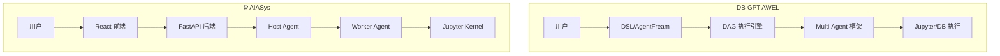
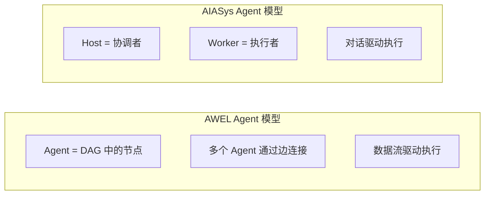
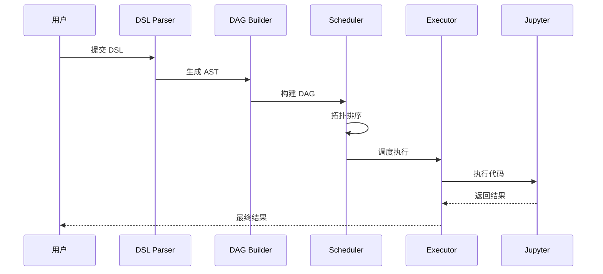
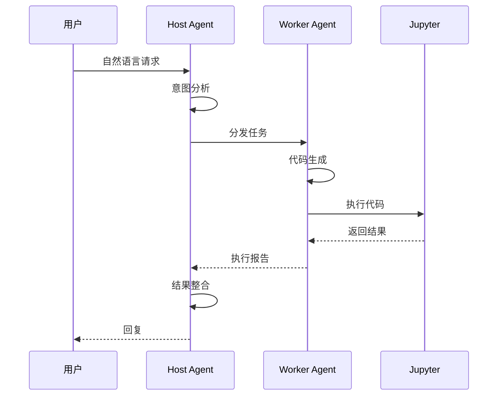
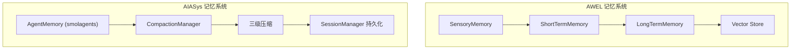
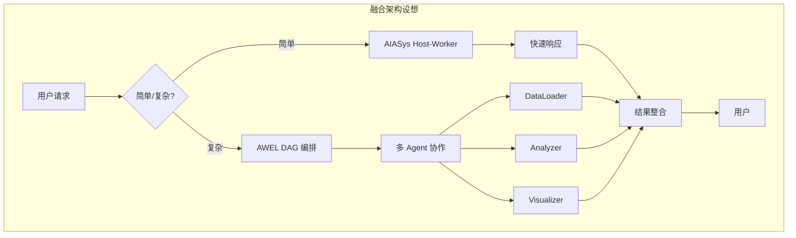

# 07-与 AIASys 对比分析

**对比对象**: DB-GPT AWEL vs AIASys  
**分析日期**: 2026-02-08

---

## TL;DR

| 维度 | DB-GPT AWEL | AIASys |
|------|-------------|--------|
| **定位** | 企业级数据应用框架 | 工业数据分析平台 |
| **Agent 架构** | DAG 工作流编排 | Host-Worker 双 Agent |
| **抽象层级** | 三层 (DSL/AF/Operator) | 单层 (Agent 类) |
| **编程风格** | 声明式 + 链式 | 命令式 |
| **适用场景** | 复杂 ETL + LLM | 交互式分析 |
| **学习曲线** | 陡峭 | 平缓 |

---

## 1. 架构对比

### 1.1 整体架构



### 1.2 Agent 架构差异



| 特性 | AWEL | AIASys |
|------|------|--------|
| **Agent 定义** | ConversableAgent + DAG 节点 | CompressedToolCallingAgent / CompressedCodeAgent |
| **通信方式** | 消息总线 + 数据流 | 函数调用 (managed_agents) |
| **执行顺序** | 拓扑排序确定 | Host 决定 |
| **并行能力** | 同层节点并行 | Worker 内部并行 |
| **状态共享** | 通过边传递 | 通过消息传递 |

---

## 2. 编程模型对比

### 2.1 定义工作流

**AWEL - DSL 层 (声明式)**:
```sql
CREATE WORKFLOW analysis AS
BEGIN
    DATA raw = LOAD FROM db_source('sales_db');
    DATA clean = TRANSFORM raw USING clean_data();
    DATA result = APPLY LLM 'gpt-4' WITH DATA clean;
    RESPOND TO user WITH result;
END;
```

**AWEL - AgentFream 层 (链式)**:
```python
result = (
    AgentFream(DBSource('sales_db'))
    .map(clean_data)
    .llm(model='gpt-4')
    .execute()
)
```

**AIASys (命令式)**:
```python
team = DataAnalysisTeam(session_id)
result = await team.run("分析销售数据")
```

### 2.2 添加自定义逻辑

**AWEL - 自定义 Operator**:
```python
class CustomTransformOperator(TransformOperator[Dict, Dict]):
    async def execute(self, input_data: Dict) -> Dict:
        # 自定义处理逻辑
        return processed_data

# 注册到工作流
workflow.add_node(CustomTransformOperator())
```

**AIASys - 自定义工具**:
```python
@tool
def custom_analysis(data: str) -> str:
    """自定义分析工具"""
    # 自定义处理逻辑
    return result

# 添加到 Agent
worker.add_tool(custom_analysis)
```

---

## 3. 执行模型对比

### 3.1 执行流程





### 3.2 性能对比

| 场景 | AWEL | AIASys | 胜出 |
|------|------|--------|------|
| **简单查询** | 启动开销大 | 快速响应 | AIASys |
| **复杂 ETL** | DAG 优化执行 | 线性执行 | AWEL |
| **并行处理** | 原生支持 | 需额外实现 | AWEL |
| **流式输出** | StreamingScheduler | SSE 包装 | 平手 |
| **交互式对话** | 不擅长 | 专门优化 | AIASys |

---

## 4. 记忆系统对比

### 4.1 架构对比



| 特性 | AWEL | AIASys |
|------|------|--------|
| **模型** | 类人生理三层 | 工程化三级压缩 |
| **存储** | 向量库 + 关系库 | 文件系统 |
| **召回** | 时间加权 + 重要性 | 最近 N 步 |
| **压缩** | 洞察提取 | Micro/Auto/Manual |
| **持久化** | GptsMessageMemory | SessionManager |

---

## 5. 适用场景对比

### 5.1 AWEL 更适合

-  **复杂数据管道** - ETL + LLM 混合流程
-  **批处理任务** - 大量数据的离线分析
-  **企业级工作流** - 需要严格流程控制
-  **多数据源集成** - DB、API、文件混合
-  **可视化编排** - DAG 图形化展示

### 5.2 AIASys 更适合

-  **交互式分析** - 实时对话式数据探索
-  **快速原型** - 快速搭建分析能力
-  **工业场景** - 设备数据、故障诊断
-  **Notebook 集成** - 分析过程可复现
-  **流式响应** - 实时看到分析过程

---

## 6. 借鉴与改进建议

### 6.1 AIASys 可以借鉴 AWEL

| AWEL 特性 | AIASys 应用 |
|-----------|-------------|
| **DAG 可视化** | 复杂分析展示执行图 |
| **Operator 复用** | 工具标准化为 Operator |
| **DSL 层** | 高级用户快速定义分析模板 |
| **分布式执行** | 大规模数据并行处理 |

### 6.2 AWEL 可以借鉴 AIASys

| AIASys 特性 | AWEL 应用 |
|-------------|-----------|
| **三层压缩** | 长对话记忆管理 |
| **Host-Worker 分工** | Agent 职责更清晰 |
| **Jupyter 深度集成** | 交互式开发体验 |
| **流式 SSE** | 实时反馈机制 |

---

## 7. 混合架构设想



**关键设计**:
1. **路由层** - 根据任务复杂度选择执行路径
2. **统一消息格式** - AWEL GptsMessage + AIASys Step 统一
3. **共享执行后端** - Jupyter Kernel 统一执行
4. **混合监控** - DAG 可视化 + 对话流追踪

---

## 8. 总结

| 维度 | 建议 |
|------|------|
| **新手项目** | 选 AIASys，学习曲线平缓 |
| **企业级应用** | 选 AWEL，功能完整 |
| **交互式分析** | 选 AIASys，响应快速 |
| **批处理 ETL** | 选 AWEL，执行高效 |
| **混合场景** | 融合两者优势 |

**核心洞察**:
- AWEL 是**框架**，AIASys 是**应用**
- AWEL 重**编排**，AIASys 重**交互**
- 两者可以**互补**，而非替代

---

*分析完成于 2026-02-08*
