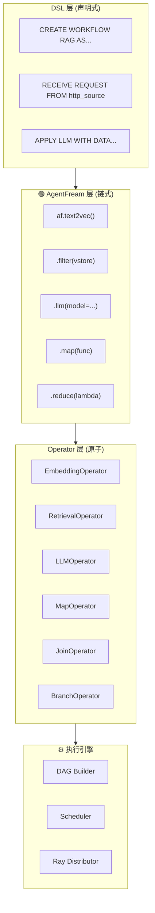

# DB-GPT AWEL 架构全景索引

**项目**: DB-GPT (eosphoros-ai/DB-GPT)  
**框架**: AWEL (Agentic Workflow Expression Language)  
**版本**: v0.7.4  
**分析日期**: 2026-02-08  
**分析状态**:  深度分析中

---

## 什么是 AWEL?

**AWEL** = **A**gentic **W**orkflow **E**xpression **L**anguage

> DB-GPT 自研的智能体工作流表达语言，专为大型模型应用开发设计。

### 核心定位

| 维度 | 设计目标 |
|------|----------|
| **抽象层级** | 三层 API 设计 (Operator → AgentFream → DSL) |
| **编程范式** | 声明式 + 链式 + 函数式 |
| **执行模型** | DAG (有向无环图) 编排 |
| **分布能力** | 支持 Ray 分布式执行 |

---

## AWEL 三层架构



---

## 文档导航

| 序号 | 文档 | 核心内容 | 大小 | 状态 |
|------|------|----------|------|------|
| 01 | [[01-AWEL整体架构与设计哲学]] | 三层架构、设计理念、核心抽象 | 13KB |  |
| 02 | [[02-Operator层深度分析]] | 基础算子、生命周期、数据流 | 22KB |  |
| 03 | [[03-AgentFream层实现机制]] | 链式计算、算子组合、类型推导 | 20KB |  |
| 04 | [[04-DSL层与解析器]] | 语法设计、AST、代码生成 | 30KB |  |
| 05 | [[05-DAG执行引擎]] | 图构建、调度策略、并发执行 | 24KB |  |
| 06 | [[06-多Agent协作机制]] | Agent间通信、消息总线、协作协议 | 20KB |  |
| 07 | [[07-与AIASys对比分析]] | 架构差异、适用场景、借鉴点 | 8KB |  |

---

## 核心源码位置 (推测)

```
db-gpt/packages/dbgpt-core/src/dbgpt/
├── core/
│   └── awel/                    # AWEL 核心实现
│       ├── __init__.py
│       ├── operator/            # Operator 层
│       │   ├── base.py          # BaseOperator
│       │   ├── stream.py        # 流式算子
│       │   └── common.py        # 通用算子
│       ├── agent_fream/         # AgentFream 层
│       │   ├── __init__.py
│       │   └── fream.py         # AgentFream 实现
│       ├── dsl/                 # DSL 层
│       │   ├── parser.py        # DSL 解析器
│       │   └── codegen.py       # 代码生成
│       ├── dag/                 # DAG 执行引擎
│       │   ├── builder.py       # DAG 构建器
│       │   ├── scheduler.py     # 调度器
│       │   └── executor.py      # 执行器
│       └── multi_agent/         # 多 Agent 支持
│           ├── agent.py         # Agent 定义
│           ├── message.py       # 消息协议
│           └── coordinator.py   # 协调器
```

---

## AWEL 代码示例

### DSL 层 (声明式)

```sql
CREATE WORKFLOW RAG AS
BEGIN
    DATA requestData = RECEIVE REQUEST FROM
        http_source("/examples/rags", method = "post");

    DATA processedData = TRANSFORM requestData 
        USING embedding(model = "text2vec");

    DATA retrievedData = RETRIEVE DATA
        FROM vstore(database = "chromadb", key = processedData)
        ON ERROR FAIL;

    DATA modelResult = APPLY LLM "vicuna-13b"
        WITH DATA retrievedData 
        AND PARAMETERS (temperature = 0.7)
        ON ERROR RETRY 2 TIMES;

    RESPOND TO http_source WITH modelResult
        ON ERROR LOG "Failed to respond to request";
END;
```

### AgentFream 层 (链式)

```python
af = AgentFream(HttpSource("/examples/run_code", method="post"))
result = (
    af
    .text2vec(model="text2vec")
    .filter(vstore, store="chromadb", db="default")
    .llm(model="vicuna-13b", temperature=0.7)
    .map(code_parse_func)
    .map(run_sql_func)
    .reduce(lambda a, b: a + b)
)
result.write_to_sink(type='source_slink')
```

### Operator 层 (基础)

```python
with DAG("simple_rag_example") as dag:
    trigger_task = HttpTrigger(
        "/examples/simple_rag", 
        methods="POST", 
        request_body=ConversationVo
    )
    req_parse_task = RequestParseOperator()
    prompt_task = PromptManagerOperator()
    history_task = ChatHistoryOperator()
    embedding_task = EmbeddingEngingOperator()
    chat_task = BaseChatOperator()
    model_task = ModelOperator()
    output_parser_task = MapOperator(lambda out: out.to_dict()["text"])

    (
        trigger_task
        >> req_parse_task
        >> prompt_task
        >> history_task
        >> embedding_task
        >> chat_task
        >> model_task
        >> output_parser_task
    )
```

---

## 与主流框架对比

| 特性 | AWEL | LangChain | AutoGen | smolagents |
|------|------|-----------|---------|------------|
| **框架类型** | 自研完整框架 | 链式编排 | 多 Agent 对话 | 轻量 Agent |
| **抽象层级** | 三层 (DSL/AF/OP) | 单层 | 单层 | 单层 |
| **编程风格** | 声明+链式+函数 | 链式 | 对话式 | 类继承 |
| **执行模型** | DAG | 链 | 群聊 | 单/多 Agent |
| **分布式** |  Ray |  |  |  |
| **适用场景** | 企业级数据应用 | 通用 LLM 应用 | 多 Agent 协作 | 简单 Agent 任务 |

---

## 核心创新点

1. **三层渐进式 API** - 从底层算子到高层 DSL，满足不同复杂度需求
2. **DAG 执行引擎** - 天然支持并行和分布式
3. **声明式工作流** - SQL-like 语法，降低学习成本
4. **数据驱动 Agent** - 与 DB-GPT 的数据能力深度集成

---

## 维护信息

- **分析者**: AI 协作助手
- **创建日期**: 2026-02-08
- **项目官网**: https://docs.dbgpt.cn/docs/awel/
- **GitHub**: https://github.com/eosphoros-ai/DB-GPT
