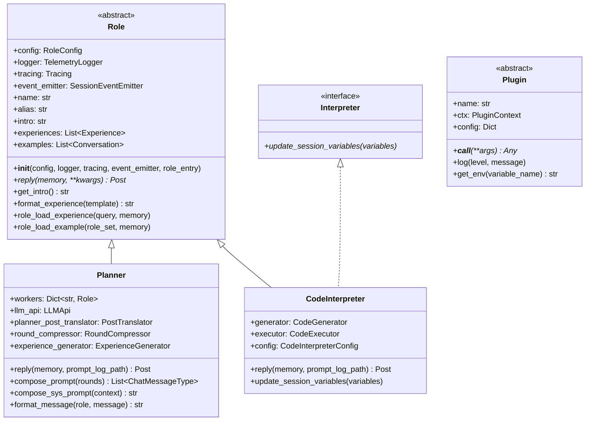

# TaskWeaver 核心类图分析

> **分析日期**: 2026-02-05  
> **文档用途**: 类关系与关键方法索引

---

## 一、核心类继承关系

### 1.1 类继承图 (Mermaid)



---

## 二、核心类详细说明

### 2.1 Role 基类

**文件**: `taskweaver/role/role.py` (第 92-142 行)

```python
class Role:
    @inject
    def __init__(
        self,
        config: RoleConfig,
        logger: TelemetryLogger,
        tracing: Tracing,
        event_emitter: SessionEventEmitter,
        role_entry: Optional[RoleEntry] = None,
    )
```

| 属性/方法 | 类型 | 说明 |
|-----------|------|------|
| `config` | `RoleConfig` | 角色配置 |
| `logger` | `TelemetryLogger` | 日志记录器 |
| `tracing` | `Tracing` | 链路追踪 |
| `event_emitter` | `SessionEventEmitter` | 事件发射器 |
| `name` | `str` | 角色名称 |
| `alias` | `str` | 显示别名 |
| `reply(memory, **kwargs)` | `Post` | **抽象方法**，子类必须实现 |
| `format_experience(template)` | `str` | 格式化经验到 Prompt |
| `role_load_experience(query, memory)` | `None` | 加载经验 |
| `role_load_example(role_set, memory)` | `None` | 加载示例 |

### 2.2 Planner 类

**文件**: `taskweaver/planner/planner.py` (第 46-371 行)

```python
class Planner(Role):
    @inject
    def __init__(
        self,
        config: PlannerConfig,
        logger: TelemetryLogger,
        tracing: Tracing,
        event_emitter: SessionEventEmitter,
        llm_api: LLMApi,
        workers: Dict[str, Role],        # 关键：持有所有 Worker
        round_compressor: Optional[RoundCompressor],
        post_translator: PostTranslator,
        experience_generator: Optional[ExperienceGenerator] = None,
    )
```

| 属性/方法 | 类型 | 说明 |
|-----------|------|------|
| `workers` | `Dict[str, Role]` | Worker 实例字典 |
| `llm_api` | `LLMApi` | LLM 接口 |
| `recipient_alias_set` | `Set[str]` | 可发送目标的别名集合 |
| `response_json_schema` | `Dict` | LLM 输出 JSON Schema |
| `ask_self_cnt` | `int` | 自我校正计数器 |
| `max_self_ask_num` | `int` | 最大自我校正次数 (3) |
| `reply(memory, prompt_log_path)` | `Post` | 核心决策方法 |
| `compose_prompt(rounds)` | `List[ChatMessageType]` | 构建 Prompt |
| `compose_sys_prompt(context)` | `str` | 构建系统提示 |
| `compose_conversation_for_prompt(conv_rounds, summary)` | `List[ChatMessageType]` | 构建对话历史 |
| `check_post_validity(post)` | `None` | 验证 LLM 输出 |

### 2.3 CodeInterpreter 类

**文件**: `taskweaver/code_interpreter/code_interpreter/code_interpreter.py` (第 94-335 行)

```python
class CodeInterpreter(Role, Interpreter):
    @inject
    def __init__(
        self,
        generator: CodeGenerator,
        executor: CodeExecutor,
        logger: TelemetryLogger,
        tracing: Tracing,
        event_emitter: SessionEventEmitter,
        config: CodeInterpreterConfig,
        role_entry: RoleEntry,
    )
```

| 属性/方法 | 类型 | 说明 |
|-----------|------|------|
| `generator` | `CodeGenerator` | 代码生成器 |
| `executor` | `CodeExecutor` | 代码执行器 |
| `config` | `CodeInterpreterConfig` | 配置 |
| `retry_count` | `int` | 重试计数器 |
| `max_retry_count` | `int` | 最大重试次数 (3) |
| `plugin_description` | `str` | 插件描述文本 |
| `reply(memory, prompt_log_path)` | `Post` | 核心执行方法 |
| `update_session_variables(variables)` | `None` | 更新会话变量 |
| `get_intro()` | `str` | 获取角色介绍 |

### 2.4 CodeGenerator 类

**文件**: `taskweaver/code_interpreter/code_interpreter/code_generator.py` (第 52-416 行)

```python
class CodeGenerator(Role):
    @inject
    def __init__(
        self,
        config: CodeGeneratorConfig,
        plugin_registry: PluginRegistry,
        logger: TelemetryLogger,
        event_emitter: SessionEventEmitter,
        tracing: Tracing,
        llm_api: LLMApi,
        round_compressor: RoundCompressor,
        post_translator: PostTranslator,
        experience_generator: ExperienceGenerator,
    )
```

| 属性/方法 | 类型 | 说明 |
|-----------|------|------|
| `plugin_pool` | `List[PluginEntry]` | 可用插件列表 |
| `role_name` | `str` | 角色名 (默认 "ProgramApe") |
| `code_verification_on` | `bool` | 是否启用代码验证 |
| `allowed_modules` | `List[str]` | 允许的 Python 模块 |
| `blocked_functions` | `List[str]` | 禁止的函数 |
| `plugin_selector` | `PluginSelector` | 插件选择器 (可选) |
| `reply(memory, post_proxy, prompt_log_path)` | `Post` | 生成代码 |
| `compose_prompt(rounds, plugins)` | `List[ChatMessageType]` | 构建 Prompt |
| `configure_verification(...)` | `None` | 配置验证规则 |
| `select_plugins_for_prompt(query)` | `List[PluginEntry]` | 自动选择插件 |

### 2.5 CodeExecutor 类

**文件**: `taskweaver/code_interpreter/code_executor.py` (第 42-152 行)

```python
class CodeExecutor:
    @inject
    def __init__(
        self,
        session_metadata: SessionMetadata,
        config: AppConfigSource,
        exec_mgr: Manager,
        plugin_registry: PluginRegistry,
        tracing: Tracing,
    )
```

| 属性/方法 | 类型 | 说明 |
|-----------|------|------|
| `session_id` | `str` | 会话 ID |
| `workspace` | `str` | 工作目录 |
| `execution_cwd` | `str` | 代码执行目录 |
| `exec_mgr` | `Manager` | 执行管理器 |
| `exec_client` | `SessionClient` | 会话客户端 |
| `session_variables` | `Dict` | 会话变量 |
| `plugin_loaded` | `bool` | 插件是否已加载 |
| `execute_code(exec_id, code)` | `ExecutionResult` | 执行代码 |
| `update_session_var(session_var_dict)` | `None` | 更新会话变量 |
| `load_plugin()` | `None` | 加载插件 |
| `format_code_output(result, ...)` | `str` | 格式化输出 |
| `start()` / `stop()` | `None` | 启动/停止执行环境 |

---

## 三、记忆系统类

### 3.1 Memory 类

**文件**: `taskweaver/memory/memory.py` (第 16-113 行)

```python
class Memory:
    def __init__(self, session_id: str)
```

| 属性/方法 | 类型 | 说明 |
|-----------|------|------|
| `session_id` | `str` | 会话标识 |
| `conversation` | `Conversation` | 对话容器 |
| `create_round(user_query)` | `Round` | 创建新轮次 |
| `get_role_rounds(role, include_failure_rounds)` | `List[Round]` | 获取角色视角的记忆 |
| `save_experience(exp_dir, thin_mode)` | `None` | 保存经验 |
| `get_shared_memory_entries(entry_type)` | `List[SharedMemoryEntry]` | 获取共享内存 |

### 3.2 Conversation 类

**文件**: `taskweaver/memory/conversation.py` (第 15-84 行)

```python
@dataclass
class Conversation:
    id: str
    rounds: List[Round]
    plugins: List[PluginEntry]
    roles: List[str]
    enabled: bool
```

| 方法 | 说明 |
|------|------|
| `init()` | 初始化空对话 |
| `add_round(round)` | 添加轮次 |
| `to_dict()` | 转字典 |
| `from_yaml(path)` | 从 YAML 加载 |

### 3.3 Round 类

**文件**: `taskweaver/memory/round.py` (第 13-86 行)

```python
@dataclass
class Round:
    id: str
    user_query: str
    state: RoundState  # "created" | "finished" | "failed"
    post_list: List[Post]
```

| 方法 | 说明 |
|------|------|
| `create(user_query, id, state, post_list)` | 创建轮次 |
| `add_post(post)` | 添加消息 |
| `change_round_state(new_state)` | 改变状态 |
| `to_dict()` / `from_dict()` | 序列化/反序列化 |

### 3.4 Post 类

**文件**: `taskweaver/memory/post.py` (第 12-96 行)

```python
@dataclass
class Post:
    id: str
    send_from: RoleName
    send_to: RoleName
    message: str
    attachment_list: List[Attachment]
```

| 方法 | 说明 |
|------|------|
| `create(message, send_from, send_to, attachment_list)` | 创建消息 |
| `add_attachment(attachment)` | 添加附件 |
| `get_attachment(type)` | `List[Attachment]` | 获取指定类型附件 |
| `del_attachment(type_list)` | 删除附件 |
| `to_dict()` / `from_dict()` | 序列化/反序列化 |

### 3.5 Attachment 类

**文件**: `taskweaver/memory/attachment.py` (第 54-129 行)

```python
@dataclass
class Attachment:
    id: str
    type: AttachmentType
    content: str
    extra: Optional[Any]
```

| AttachmentType 枚举 | 说明 |
|---------------------|------|
| `init_plan` | 初始计划 |
| `plan` | 执行计划 |
| `current_plan_step` | 当前计划步骤 |
| `thought` | 思考过程 |
| `reply_type` | 回复类型 (python/text) |
| `reply_content` | 回复内容 (代码/文本) |
| `verification` | 验证状态 |
| `execution_status` | 执行状态 |
| `execution_result` | 执行结果 |
| `artifact_paths` | 产物路径 |
| `revise_message` | 修正指令 |
| `shared_memory_entry` | 共享内存条目 |
| `image_url` | 图片 URL |

---

## 四、经验学习类

### 4.1 ExperienceGenerator 类

**文件**: `taskweaver/memory/experience.py` (第 59-335 行)

```python
class ExperienceGenerator:
    @inject
    def __init__(
        self,
        llm_api: LLMApi,
        config: ExperienceConfig,
        logger: TelemetryLogger,
        tracing: Tracing,
    )
```

| 属性/方法 | 类型 | 说明 |
|-----------|------|------|
| `experience_list` | `List[Experience]` | 经验列表 |
| `experience_dir` | `str` | 经验存储目录 |
| `sub_path` | `str` | 子路径过滤 |
| `default_prompt_template` | `str` | 经验摘要模板 |
| `summarize_experience(exp_id, prompt)` | `str` | LLM 生成经验摘要 |
| `refresh(prompt)` | `None` | 刷新经验索引 |
| `load_experience()` | `None` | 加载经验到内存 |
| `retrieve_experience(user_query)` | `List[Tuple[Experience, float]]` | 检索相关经验 |
| `format_experience_in_prompt(template, experiences)` | `str` | 格式化经验到 Prompt |
| `delete_experience(exp_id)` | `None` | 删除经验 |

### 4.2 Experience 数据类

**文件**: `taskweaver/memory/experience.py` (第 15-41 行)

```python
@dataclass
class Experience:
    experience_text: str          # 经验文本摘要
    exp_id: str                   # 经验 ID
    raw_experience_path: str      # 原始对话路径
    embedding_model: str          # 使用的嵌入模型
    embedding: List[float]        # 向量嵌入
```

---

## 五、会话管理类

### 5.1 Session 类

**文件**: `taskweaver/session/session.py` (第 44-363 行)

```python
class Session:
    @inject
    def __init__(
        self,
        session_id: str,
        workspace: Workspace,
        app_injector: Injector,
        logger: TelemetryLogger,
        tracing: Tracing,
        config: AppSessionConfig,
        role_registry: RoleRegistry,
    )
```

| 属性/方法 | 类型 | 说明 |
|-----------|------|------|
| `session_id` | `str` | 会话 ID |
| `workspace` | `str` | 工作空间路径 |
| `execution_cwd` | `str` | 代码执行目录 |
| `metadata` | `SessionMetadata` | 会话元数据 |
| `session_injector` | `Injector` | 会话级注入器 |
| `memory` | `Memory` | 记忆管理 |
| `planner` | `Planner` | Planner 实例 |
| `worker_instances` | `Dict[str, Role]` | Worker 实例字典 |
| `session_var` | `Dict[str, str]` | 会话变量 |
| `send_message(message, event_handler, files)` | `Round` | 发送消息入口 |
| `_send_text_message(message)` | `Round` | 内部消息发送 |
| `update_session_var(variables)` | `None` | 更新会话变量 |
| `stop()` | `None` | 停止会话 |

### 5.2 SessionMetadata 数据类

**文件**: `taskweaver/session/session.py` (第 37-42 行)

```python
@dataclass
class SessionMetadata:
    session_id: str
    workspace: str
    execution_cwd: str
```

---

## 六、代码执行相关类

### 6.1 TaskWeaverContextMagic 类

**文件**: `taskweaver/ces/kernel/ctx_magic.py` (第 20-72 行)

```python
@magics_class
class TaskWeaverContextMagic(Magics):
    def __init__(self, shell: InteractiveShell, executor: Executor, **kwargs)
```

| Magic 命令 | 类型 | 说明 |
|------------|------|------|
| `_taskweaver_session_init` | `@line_magic` | 初始化会话上下文 |
| `_taskweaver_update_session_var` | `@cell_magic` | 更新会话变量 |
| `_taskweaver_check_session_var` | `@line_magic` | 检查会话变量 |
| `_taskweaver_convert_path` | `@cell_magic` | 转换路径 |
| `_taskweaver_exec_pre_check` | `@line_magic` | 执行前检查 |
| `_taskweaver_exec_post_check` | `@line_magic` | 执行后检查 |
| `_taskweaver_write_and_run` | `@cell_magic` | 写入并运行代码 |

### 6.2 TaskWeaverPluginMagic 类

**文件**: `taskweaver/ces/kernel/ctx_magic.py` (第 74-134 行)

```python
@magics_class
class TaskWeaverPluginMagic(Magics):
```

| Magic 命令 | 类型 | 说明 |
|------------|------|------|
| `_taskweaver_plugin_register` | `@line_cell_magic` | 注册插件代码 |
| `_taskweaver_plugin_test` | `@line_magic` | 测试插件 |
| `_taskweaver_plugin_load` | `@line_cell_magic` | 加载插件实例 |
| `_taskweaver_plugin_unload` | `@line_magic` | 卸载插件 |

---

## 七、配置类

### 7.1 ModuleConfig 基类

**文件**: `taskweaver/config/module_config.py` (第 9-47 行)

```python
@singleton
class ModuleConfig:
    @inject
    def __init__(self, src: AppConfigSource)
```

| 方法 | 说明 |
|------|------|
| `_set_name(name)` | 设置模块名 |
| `_config_key(key)` | 生成配置键 |
| `_get_str(key, default, required)` | 获取字符串配置 |
| `_get_bool(key, default)` | 获取布尔配置 |
| `_get_int(key, default)` | 获取整数配置 |
| `_get_list(key, default)` | 获取列表配置 |
| `_get_path(key, default)` | 获取路径配置 |
| `_configure()` | 子类重写配置 |

### 7.2 具体配置类

| 配置类 | 文件 | 关键配置项 |
|--------|------|-----------|
| `PlannerConfig` | `planner/planner.py:24-43` | `prompt_file_path`, `prompt_compression`, `llm_alias` |
| `CodeInterpreterConfig` | `code_interpreter/code_interpreter.py:19-70` | `code_verification_on`, `allowed_modules`, `blocked_functions` |
| `CodeGeneratorConfig` | `code_interpreter/code_generator.py:23-49` | `load_plugin`, `enable_auto_plugin_selection`, `auto_plugin_selection_topk` |
| `ExperienceConfig` | `memory/experience.py:43-56` | `retrieve_threshold`, `llm_alias` |
| `RoleConfig` | `role/role.py:43-82` | `use_experience`, `experience_dir`, `use_example` |
| `AppSessionConfig` | `session/session.py:18-34` | `max_internal_chat_round_num`, `experience_dir`, `roles` |

---

## 八、辅助类

### 8.1 PostTranslator 类

**文件**: `taskweaver/role/translator.py` (第 17-300 行)

```python
class PostTranslator:
    @inject
    def __init__(self, logger: TelemetryLogger, tracing: Tracing, event_emitter: SessionEventEmitter)
```

| 方法 | 说明 |
|------|------|
| `raw_text_to_post(llm_output, post_proxy, early_stop, validation_func)` | LLM 输出 → Post |
| `post_to_raw_text(post, ...)` | Post → LLM 格式文本 |
| `parse_llm_output(llm_output)` | 解析完整 LLM 输出 |
| `parse_llm_output_stream(llm_output)` | 流式解析 (使用 ijson) |
| `parse_llm_output_stream_v2(llm_output)` | 流式解析 V2 (使用自定义 parser) |

### 8.2 RoleEntry 数据类

**文件**: `taskweaver/role/role.py` (第 21-40 行)

```python
@dataclass
class RoleEntry:
    name: str
    alias: str
    module: type
    intro: str
```

| 静态方法 | 说明 |
|----------|------|
| `from_yaml_file(file_path)` | 从 YAML 加载角色配置 |

### 8.3 RoleRegistry 类

**文件**: `taskweaver/role/role.py` (第 285-299 行)

```python
class RoleRegistry(ComponentRegistry[RoleEntry]):
    def __init__(self, file_glob: Union[str, List[str]], ttl: Optional[timedelta] = None)
```

| 方法 | 说明 |
|------|------|
| `_load_component(path)` | 加载单个角色 |
| `get_role_name_list()` | 获取角色名称列表 |

---

## 九、类关系总表

### 9.1 继承关系

| 子类 | 父类/接口 | 文件 |
|------|-----------|------|
| `Planner` | `Role` | `planner/planner.py` |
| `CodeInterpreter` | `Role`, `Interpreter` | `code_interpreter/code_interpreter.py` |
| `CodeGenerator` | `Role` | `code_interpreter/code_generator.py` |
| `RoleConfig` | `ModuleConfig` | `role/role.py` |
| `PlannerConfig` | `RoleConfig` | `planner/planner.py` |
| `CodeInterpreterConfig` | `RoleConfig` | `code_interpreter/code_interpreter.py` |
| `CodeGeneratorConfig` | `RoleConfig` | `code_interpreter/code_generator.py` |
| `ExperienceConfig` | `ModuleConfig` | `memory/experience.py` |
| `AppSessionConfig` | `ModuleConfig` | `session/session.py` |

### 9.2 组合关系

| 容器类 | 成员类 | 关系 |
|--------|--------|------|
| `Memory` | `Conversation` | 1:1 |
| `Conversation` | `Round` | 1:N |
| `Round` | `Post` | 1:N |
| `Post` | `Attachment` | 1:N |
| `Session` | `Memory` | 1:1 |
| `Session` | `Planner` | 1:1 |
| `Session` | `Role` (Workers) | 1:N |
| `CodeInterpreter` | `CodeGenerator` | 1:1 |
| `CodeInterpreter` | `CodeExecutor` | 1:1 |
| `Planner` | `Role` (Workers) | 1:N |

### 9.3 依赖关系 (依赖注入)

| 类 | 注入的依赖 |
|----|-----------|
| `Role` | `RoleConfig`, `TelemetryLogger`, `Tracing`, `SessionEventEmitter`, `RoleEntry` |
| `Planner` | `PlannerConfig`, `TelemetryLogger`, `Tracing`, `SessionEventEmitter`, `LLMApi`, `Dict[str, Role]`, `RoundCompressor`, `PostTranslator`, `ExperienceGenerator` |
| `CodeInterpreter` | `CodeGenerator`, `CodeExecutor`, `TelemetryLogger`, `Tracing`, `SessionEventEmitter`, `CodeInterpreterConfig`, `RoleEntry` |
| `CodeGenerator` | `CodeGeneratorConfig`, `PluginRegistry`, `TelemetryLogger`, `SessionEventEmitter`, `Tracing`, `LLMApi`, `RoundCompressor`, `PostTranslator`, `ExperienceGenerator` |
| `CodeExecutor` | `SessionMetadata`, `AppConfigSource`, `Manager`, `PluginRegistry`, `Tracing` |
| `ExperienceGenerator` | `LLMApi`, `ExperienceConfig`, `TelemetryLogger`, `Tracing` |
| `Session` | `str`, `Workspace`, `Injector`, `TelemetryLogger`, `Tracing`, `AppSessionConfig`, `RoleRegistry` |

---

## 十、关键方法调用链

### 10.1 消息处理流程

```
User Request
    ↓
Session.send_message()
    ↓
Session._send_text_message()
    ↓
[Loop] Session._send_message(recipient, post)
    ├── if recipient == "Planner":
    │       Planner.reply(memory)
    │           ├── compose_prompt()
    │           ├── llm_api.chat_completion_stream()
    │           ├── planner_post_translator.raw_text_to_post()
    │           └── check_post_validity()
    │
    └── elif recipient == "CodeInterpreter":
            CodeInterpreter.reply(memory)
                ├── generator.reply()
                │       └── CodeGenerator.reply()
                ├── code_snippet_verification()
                └── executor.execute_code()
                    └── exec_client.execute_code() (IPython)
```

### 10.2 经验学习流程

```
Role.reply()
    ↓
Role.role_load_experience(query, memory)
    ↓
ExperienceGenerator.retrieve_experience(user_query)
    ├── llm_api.get_embedding(user_query)
    └── cosine_similarity(query_embedding, experience_embedding)
    ↓
Role.format_experience(template)
    ↓
Prompt 中包含经验
```

### 10.3 代码执行流程

```
CodeInterpreter.reply()
    ↓
CodeGenerator.reply() → 生成代码
    ↓
code_snippet_verification() → 验证代码安全
    ↓
CodeExecutor.execute_code()
    ├── start() → 启动 IPython Kernel
    ├── load_plugin() → 加载插件
    ├── exec_client.update_session_var() → 注入变量
    └── exec_client.execute_code() → 执行代码
        └── TaskWeaverContextMagic._taskweaver_exec_post_check()
    ↓
format_code_output() → 格式化结果
```
