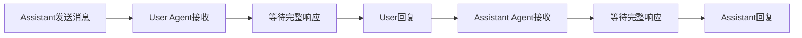
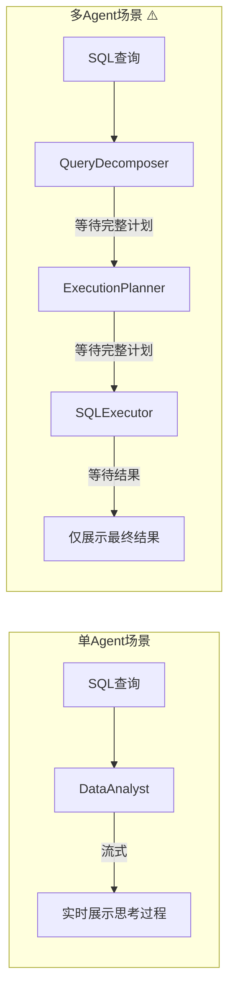

# 07-多Agent流式输出分析

**CAMEL版本**: v0.2.85  
**分析日期**: 2025-06-08  
**分析范围**: `societies/role_playing/`, `societies/workforce/`

---

## TL;DR - 核心结论

| 场景 | 流式支持 | 机制 | 说明 |
|------|---------|------|------|
| RolePlaying (双角色对话) |  不支持 | N/A | 必须等待完整响应才能切换角色 |
| Workforce (多Worker协作) |  不支持 | 事件回调 | 提供任务级进度通知，但非token级流式 |

**关键发现**: CAMEL多Agent场景**不提供原生流式输出支持**。多Agent协作模式决定了它们需要完整的响应才能进行下一步（任务分配、角色切换等），这与单Agent的流式机制有本质区别。

---

## 1. RolePlaying 流式分析

### 1.1 核心方法实现

```python
# camel/societies/role_playing/role_playing.py:631-709

def step(
    self,
    assistant_msg: BaseMessage,
) -> Tuple[ChatAgentResponse, ChatAgentResponse]:
    r"""同步执行一轮对话
    
    Returns:
        Tuple[ChatAgentResponse, ChatAgentResponse]: 
        返回两个完整响应，分别来自User Agent和Assistant Agent
    """
    # 1. User Agent 响应
    user_response = self.user_agent.step(assistant_msg)
    if user_response.terminated or user_response.msgs is None:
        return (..., ...)  # 终止情况处理
    
    user_msg = self._reduce_message_options(user_response.msgs)
    
    # 2. Assistant Agent 响应
    assistant_response = self.assistant_agent.step(user_msg)
    if assistant_response.terminated or assistant_response.msgs is None:
        return (..., ...)  # 终止情况处理
    
    assistant_msg = self._reduce_message_options(assistant_response.msgs)
    
    return (
        ChatAgentResponse(msgs=[assistant_msg], ...),
        ChatAgentResponse(msgs=[user_msg], ...),
    )
```

```python
# camel/societies/role_playing/role_playing.py:711-757

async def astep(
    self,
    assistant_msg: BaseMessage,
) -> Tuple[ChatAgentResponse, ChatAgentResponse]:
    r"""异步执行一轮对话"""
    user_response = await self.user_agent.astep(assistant_msg)
    assistant_response = await self.assistant_agent.astep(user_msg)
    return (assistant_response, user_response)
```

### 1.2 为什么不支持流式



**根本原因**: RolePlaying的回合制设计决定了**必须等待一方完全响应后**，另一方才能开始思考和回复。这种设计无法支持实时流式输出，因为：

1. **角色切换依赖完整响应**: User Agent需要看到Assistant的完整消息才能生成有意义的回复
2. **上下文构建需要完整内容**: 每个Agent的Memory需要完整的message对象
3. **终止判断需要完整解析**: 需要检查`response.terminated`状态

---

## 2. Workforce 流式分析

### 2.1 核心方法实现

```python
# camel/societies/workforce/workforce.py:2483-2526

async def process_task_async(
    self, task: Task, interactive: bool = False
) -> Task:
    r"""异步处理任务的主入口
    
    Returns:
        Task: 返回完整的Task对象，包含执行结果
    """
    if self.mode == WorkforceMode.PIPELINE:
        return await self._process_task_with_pipeline(task)
    else:
        # AUTO_DECOMPOSE 模式
        subtasks = await self.handle_decompose_append_task(task)
        await self.start()  # 启动所有Worker
        # 收集所有子任务结果
        task.result = "\n\n".join(...)
        return task
```

```python
# camel/societies/workforce/workforce.py:2636-2680

def process_task(self, task: Task) -> Task:
    r"""同步包装器，内部调用async版本"""
    # 使用线程池在事件循环中执行
    with concurrent.futures.ThreadPoolExecutor() as executor:
        return executor.submit(run_in_thread).result()
```

### 2.2 事件回调机制

虽然Workforce不支持token级流式，但提供了**任务级事件回调**：

```python
# camel/societies/workforce/workforce_callback.py

class WorkforceCallback(ABC):
    r"""Workforce生命周期事件记录接口"""

    @abstractmethod
    def log_task_created(self, event: TaskCreatedEvent) -> None:
        r"""任务被创建时触发"""
        pass

    @abstractmethod
    def log_task_assigned(self, event: TaskAssignedEvent) -> None:
        r"""任务被分配给Worker时触发"""
        pass

    @abstractmethod
    def log_task_started(self, event: TaskStartedEvent) -> None:
        r"""Worker开始执行任务时触发"""
        pass

    @abstractmethod
    def log_task_completed(self, event: TaskCompletedEvent) -> None:
        r"""任务完成时触发"""
        pass

    @abstractmethod
    def log_task_failed(self, event: TaskFailedEvent) -> None:
        r"""任务失败时触发"""
        pass
```

### 2.3 回调使用示例

```python
from camel.societies.workforce import Workforce
from camel.societies.workforce.workforce_callback import WorkforceCallback
from camel.societies.workforce.events import TaskStartedEvent, TaskCompletedEvent

class StreamingCallback(WorkforceCallback):
    r"""自定义回调实现，用于获取任务进度更新"""
    
    def log_task_started(self, event: TaskStartedEvent) -> None:
        print(f" 任务 {event.task_id} 开始执行...")
    
    def log_task_completed(self, event: TaskCompletedEvent) -> None:
        print(f" 任务 {event.task_id} 完成")
        if event.result:
            print(f" 结果: {event.result[:100]}...")
    
    def log_task_assigned(self, event: TaskAssignedEvent) -> None:
        print(f" 任务 {event.task_id} 分配给 {event.worker_id}")

# 使用回调
workforce = Workforce("My Team")
workforce.add_callback(StreamingCallback())

result = await workforce.process_task_async(task)
```

---

## 3. 多Agent vs 单Agent 流式对比

| 特性 | 单Agent ChatAgent | 多Agent RolePlaying | 多Agent Workforce |
|------|------------------|---------------------|-------------------|
| **流式支持** |  完整支持 |  不支持 |  不支持 |
| **返回类型** | `StreamingChatAgentResponse` | `Tuple[ChatAgentResponse, ChatAgentResponse]` | `Task` |
| **进度通知** | Token级 | 无 | 任务级(回调) |
| **实时性** | 高 | 低(回合制) | 中(任务粒度) |
| **调用方式** | `_stream()`, `_astream()` | `step()`, `astep()` | `process_task()`, `process_task_async()` |

### 3.1 架构差异图示

```mermaid
flowchart TB
    subgraph SingleAgent["单Agent - 支持流式"]
        User["用户"] -->|输入| Agent["ChatAgent"]
        Agent -->|_stream()| Stream["StreamingChatAgentResponse"]
        Stream -->|chunks| Output["实时输出"]
        Stream -->|聚合| Final["完整响应"]
    end
    
    subgraph MultiAgentRole["多Agent RolePlaying - 不支持流式"]
        User2["用户"] -->|msg| Assistant["Assistant Agent"]
        Assistant -->|完整响应| UserAgent["User Agent"]
        UserAgent -->|完整响应| Assistant2["Assistant Agent"]
        Assistant2 -->|完整响应| Final2["下一轮..."]
    end
    
    subgraph MultiAgentWorkforce["多Agent Workforce - 事件驱动"]
        Task["任务"] -->|分解| Subtasks["子任务队列"]
        Subtasks -->|分配| Worker1["Worker 1"]
        Subtasks -->|分配| Worker2["Worker 2"]
        
        Worker1 -->|Callback| Event1["TaskCompleted"]
        Worker2 -->|Callback| Event2["TaskCompleted"]
        
        Event1 --> Aggregator["结果聚合"]
        Event2 --> Aggregator
        Aggregator --> FinalResult["最终任务结果"]
    end
```

---

## 4. 实现"类流式"体验的变通方案

### 4.1 方案一：自定义Worker实现流式

```python
from camel.societies.workforce.worker import Worker
from camel.agents import ChatAgent

class StreamingWorker(Worker):
    r"""自定义Worker，内部支持流式但对外返回完整结果"""
    
    async def process(self, task: Task) -> Task:
        # 内部使用流式API获取chunks
        chunks = []
        stream_response = await self.agent._astream(task.content)
        
        async for chunk in stream_response:
            # 可以在这里发送自定义事件/信号
            self._notify_chunk(chunk.content)
            chunks.append(chunk.content)
        
        # 聚合后返回完整结果
        task.result = "".join(chunks)
        return task
```

### 4.2 方案二：Queue-based 实时更新

```python
import asyncio
from queue import Queue

class QueueWorkforceCallback(WorkforceCallback):
    r"""使用队列实现实时更新的回调"""
    
    def __init__(self):
        self.event_queue = Queue()
    
    def log_task_started(self, event):
        self.event_queue.put({"type": "started", "task_id": event.task_id})
    
    def log_task_completed(self, event):
        self.event_queue.put({
            "type": "completed", 
            "task_id": event.task_id,
            "result": event.result
        })
    
    def get_updates(self):
        r"""获取待处理的更新"""
        updates = []
        while not self.event_queue.empty():
            updates.append(self.event_queue.get())
        return updates

# 前端/UI可以轮询get_updates()实现"准实时"更新
callback = QueueWorkforceCallback()
workforce.add_callback(callback)
```

---

## 5. 对 ERNIE-SQL 项目的启示

### 5.1 架构设计考虑



### 5.2 建议实现策略

| 组件 | 流式策略 | 说明 |
|------|---------|------|
| **单Agent数据分析** | 使用`_stream()` | 实时展示分析过程 |
| **多Agent协作** | 使用事件回调 | 展示任务级进度 |
| **混合架构** | 组合策略 | 多Agent内部使用完整响应，对外包装成流式 |

### 5.3 参考实现模式

```python
class HybridStreamingSociety:
    r"""混合流式架构示例"""
    
    async def process_with_streaming(self, query: str):
        # Phase 1: 多Agent规划阶段 (非流式)
        plan = await self.planner_society.create_plan(query)
        yield {"type": "plan", "content": plan}
        
        # Phase 2: 单Agent执行阶段 (流式)
        executor = ChatAgent(system_msg="SQL执行专家")
        stream = await executor._astream(plan.sql)
        
        async for chunk in stream:
            yield {"type": "execution", "content": chunk.content}
```

---

## 6. 结论与建议

### 6.1 CAMEL多Agent流式现状

1. **RolePlaying**: 不支持流式，设计上就是回合制同步通信
2. **Workforce**: 不支持token级流式，但提供任务级事件回调
3. **自定义**: 可以通过自定义Worker或Callback模拟"类流式"体验

### 6.2 对 ERNIE-SQL 的建议

1. **优先使用单Agent流式**: 对于数据分析场景，单Agent流式体验更好
2. **多Agent用于复杂任务分解**: 使用Workforce进行任务规划和分配
3. **分层设计**: 
   - 协调层: Workforce管理整体流程(事件驱动)
   - 执行层: ChatAgent提供流式执行体验
4. **UI适配**: 根据Agent类型选择合适的展示方式

### 6.3 相关文档索引

- 单Agent流式分析: [[06-CAMEL流式输出分析]]
- 核心Agent架构: [[01-CAMEL核心Agent分析]]
- 对比其他框架: [[../框架横向对比总结]]
