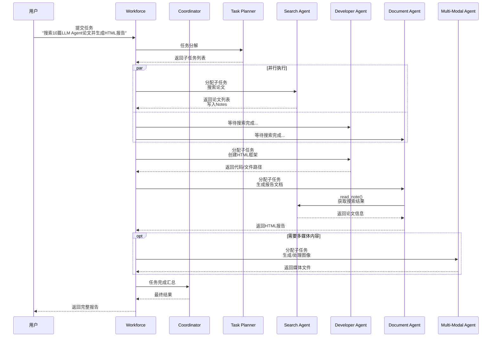
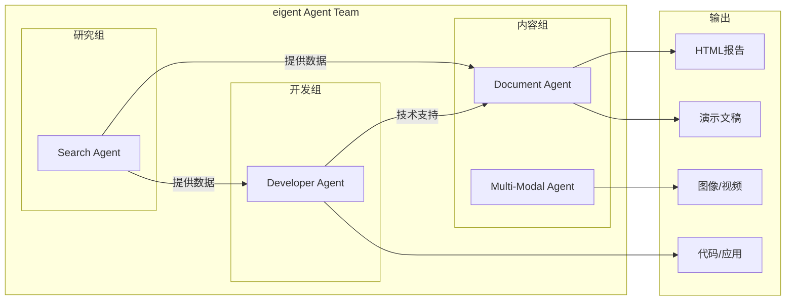

# 01-eigent 整体架构分析

**分析对象**: `examples/workforce/eigent.py`  
**代码版本**: CAMEL v0.2.85  
**分析日期**: 2026-02-08

---

## TL;DR

eigent.py 是 CAMEL Workforce 多Agent协作的**最佳实践示例**，展示如何构建一个由4个专业Agent组成的智能团队，通过协调器统一调度，完成复杂任务（如：搜索论文并生成HTML报告）。

---

## 1. 文件结构概览

```
eigent.py (1126 lines)
├── 1. 导入与配置 (lines 1-60)
│   ├── 工具包导入 (28-52)
│   └── 工作目录配置 (58-60)
│
├── 2. 消息处理工具 (lines 63-112)
│   └── send_message_to_user() - 统一消息发送
│
├── 3. Agent 工厂函数 (lines 115-904)
│   ├── developer_agent_factory()    # Lead Software Engineer
│   ├── search_agent_factory()       # Senior Research Analyst
│   ├── document_agent_factory()     # Documentation Specialist
│   ├── multi_modal_agent_factory()  # Creative Content Specialist
│   └── social_medium_agent_factory()# Social Media Manager (注释)
│
├── 4. 主函数与Workforce构建 (lines 907-1126)
│   ├── 模型初始化 (926-940)
│   ├── Agent创建 (1019-1031)
│   ├── 通信工具注册 (1035-1043)
│   ├── Workforce组装 (1061-1094)
│   ├── 任务定义 (1097-1105)
│   └── 任务执行 (1108)
│
└── 5. 日志输出 (1111-1122)
    └── Workforce KPI 和日志导出
```

---

## 2. 执行流程图



---

## 3. 核心设计理念

### 3.1 分层架构

```
┌────────────────────────────────────────┐
│           任务层 (Task Layer)           │
│    用户输入 → Task对象 → 执行结果        │
├────────────────────────────────────────┤
│         协调层 (Workforce Layer)        │
│  Coordinator + Task Planner + Workers   │
├────────────────────────────────────────┤
│          Agent层 (Agent Layer)          │
│     4个 Specialist ChatAgents           │
├────────────────────────────────────────┤
│          工具层 (Toolkit Layer)         │
│     15+ 工具包 → 60+ 具体工具           │
├────────────────────────────────────────┤
│         集成层 (Integration Layer)      │
│    AgentCommunication + MessageHandler  │
└────────────────────────────────────────┘
```

### 3.2 Agent 专业化分工



### 3.3 协作模式

| 模式 | 说明 | 示例 |
|------|------|------|
| **顺序协作** | Agent A 完成后 Agent B 开始 | Search → Document |
| **并行协作** | 多个Agent同时工作 | Search + Multi-Modal |
| **工具共享** | 通过 Notes 共享信息 | read_note() / create_note() |
| **消息通知** | 实时通知用户进度 | send_message_to_user() |

---

## 4. 关键配置参数

### 4.1 Workforce 配置

```python
workforce = Workforce(
    'A workforce',
    graceful_shutdown_timeout=30.0,   # 优雅关闭超时
    share_memory=False,                # 不共享内存
    coordinator_agent=coordinator_agent,
    task_agent=task_agent,
    new_worker_agent=new_worker_agent,
    use_structured_output_handler=False,
    task_timeout_seconds=900.0,        # 任务超时: 15分钟
)
```

### 4.2 模型配置

```python
# 主力模型 - GPT-4.1
model_backend = ModelFactory.create(
    model_platform=ModelPlatformType.OPENAI,
    model_type=ModelType.GPT_4_1,
    model_config_dict={"stream": False},  # 注意: 非流式
)

# 推理模型 - GPT-4.1 (同样配置)
model_backend_reason = ModelFactory.create(
    model_platform=ModelPlatformType.OPENAI,
    model_type=ModelType.GPT_4_1,
    model_config_dict={"stream": False},
)
```

> ⚠️ **重要**: eigent.py 中 `stream=False`，说明 Workforce 场景不使用流式输出。

---

## 5. 代码组织模式

### 5.1 工厂模式 (Factory Pattern)

```python
def xxx_agent_factory(model: BaseModelBackend, task_id: str) -> ChatAgent:
    r"""工厂函数统一结构"""
    # 1. 初始化消息集成
    message_integration = ToolkitMessageIntegration(...)
    
    # 2. 初始化工具包
    toolkit = XxxToolkit(...)
    
    # 3. 注册消息处理
    toolkit = message_integration.register_toolkits(toolkit)
    
    # 4. 组装工具列表
    tools = [...]
    
    # 5. 定义 System Message (XML格式)
    system_message = """
    <role>...</role>
    <team_structure>...</team_structure>
    <capabilities>...</capabilities>
    """
    
    # 6. 返回 ChatAgent
    return ChatAgent(
        system_message=...,
        model=model,
        tools=tools,
    )
```

### 5.2 System Message 结构

每个 Agent 的 System Message 采用 **XML 标签结构**：

```xml
<role>
    角色定义和核心职责
</role>

<team_structure>
    团队成员介绍和协作关系
</team_structure>

<operating_environment>
    系统信息、工作目录、当前日期
</operating_environment>

<mandatory_instructions>
    必须遵守的指令规则
</mandatory_instructions>

<capabilities>
    可用能力详细说明
</capabilities>

<xxx_workflow>
    具体工作流程指导
</xxx_workflow>
```

---

## 6. 数据流分析

### 6.1 任务输入到输出的完整流程

```mermaid
flowchart TB
    Start([用户输入]) --> Task[Task对象创建]
    
    Task --> Decompose[Workforce任务分解]
    Decompose --> Subtask1[子任务1: 搜索论文]
    Decompose --> Subtask2[子任务2: 创建HTML]
    Decompose --> Subtask3[子任务3: 生成报告]
    
    Subtask1 --> SA[Search Agent]
    SA --> Notes1[写入Notes<br/>论文列表]
    
    Subtask2 --> DA[Developer Agent]
    DA --> File1[创建HTML框架文件]
    
    Subtask3 --> DOC[Document Agent]
    DOC --> ReadNotes[read_note()<br/>获取论文信息]
    Notes1 --> ReadNotes
    DOC --> File2[生成最终HTML报告]
    
    File1 --> Collect[结果收集]
    File2 --> Collect
    
    Collect --> Result[Task.result<br/>完整报告内容]
    Result --> End([返回用户])
```

---

## 7. 日志与监控

### 7.1 内置日志功能

```python
# 打印 Workforce 执行树
print(workforce.get_workforce_log_tree())

# 获取 KPI 指标
kpis = workforce.get_workforce_kpis()
for key, value in kpis.items():
    print(f"{key}: {value}")

# 导出日志到文件
workforce.dump_workforce_logs("eigent_logs.json")
```

### 7.2 实时消息通知

```python
def send_message_to_user(message_title, message_description, message_attachment=""):
    r"""统一消息发送函数
    
    使用场景:
    - Announce what you are about to do
    - Report the result of an action
    - Report a created file
    - State a decision
    - Give a status update
    """
    print(f"\nAgent Message:\n{message_title} \n{message_description}\n")
    return "Message successfully sent"
```

---

## 8. 总结

### 8.1 架构亮点

1. **清晰的职责分离** - 4个专业Agent各司其职
2. **统一的消息系统** - ToolkitMessageIntegration 统一处理
3. **灵活的协作模式** - Notes共享 + 消息通知
4. **完整的工具链** - 覆盖网络、代码、文档、多媒体

### 8.2 适用场景

-  复杂多步骤任务
-  需要多种技能协作
-  研究型任务（搜索+分析+报告）
-  内容创作（文档+多媒体）

### 8.3 局限性

- ⚠️ 非流式输出
- ⚠️ 依赖外部API（OpenAI）
- ⚠️ 工具调用可能产生高额费用

---

## 9. 下一步阅读

- [[02-Agent工厂模式]] - 深入了解5个工厂函数的设计
- [[03-工具集成与消息系统]] - Toolkit集成机制
- [[04-Workforce构建与协作]] - Workforce初始化和任务分配
