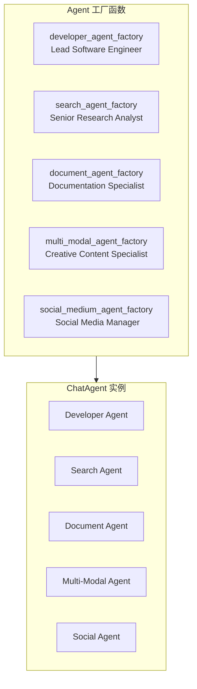

# 02-Agent 工厂模式

**分析对象**: eigent.py 中的 5 个 Agent Factory Functions  
**分析日期**: 2026-02-08

---

## TL;DR

eigent.py 使用**工厂模式**创建 5 个专业 Agent，每个工厂遵循统一结构：**消息集成 → 工具初始化 → 工具注册 → System Message 定义 → Agent 创建**。这种模式实现了 Agent 配置的标准化和可复用。

---

## 1. 工厂模式总览

### 1.1 工厂函数列表



### 1.2 统一接口

```python
def xxx_agent_factory(
    model: BaseModelBackend,      # 模型后端
    task_id: str,                 # 任务ID
) -> ChatAgent:                  # 返回 ChatAgent
    ...
```

---

## 2. 工厂函数标准结构

所有工厂函数遵循 **6 步标准流程**：

```python
def xxx_agent_factory(model: BaseModelBackend, task_id: str):
    # Step 1: 初始化消息集成
    message_integration = ToolkitMessageIntegration(
        message_handler=send_message_to_user
    )
    
    # Step 2: 初始化工具包
    toolkit1 = XxxToolkit(...)
    toolkit2 = XxxToolkit(...)
    
    # Step 3: 注册消息处理到工具包
    toolkit1 = message_integration.register_toolkits(toolkit1)
    toolkit2 = message_integration.register_toolkits(toolkit2)
    
    # Step 4: 组装工具列表
    tools = [
        HumanToolkit().ask_human_via_console,
        *toolkit1.get_tools(),
        *toolkit2.get_tools(),
    ]
    
    # Step 5: 定义 System Message (XML格式)
    system_message = """
    <role>...</role>
    <team_structure>...</team_structure>
    ...
    """
    
    # Step 6: 创建并返回 ChatAgent
    return ChatAgent(
        system_message=BaseMessage.make_assistant_message(...),
        model=model,
        tools=tools,
        toolkits_to_register_agent=[...],  # 可选
    )
```

---

## 3. 各 Agent 详细分析

### 3.1 Developer Agent (开发者Agent)

```python
def developer_agent_factory(model: BaseModelBackend, task_id: str):
    # 工具包配置
    screenshot_toolkit = ScreenshotToolkit(working_directory=WORKING_DIRECTORY)
    terminal_toolkit = TerminalToolkit(safe_mode=True, clone_current_env=False)
    note_toolkit = NoteTakingToolkit(working_directory=WORKING_DIRECTORY)
    web_deploy_toolkit = WebDeployToolkit()
    
    tools = [
        HumanToolkit().ask_human_via_console,
        *terminal_toolkit.get_tools(),      # 终端操作
        *note_toolkit.get_tools(),          # 笔记管理
        *web_deploy_toolkit.get_tools(),    # Web部署
        *screenshot_toolkit.get_tools(),    # 截图/GUI
    ]
```

**核心能力**:
-  代码编写与执行
-  终端命令执行 (root级别)
-  GUI自动化 (AppleScript/pyautogui)
-  Web应用部署

**System Message 亮点**:
```xml
<capabilities>
- **Unrestricted Code Execution**: 
  必须先保存代码到文件，然后从终端运行
  
- **Full Terminal Control**: 
  root级别访问，可以安装任何工具
  
- **Desktop Automation**: 
  macOS优先AppleScript，其他用pyautogui
  
- **Solution Verification**: 
  立即在终端测试和验证解决方案
</capabilities>

<philosophy>
- **Bias for Action**: 采取行动而不是建议
- **Complete the Full Task**: 完成整个工作流
- **Embrace Challenges**: 从不说"I can't"
</philosophy>
```

---

### 3.2 Search Agent (搜索Agent)

```python
def search_agent_factory(model: BaseModelBackend, task_id: str):
    # 浏览器工具包 - 定制工具集
    custom_tools = [
        "browser_open", "browser_close", "browser_back",
        "browser_forward", "browser_click", "browser_type",
        "browser_enter", "browser_switch_tab", "browser_visit_page",
        "browser_get_som_screenshot",
    ]
    web_toolkit = HybridBrowserToolkit(
        headless=False,
        enabled_tools=custom_tools,
        stealth=True,                    # 防检测模式
        session_id=agent_id,
        default_start_url="https://search.brave.com/",
    )
    
    tools = [
        *web_toolkit.get_tools(),        # 浏览器操作
        search_toolkit,                  # Google搜索
        *note_toolkit.get_tools(),       # 笔记记录
    ]
```

**核心能力**:
-  多搜索引擎 (Google, Bing, Exa)
-  浏览器自动化 (Playwright)
-  详细笔记记录 (必须记录所有发现)
-  来源引用 (必须包含URL)

**强制指令** (Mandatory Instructions):
```xml
<mandatory_instructions>
- You MUST use the note-taking tools to record your findings
- You MUST only use URLs from trusted sources
- You are strictly forbidden from inventing URLs
- You MUST NOT answer from your own knowledge
- Record ALL relevant details, do not summarize
</mandatory_instructions>
```

**研究工作流**:
```
1. Initial Search: 使用 search_google/search_bing 获取URL列表
2. Browser Exploration: 使用 browser_visit_page 打开页面
3. Visual Analysis: 使用 browser_get_som_screenshot 理解页面
4. Interaction: 使用 browser_click/browser_type 操作
5. Documentation: 使用 create_note 记录完整发现
```

---

### 3.3 Document Agent (文档Agent)

```python
def document_agent_factory(model: BaseModelBackend, task_id: str):
    toolkits = [
        FileToolkit(working_directory=WORKING_DIRECTORY),
        PPTXToolkit(working_directory=WORKING_DIRECTORY),
        MarkItDownToolkit(),              # Markdown转换
        ExcelToolkit(working_directory=WORKING_DIRECTORY),
        NoteTakingToolkit(working_directory=WORKING_DIRECTORY),
    ]
```

**文档读取能力**:
| 格式 | 扩展名 | 用途 |
|------|--------|------|
| PDF | .pdf | 文档解析 |
| Word | .doc, .docx | Office文档 |
| Excel | .xls, .xlsx | 表格数据 |
| PowerPoint | .ppt, .pptx | 演示文稿 |
| EPUB | .epub | 电子书 |
| Images | .jpg, .png | OCR识别 |
| Audio | .mp3, .wav | 转录 |
| Archive | .zip | 压缩包 |

**文档创建能力**:
- Markdown, HTML, JSON, YAML, CSV
- Word (.docx) - 带格式
- PowerPoint - 专业演示文稿
- PDF - LaTeX数学表达式
- Excel - 多工作表、图表

**工作流程**:
```xml
<document_creation_workflow>
1. 使用 read_note 收集其他Agent的信息
2. 使用终端工具生成图表 (plotly/matplotlib)
3. 使用 write_to_file 创建HTML报告
4. 使用 create_presentation 创建PPT
</document_creation_workflow>
```

---

### 3.4 Multi-Modal Agent (多媒体Agent)

```python
def multi_modal_agent_factory(model: BaseModelBackend, task_id: str):
    toolkits = [
        VideoDownloaderToolkit(working_directory=WORKING_DIRECTORY),
        AudioAnalysisToolkit(),           # 音频分析
        ImageAnalysisToolkit(),           # 图像分析
        OpenAIImageToolkit(               # DALL-E图像生成
            model="dall-e-3",
            size="1024x1024",
        ),
    ]
```

**能力矩阵**:

| 类型 | 输入 | 输出 | 工具 |
|------|------|------|------|
| 视频 | URL/本地 | 分析、转录 | VideoDownloaderToolkit |
| 音频 | MP3/WAV/OGG | 转录文本、问答 | AudioAnalysisToolkit |
| 图像 | URL/本地 | 描述、OCR、问答 | ImageAnalysisToolkit |
| 图像生成 | 文本提示 | 1024x1024图像 | OpenAIImageToolkit (DALL-E) |

---

### 3.5 Social Medium Agent (社交媒体Agent) [注释]

虽然被注释，但展示了扩展模式：

```python
def social_medium_agent_factory(model: BaseModelBackend, task_id: str):
    toolkits = [
        WhatsAppToolkit(),
        TwitterToolkit(),
        LinkedInToolkit(),
        RedditToolkit(),
        NotionToolkit(),
        SlackToolkit(),
    ]
```

---

## 4. System Message 设计模式

### 4.1 XML 标签结构

所有 Agent 的 System Message 采用统一的 XML 结构：

```xml
<role>
    角色定位和核心身份
</role>

<team_structure>
    团队成员及其职责：
    - Agent A: 职责描述
    - Agent B: 职责描述
    协作关系说明
</team_structure>

<operating_environment>
    - **System**: {platform.system()} ({platform.machine()})
    - **Working Directory**: `{WORKING_DIRECTORY}`
    - **Current Date**: {datetime.date.today()}
</operating_environment>

<mandatory_instructions>
    必须遵守的强制规则（通常是 3-5 条）
</mandatory_instructions>

<capabilities>
    详细的能力清单，包括：
    - 核心功能
    - 工具使用说明
    - 最佳实践
</capabilities>

<xxx_workflow>
    特定于该角色的工作流程
</xxx_workflow>

<philosophy> (Developer Agent特有)
    工作哲学和价值观
</philosophy>
```

### 4.2 动态变量注入

使用 f-string 注入动态信息：

```python
system_message = f"""
<operating_environment>
- **System**: {platform.system()} ({platform.machine()})
- **Working Directory**: `{WORKING_DIRECTORY}`
- **Current Date**: {datetime.date.today()}.
</operating_environment>
"""
```

---

## 5. 工具注册模式

### 5.1 三种注册方式

```python
# 方式1: 通过 toolkit.get_tools()
tools = [
    *terminal_toolkit.get_tools(),
    *note_toolkit.get_tools(),
]

# 方式2: 通过单个函数
search_tool = SearchToolkit().search_google
tools = message_integration.register_functions([search_tool])

# 方式3: 通过 toolkits_to_register_agent 参数
return ChatAgent(
    ...,
    toolkits_to_register_agent=[screenshot_toolkit],
)
```

### 5.2 ToolkitMessageIntegration 的作用

```python
# 所有工具包都经过 message_integration 包装
message_integration = ToolkitMessageIntegration(
    message_handler=send_message_to_user
)

toolkit = message_integration.register_toolkits(toolkit)
```

**效果**: 每个工具执行时都会触发 `send_message_to_user`，向用户报告进度。

---

## 6. 对比分析

### 6.1 Agent 能力对比

| Agent | 核心工具数 | 主要输出 | 依赖其他Agent |
|-------|-----------|---------|--------------|
| Developer | 4 | 代码、应用、文件 | 否 |
| Search | 5 | 笔记(数据) | 否 |
| Document | 6 | 文档、PPT、Excel | 是(读取Notes) |
| Multi-Modal | 4 | 图像、音频、视频 | 否 |

### 6.2 System Message 长度对比

```
Developer:     ~280 lines  (最长，包含详细终端/编程指导)
Search:        ~240 lines  (研究工作流详细)
Document:      ~220 lines  (文档格式说明)
Multi-Modal:   ~140 lines  (相对简洁)
Social:        ~100 lines  (被注释)
```

---

## 7. 设计亮点总结

### 7.1 为什么使用工厂模式？

| 优势 | 说明 |
|------|------|
| **标准化** | 所有Agent遵循统一创建流程 |
| **可配置** | 通过参数调整Agent行为 |
| **可复用** | 工厂函数可在其他项目使用 |
| **可测试** | 便于单元测试 |

### 7.2 System Message 设计原则

1. **XML结构化** - 便于LLM理解层次
2. **动态注入** - 运行时信息(日期、系统)
3. **强制指令分离** - mandatory_instructions 强调关键规则
4. **工作流示例** - 提供具体操作步骤

### 7.3 工具选择策略

- **核心工具**: HumanToolkit (所有Agent)
- **专业工具**: 每个Agent有专属工具包
- **共享工具**: NoteTakingToolkit (协作关键)
- **消息工具**: 通过 ToolkitMessageIntegration 统一注入

---

## 8. 下一步阅读

- [[03-工具集成与消息系统]] - Toolkit 集成机制详解
- [[04-Workforce构建与协作]] - Workforce 组装和任务分配
- [[05-对ERNIE-SQL的启示]] - 如何应用到 ERNIE-SQL 项目
