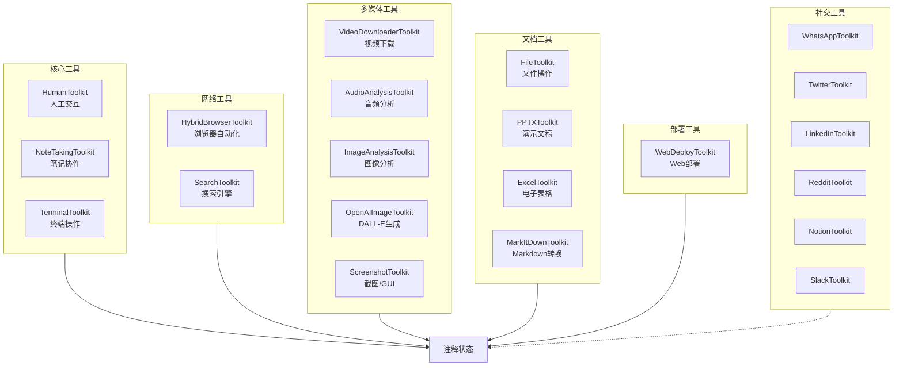
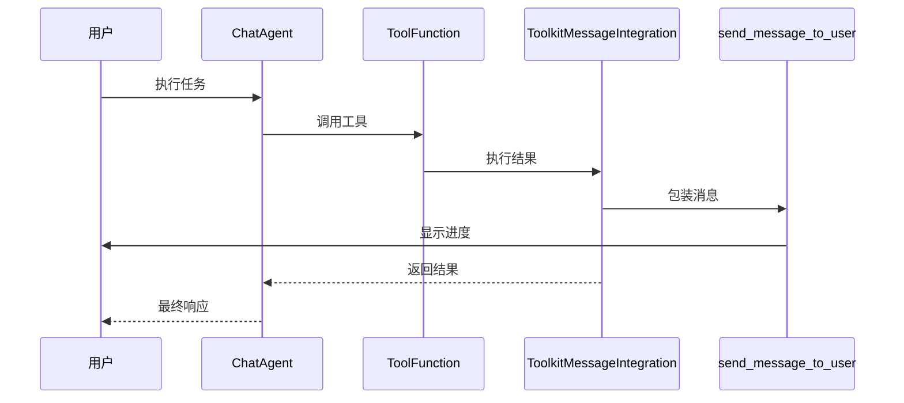
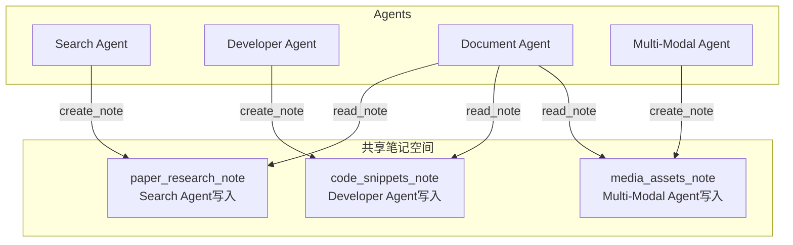
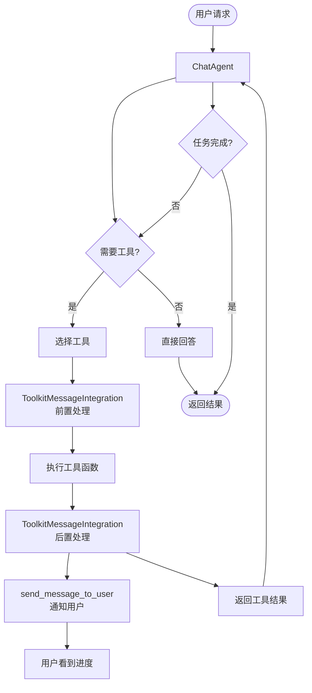

# 03-工具集成与消息系统

**分析对象**: eigent.py 中的 Toolkit 集成与 Agent 通信机制  
**分析日期**: 2026-02-08

---

## TL;DR

eigent.py 使用 **ToolkitMessageIntegration** 实现统一的消息路由，配合 **AgentCommunicationToolkit** 实现 Agent 间通信。共集成 15+ 工具包，提供 60+ 具体工具。

---

## 1. 工具包全景图

### 1.1 工具包清单



### 1.2 各 Agent 工具配置

| Agent | 工具包数量 | 主要工具 | 特殊配置 |
|-------|-----------|---------|---------|
| Developer | 4 | Terminal, Note, Screenshot, Deploy | safe_mode=True |
| Search | 5 | HybridBrowser, Terminal, Note, Search | stealth=True |
| Document | 6 | File, PPTX, Excel, MarkItDown, Note | - |
| Multi-Modal | 4 | Video, Audio, Image, DALL-E | dall-e-3 |

---

## 2. ToolkitMessageIntegration 机制

### 2.1 核心作用

```python
from camel.toolkits import ToolkitMessageIntegration

# 初始化消息集成
message_integration = ToolkitMessageIntegration(
    message_handler=send_message_to_user
)

# 注册到工具包
toolkit = message_integration.register_toolkits(toolkit)
```

**效果**: 每个工具执行后，自动调用 `send_message_to_user` 向用户报告。

### 2.2 消息处理流程



### 2.3 send_message_to_user 实现

```python
def send_message_to_user(
    message_title: str,
    message_description: str,
    message_attachment: str = "",
) -> str:
    r"""统一消息发送函数
    
    使用场景:
    1. Announce what you are about to do
       例: "Starting Task", "Searching for papers..."
    
    2. Report the result of an action  
       例: "Search Complete", "Found 15 papers"
    
    3. Report a created file
       例: "File Ready", "report.pdf"
    
    4. State a decision
       例: "Next Step", "Analyzing top 10 papers"
    
    5. Give a status update
       例: 长时间任务的进度更新
    """
    print(f"\nAgent Message:\n{message_title} \n{message_description}\n")
    if message_attachment:
        print(message_attachment)
    
    logger.info(f"Agent Message: {message_title} {message_description}")
    
    return f"Message successfully sent to user"
```

### 2.4 消息注册方式

```python
# 方式1: 注册整个 Toolkit
toolkit = message_integration.register_toolkits(toolkit)

# 方式2: 注册单个函数
functions = message_integration.register_functions([search_toolkit])

# 方式3: 包装特定工具
tools = [
    HumanToolkit().ask_human_via_console,  # 不包装
    *message_integration.register_toolkits(terminal_toolkit).get_tools(),
]
```

---

## 3. AgentCommunicationToolkit (Agent间通信)

### 3.1 初始化与注册

```python
from camel.toolkits import AgentCommunicationToolkit

# 初始化通信工具包
msg_toolkit = AgentCommunicationToolkit(max_message_history=100)

# 注册所有 Agent
msg_toolkit.register_agent("Worker", new_worker_agent)
msg_toolkit.register_agent("Search_Agent", search_agent)
msg_toolkit.register_agent("Developer_Agent", developer_agent)
msg_toolkit.register_agent("Document_Agent", document_agent)
msg_toolkit.register_agent("Multi_Modal_Agent", multi_modal_agent)

# 获取通信工具
communication_tools = msg_toolkit.get_tools()
# 包括: send_message, list_available_agents
```

### 3.2 Agent 通信流程

```mermaid
sequenceDiagram
    participant DOC as Document Agent
    participants MSG as AgentCommunicationToolkit
    participant SA as Search Agent
    
    DOC->>MSG: list_available_agents()
    MSG-->>DOC: ["Search_Agent", "Developer_Agent", ...]
    
    DOC->>MSG: send_message(
        recipient="Search_Agent",
        content="Need more details about paper X"
    )
    MSG->>SA: 转发消息
    SA-->>MSG: 回复
    MSG-->>DOC: 返回回复
```

### 3.3 实际使用场景

在 eigent.py 中，Agent 通信工具包被创建但没有实际添加到所有 Agent（注释状态）：

```python
# 代码中被注释的部分
# communication_tools = msg_toolkit.get_tools()
# for agent in [coordinator_agent, task_agent, ...]:
#     for tool in communication_tools:
#         agent.add_tool(tool)
```

**原因**: 实际协作主要通过 **NoteTakingToolkit** 实现（见下文）。

---

## 4. NoteTakingToolkit (笔记协作系统)

### 4.1 核心作用

eigent.py 中 **最关键的协作机制**，所有 Agent 共享笔记系统：

```python
# 每个 Agent 都有 NoteTakingToolkit
note_toolkit = NoteTakingToolkit(working_directory=WORKING_DIRECTORY)

# Search Agent 写入发现
create_note(title="Paper Research", content="Found 10 papers...")

# Document Agent 读取信息
read_note(note_id="paper_research_note")
```

### 4.2 笔记系统架构



### 4.3 笔记 API

```python
# 创建笔记
create_note(
    title="Research Results",
    content="详细的研究发现...",
    tags=["papers", "llm"]
)

# 追加内容
append_note(
    note_id="research_note",
    content="Additional findings..."
)

# 读取笔记
content = read_note(note_id="research_note")

# 列出笔记
notes = list_notes()
```

---

## 5. 关键工具包详解

### 5.1 HybridBrowserToolkit (混合浏览器)

```python
custom_tools = [
    "browser_open",
    "browser_close", 
    "browser_back",
    "browser_forward",
    "browser_click",
    "browser_type",
    "browser_enter",
    "browser_switch_tab",
    "browser_visit_page",
    "browser_get_som_screenshot",  # 重要: 获取可交互元素截图
]

web_toolkit = HybridBrowserToolkit(
    headless=False,              # 有头模式(可见)
    enabled_tools=custom_tools,  # 启用特定工具
    browser_log_to_file=True,    # 记录日志
    stealth=True,                # 反检测模式
    session_id=agent_id,         # 会话隔离
    viewport_limit=False,        # 无视口限制
    cache_dir=WORKING_DIRECTORY, # 缓存目录
    default_start_url="https://search.brave.com/",
)
```

**特点**:
- 基于 Playwright
- 支持 `browser_get_som_screenshot` (Set-of-Mark 截图)
- stealth 模式绕过 bot 检测

### 5.2 TerminalToolkit (终端工具)

```python
terminal_toolkit = TerminalToolkit(
    safe_mode=True,           # 安全模式
    clone_current_env=False,  # 不克隆当前环境
)
```

**提供的工具**:
```python
- shell_exec()         # 执行命令
- shell_kill_process() # 终止进程
# 等10+终端相关工具
```

### 5.3 SearchToolkit (搜索工具)

```python
# 使用方式 - 获取特定搜索函数
search_google = SearchToolkit().search_google
search_bing = SearchToolkit().search_bing
search_exa = SearchToolkit().search_exa
```

**支持的搜索引擎**:
- Google Search
- Bing Search  
- Baidu Search
- Exa (AI搜索引擎)
- Bocha Search
- DuckDuckGo

---

## 6. 工具调用数据流

### 6.1 完整调用链路



### 6.2 实际调用示例

```python
# Document Agent 的工作流程

# Step 1: 读取 Search Agent 的笔记
note_content = read_note(note_id="research_note")
# → ToolkitMessageIntegration 拦截
# → send_message_to_user("Reading Note", "Getting research data from Search Agent")

# Step 2: 生成图表
shell_exec(command="python generate_chart.py")
# → ToolkitMessageIntegration 拦截
# → send_message_to_user("Generating Chart", "Creating data visualization")

# Step 3: 创建HTML报告
write_to_file(filepath="report.html", content=html_content)
# → ToolkitMessageIntegration 拦截
# → send_message_to_user("File Ready", "HTML report generated", "report.html")
```

---

## 7. 日志与监控

### 7.1 Workforce 日志系统

```python
# 打印执行树
print(workforce.get_workforce_log_tree())
# 输出: 层级化的任务执行记录

# 获取 KPI
kpis = workforce.get_workforce_kpis()
# {
#   "total_tasks": 5,
#   "completed_tasks": 5,
#   "failed_tasks": 0,
#   "average_execution_time": 120.5
# }

# 导出日志
workforce.dump_workforce_logs("eigent_logs.json")
```

### 7.2 日志结构

```json
{
  "workforce_id": "workforce_xxx",
  "tasks": [
    {
      "task_id": "task_1",
      "assignee": "Search_Agent",
      "status": "completed",
      "start_time": "2026-02-08T10:00:00",
      "end_time": "2026-02-08T10:05:00",
      "tool_calls": [
        {"tool": "search_google", "timestamp": "..."},
        {"tool": "create_note", "timestamp": "..."}
      ]
    }
  ]
}
```

---

## 8. 工具集成最佳实践

### 8.1 eigent.py 的设计选择

| 设计决策 | 说明 | 优点 |
|---------|------|------|
| 统一消息处理 | ToolkitMessageIntegration | 用户实时了解进度 |
| 笔记共享 | NoteTakingToolkit | Agent间数据传递 |
| 工具定制 | enabled_tools 参数 | 按需启用，减少干扰 |
| 会话隔离 | session_id | 防止Agent间干扰 |

### 8.2 对 ERNIE-SQL 的启示

```python
# 推荐的工具配置模式

# 1. 数据分析 Agent
def data_analyst_factory(model, task_id):
    message_integration = ToolkitMessageIntegration(
        message_handler=send_message_to_user
    )
    
    # 数据相关工具
    db_toolkit = DatabaseToolkit(connection=...)
    analysis_toolkit = DataAnalysisToolkit()
    
    tools = [
        *message_integration.register_toolkits(db_toolkit).get_tools(),
        *message_integration.register_toolkits(analysis_toolkit).get_tools(),
        *NoteTakingToolkit().get_tools(),  # 共享笔记
    ]
    
    return ChatAgent(..., tools=tools)
```

---

## 9. 下一步阅读

- [[04-Workforce构建与协作]] - Workforce 初始化与任务分配
- [[05-对ERNIE-SQL的启示]] - 如何应用到数据分析场景
