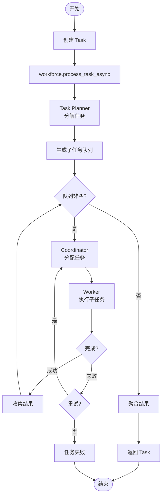
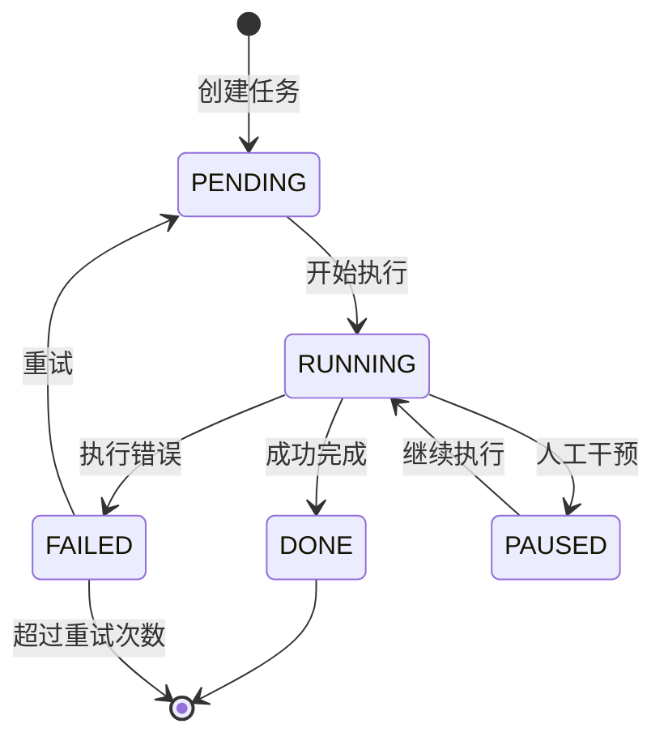
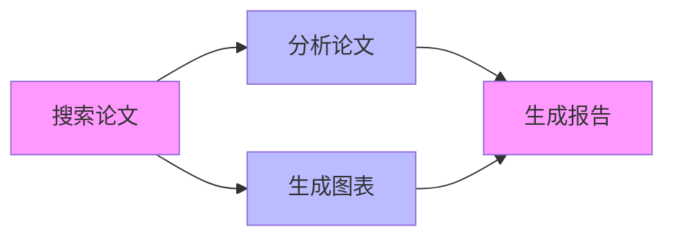

# 04-Workforce 构建与协作

**分析对象**: eigent.py 中的 Workforce 初始化、Worker 注册和任务执行  
**分析日期**: 2026-02-08

---

## TL;DR

eigent.py 构建了一个 **Workforce** 实例，包含 3 个内部 Agent（Coordinator、Task Planner、New Worker）和 4 个外部 Worker（Search、Developer、Document、Multi-Modal）。通过 `add_single_agent_worker()` 注册 Worker，最终调用 `process_task_async()` 执行任务。

---

## 1. Workforce 架构图

```mermaid
flowchart TB
    subgraph WF[" Workforce 'A workforce'"]
        direction TB
        
        subgraph Internal["内部 Agents"]
            CO[Coordinator Agent<br/>任务分配器]
            TP[Task Planner Agent<br/>任务规划器]
            NW[New Worker Agent<br/>动态Worker模板]
        end
        
        subgraph External["外部 Workers"]
            SA[Search Agent<br/> 网络研究]
            DA[Developer Agent<br/> 代码开发]
            DOC[Document Agent<br/> 文档处理]
            MM[Multi-Modal Agent<br/> 多媒体]
        end
        
        subgraph Channel["Task Channel"]
            Queue[任务队列]
        end
    end
    
    subgraph Input["输入"]
        Task[Task对象<br/>content="搜索10篇论文..."]
    end
    
    subgraph Output["输出"]
        Result[Task.result<br/>完整HTML报告]
    end
    
    Input --> WF
    CO --> TP
    TP --> Queue
    Queue --> External
    External --> Result
```

---

## 2. Workforce 初始化

### 2.1 完整配置

```python
workforce = Workforce(
    # 基础配置
    'A workforce',                          # Workforce 名称
    
    # 超时配置
    graceful_shutdown_timeout=30.0,         # 优雅关闭超时(秒)
    task_timeout_seconds=900.0,             # 任务超时(15分钟)
    
    # 内部 Agents
    coordinator_agent=coordinator_agent,    # 协调器
    task_agent=task_agent,                  # 任务规划器
    new_worker_agent=new_worker_agent,      # 动态Worker模板
    
    # 功能开关
    share_memory=False,                     # 不共享内存
    use_structured_output_handler=False,    # 不使用结构化输出
)
```

### 2.2 内部 Agent 创建

```python
# 1. Coordinator Agent - 协调器
coordinator_agent = ChatAgent(
    system_message="""
    You are a helpful coordinator.
    - You are now working in system {platform.system()}...
    - If a task assigned to another agent fails, you should re-assign it 
      to the `Developer_Agent`. The `Developer_Agent` is a powerful agent 
      with terminal access and can resolve a wide range of issues.
    """,
    model=model_backend_reason,
    tools=[*NoteTakingToolkit(...).get_tools()],
)

# 2. Task Planner Agent - 任务规划器
task_agent = ChatAgent(
    system_message="""
    You are a helpful task planner.
    - You are now working in system {platform.system()}...
    """,
    model=model_backend_reason,
    tools=[*NoteTakingToolkit(...).get_tools()],
)

# 3. New Worker Agent - 动态Worker模板
new_worker_agent = ChatAgent(
    system_message="""
    You are a helpful worker. When you complete your task, your final 
    response must be a comprehensive summary...
    You can also communicate with other agents using messaging tools...
    """,
    model=model_backend,
    tools=[
        HumanToolkit().ask_human_via_console,
        *message_integration.register_toolkits(
            NoteTakingToolkit(working_directory=WORKING_DIRECTORY)
        ).get_tools(),
    ],
)
```

---

## 3. Worker 注册

### 3.1 add_single_agent_worker 方法

```python
workforce.add_single_agent_worker(
    "Search Agent: An expert web researcher that can browse websites, "
    "perform searches, and extract information to support other agents.",
    worker=search_agent,
).add_single_agent_worker(
    "Developer Agent: A master-level coding assistant with a powerful "
    "terminal. It can write and execute code, manage files, automate "
    "desktop tasks, and deploy web applications...",
    worker=developer_agent,
).add_single_agent_worker(
    "Document Agent: A document processing assistant skilled in creating "
    "and modifying a wide range of file formats...",
    worker=document_agent,
).add_single_agent_worker(
    "Multi-Modal Agent: A specialist in media processing. It can "
    "analyze images and audio, transcribe speech, download videos...",
    worker=multi_modal_agent,
)
```

### 3.2 Worker 注册流程

```mermaid
sequenceDiagram
    participant User as 用户代码
    participant WF as Workforce
    participant Registry as Worker Registry
    
    User->>WF: add_single_agent_worker(
        description="...",
        worker=search_agent
    )
    
    WF->>Registry: 注册 Worker
    Registry->>Registry: 存储 Worker + Description
    
    WF-->>User: 返回 self (链式调用)
    
    User->>WF: add_single_agent_worker(...)
    WF->>Registry: 注册下一个 Worker
    WF-->>User: 返回 self
```

### 3.3 Worker 描述的重要性

```python
# Coordinator 使用 description 来理解 Worker 能力
description = """
Search Agent: An expert web researcher that can browse websites, 
perform searches, and extract information to support other agents.
"""
```

**作用**:
- Coordinator Agent 根据描述选择最合适的 Worker
- 描述应包含 Worker 的核心能力和专长
- 类似 "Agent 的简历"

---

## 4. 任务定义与执行

### 4.1 Task 对象创建

```python
from camel.tasks.task import Task

human_task = Task(
    content="""
    search 10 different papers related to llm agent 
    and write a html report about them.
    """,
    id='0',
    # 可选字段
    # type=TaskType.RESEARCH,
    # additional_info={},
)
```

### 4.2 任务执行流程



### 4.3 实际执行代码

```python
# 异步执行（推荐）
await workforce.process_task_async(human_task)

# 同步执行（内部包装了异步）
workforce.process_task(human_task)
```

---

## 5. 任务分解与分配机制

### 5.1 Task Planner 的工作

```python
# 自动任务分解 (AUTO_DECOMPOSE 模式)
subtasks = await workforce.handle_decompose_append_task(task)

# 或预定义管道 (PIPELINE 模式)
workforce.set_pipeline_tasks([
    Task(content="搜索论文", id="1"),
    Task(content="生成报告", id="2", dependencies=["1"]),
])
```

### 5.2 Coordinator 的任务分配逻辑

```python
# Coordinator 基于以下信息选择 Worker:
# 1. Worker description
# 2. 当前任务内容
# 3. Worker 可用性
# 4. 历史成功率

# 伪代码示例
if "搜索" in task.content or "网页" in task.content:
    return "Search_Agent"
elif "代码" in task.content or "开发" in task.content:
    return "Developer_Agent"
elif "文档" in task.content or "报告" in task.content:
    return "Document_Agent"
```

---

## 6. 任务状态机

### 6.1 TaskState 枚举

```python
from camel.tasks.task import TaskState

class TaskState(Enum):
    PENDING = "pending"      # 等待执行
    RUNNING = "running"      # 执行中
    DONE = "done"            # 完成
    FAILED = "failed"        # 失败
    PAUSED = "paused"        # 暂停 (interactive模式)
```

### 6.2 状态转换



---

## 7. 任务依赖与并行执行

### 7.1 依赖关系设置

```python
# 创建带依赖的任务
task_a = Task(content="搜索论文", id="A")
task_b = Task(content="分析论文", id="B", dependencies=["A"])
task_c = Task(content="生成图表", id="C", dependencies=["A"])
task_d = Task(content="生成报告", id="D", dependencies=["B", "C"])

# 设置管道
workforce.set_pipeline_tasks([task_a, task_b, task_c, task_d])
workforce.mode = WorkforceMode.PIPELINE
```

### 7.2 并行执行示例



- B 和 C 可以**并行执行**
- D 必须等待 B 和 C **都完成**

---

## 8. 错误处理与重试

### 8.1 自动重试机制

```python
workforce = Workforce(
    'A workforce',
    # 任务失败后重试次数
    max_task_retries=3,  # 默认
)
```

### 8.2 失败处理策略

```python
# Coordinator 的失败处理逻辑
# 当 Worker 失败时:

# 1. 重试同一 Worker
if retry_count < max_retries:
    reassign_to_same_worker()

# 2. 切换到 Developer Agent
# (eigent.py 中 Coordinator 的特殊指令)
if task_failed:
    reassign_to_developer_agent()

# 3. 创建新 Worker
if all_workers_failed:
    create_new_worker()
```

---

## 9. 执行监控与日志

### 9.1 实时监控

```python
# 执行中监控
while workforce.is_running:
    status = workforce.get_status()
    print(f"Pending: {status.pending}, Running: {status.running}")
    await asyncio.sleep(1)
```

### 9.2 执行后分析

```python
# 打印执行树
print("\n--- Workforce Log Tree ---")
print(workforce.get_workforce_log_tree())
# 输出:
# Workforce 'A workforce'
# ├── Task 0: search 10 papers...
# │   ├── Subtask 1: Search for papers
# │   │   └── Search_Agent: COMPLETED (45s)
# │   └── Subtask 2: Generate HTML report
# │       └── Document_Agent: COMPLETED (30s)

# KPI 指标
print("\n--- Workforce KPIs ---")
kpis = workforce.get_workforce_kpis()
for key, value in kpis.items():
    print(f"{key}: {value}")
# 输出:
# total_tasks: 5
# completed_tasks: 5
# failed_tasks: 0
# average_execution_time: 75.2s

# 导出详细日志
log_file_path = "eigent_logs.json"
workforce.dump_workforce_logs(log_file_path)
```

---

## 10. 执行模式对比

### 10.1 AUTO_DECOMPOSE vs PIPELINE

| 特性 | AUTO_DECOMPOSE | PIPELINE |
|------|----------------|----------|
| 任务分解 | 自动 | 手动预定义 |
| 灵活性 | 高 | 低 |
| 可控性 | 低 | 高 |
| 适用场景 | 开放式任务 | 固定流程 |
| 依赖支持 | 有限 | 完整 |

### 10.2 eigent.py 的选择

```python
# eigent.py 使用默认的 AUTO_DECOMPOSE 模式
# (不设置 mode，默认为 auto_decompose)

workforce = Workforce('A workforce', ...)
# mode 默认为 WorkforceMode.AUTO_DECOMPOSE

# 如果要使用 PIPELINE 模式:
# workforce.mode = WorkforceMode.PIPELINE
# workforce.set_pipeline_tasks([...])
```

---

## 11. 内存与状态管理

### 11.1 share_memory 参数

```python
workforce = Workforce(
    'A workforce',
    share_memory=False,  # eigent.py 设置
    ...
)
```

| 设置 | 效果 | 适用场景 |
|------|------|---------|
| `True` | 所有 Agent 共享记忆 | 需要全局上下文 |
| `False` | 每个 Agent 独立记忆 | Agent 职责清晰分离 |

### 11.2 状态持久化

```python
# 保存状态
snapshot = workforce.create_snapshot()

# 恢复状态
workforce.load_snapshot(snapshot)

# 用于: 暂停/恢复、断点续传
```

---

## 12. 总结

### 12.1 eigent.py 的 Workforce 特点

| 特点 | 说明 |
|------|------|
| **3+4 Agent 架构** | 3内部 + 4外部 Worker |
| **职责分离** | Coordinator 分配、Task Planner 分解、Workers 执行 |
| **链式注册** | `add_single_agent_worker().add_single_agent_worker()` |
| **异步执行** | `process_task_async()` 非阻塞 |
| **完整监控** | Log Tree + KPI + JSON 导出 |

### 12.2 关键代码模式

```python
# 标准 Workforce 构建流程

# 1. 创建内部 Agents
coordinator_agent = ChatAgent(...)
task_agent = ChatAgent(...)
new_worker_agent = ChatAgent(...)

# 2. 创建 Workforce
workforce = Workforce(
    'Name',
    coordinator_agent=coordinator_agent,
    task_agent=task_agent,
    new_worker_agent=new_worker_agent,
    ...
)

# 3. 注册 Workers
workforce.add_single_agent_worker("Description", worker=agent1)
workforce.add_single_agent_worker("Description", worker=agent2)

# 4. 执行任务
result = await workforce.process_task_async(Task(content="..."))
```

---

## 13. 下一步阅读

- [[05-对ERNIE-SQL的启示]] - 如何应用到数据分析项目
