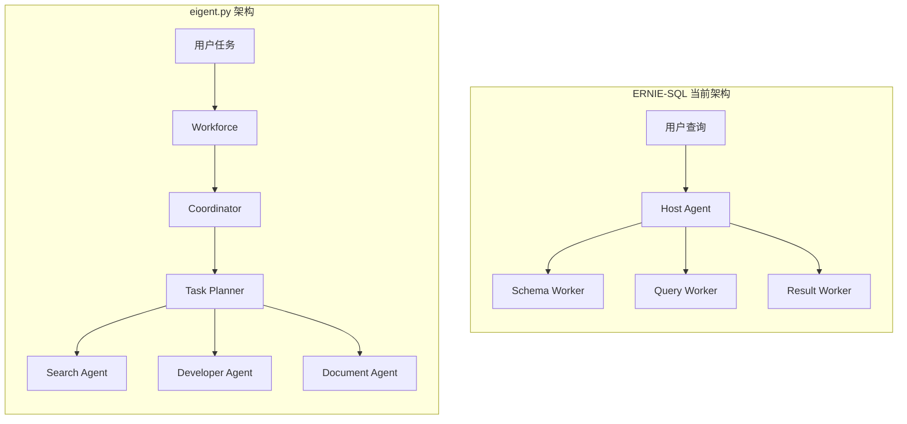
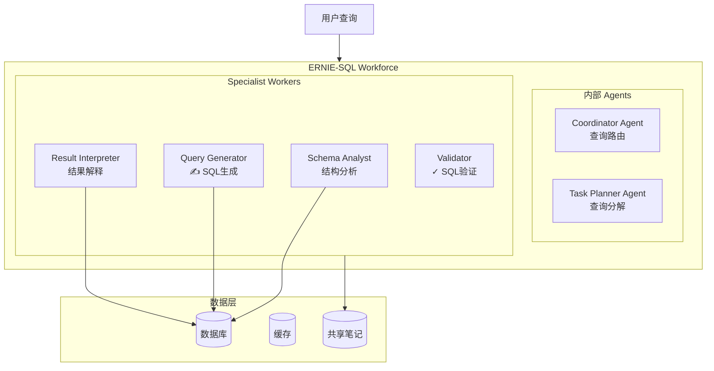

# 05-对 ERNIE-SQL 的启示

**分析对象**: eigent.py 架构对 ERNIE-SQL 项目的借鉴意义  
**分析日期**: 2026-02-08

---

## TL;DR

eigent.py 展示了 **Workforce 多Agent协作** 的最佳实践。对 ERNIE-SQL 的核心启示：**分层架构**（Coordinator + Specialists）、**工厂模式**创建 Agent、**Note 共享**实现协作、**消息集成**提供进度反馈。

---

## 1. ERNIE-SQL 现状 vs eigent 架构

### 1.1 当前架构对比



### 1.2 核心差异

| 维度 | ERNIE-SQL 当前 | eigent.py |
|------|---------------|-----------|
| **协调机制** | Host Agent 直接调用 Workers | Workforce + Coordinator + Task Planner |
| **Agent 创建** | 类继承 | 工厂函数 |
| **协作方式** | 函数调用 | Note 共享 + 消息通知 |
| **进度反馈** | 有限 | ToolkitMessageIntegration |
| **任务分解** | 固定流程 | 自动分解 (AUTO_DECOMPOSE) |

---

## 2. 可借鉴的设计模式

### 2.1 Agent 工厂模式

**当前 ERNIE-SQL**:
```python
class SchemaAgent(BaseWorker):
    def __init__(self):
        super().__init__()
        
class QueryAgent(BaseWorker):
    def __init__(self):
        super().__init__()
```

**借鉴 eigent 改进**:
```python
def schema_agent_factory(model: BaseModelBackend, task_id: str):
    r"""Schema 分析 Agent 工厂"""
    message_integration = ToolkitMessageIntegration(
        message_handler=send_message_to_user
    )
    
    # 数据相关工具
    db_toolkit = DatabaseToolkit(connection=db_conn)
    note_toolkit = NoteTakingToolkit(working_directory=WORKING_DIRECTORY)
    
    # 注册消息处理
    db_toolkit = message_integration.register_toolkits(db_toolkit)
    note_toolkit = message_integration.register_toolkits(note_toolkit)
    
    tools = [
        *db_toolkit.get_tools(),      # 获取表结构、字段信息
        *note_toolkit.get_tools(),    # 记录 schema 信息
    ]
    
    system_message = f"""
    <role>
    You are a Database Schema Analyst, specialized in understanding 
    database structures and their relationships.
    </role>
    
    <capabilities>
    - Analyze database schemas
    - Identify table relationships
    - Document schema information in notes
    </capabilities>
    
    <mandatory_instructions>
    - You MUST use create_note to record schema information
    - Include table names, column types, and relationships
    </mandatory_instructions>
    """
    
    return ChatAgent(
        system_message=BaseMessage.make_assistant_message(
            role_name="Schema Analyst",
            content=system_message,
        ),
        model=model,
        tools=tools,
    )


def query_agent_factory(model: BaseModelBackend, task_id: str):
    r"""SQL 生成 Agent 工厂"""
    # ... 类似结构
    tools = [
        # SQL 生成工具
        # Note 读取工具 (获取 schema 信息)
    ]
    # ...
```

### 2.2 System Message XML 结构

**推荐模板**:
```xml
<role>
    你在 ERNIE-SQL 团队中的角色定位
</role>

<team_structure>
    你与其他 Agent 的协作关系：
    - Schema Analyst: 提供数据库结构信息
    - Query Generator: 编写 SQL 查询
    - Result Interpreter: 解释查询结果
</team_structure>

<operating_environment>
    - **Database**: {db_type} ({db_version})
    - **Working Directory**: {WORKING_DIRECTORY}
    - **Current Time**: {datetime.now()}
</operating_environment>

<mandatory_instructions>
    - 必须遵守的规则
    - 输出格式要求
    - 错误处理方式
</mandatory_instructions>

<capabilities>
    你的具体能力清单
</capabilities>

<workflow>
    标准工作流程步骤
</workflow>
```

### 2.3 Note 共享机制

**ERNIE-SQL 协作流程**:

```mermaid
sequenceDiagram
    participant User as 用户
    participant SA as Schema Agent
    participant QA as Query Agent
    participant RI as Result Agent
    participant Notes as 共享笔记
    
    User->>SA: 查询需求
    SA->>SA: 分析数据库结构
    SA->>Notes: create_note("schema_info", 
           "tables: users, orders...")
    
    SA->>QA: 任务完成
    QA->>Notes: read_note("schema_info")
    Notes-->>QA: 返回 schema 信息
    QA->>QA: 生成 SQL
    QA->>Notes: create_note("sql_query",
           "SELECT * FROM...")
    
    QA->>RI: 任务完成
    RI->>Notes: read_note("sql_query")
    RI->>RI: 执行并解释结果
    RI->>User: 返回最终答案
```

**实现代码**:
```python
# Schema Agent
schema_info = analyze_database_schema()
create_note(
    title="Schema Analysis",
    content=schema_info,
    tags=["schema", db_name]
)

# Query Agent 读取
schema_note = read_note(note_id="schema_analysis_note")
sql = generate_sql(user_query, schema_note.content)
create_note(
    title="Generated SQL",
    content=sql,
    tags=["sql", "query"]
)

# Result Agent 读取
sql_note = read_note(note_id="generated_sql_note")
result = execute_sql(sql_note.content)
```

---

## 3. Workforce 架构迁移方案

### 3.1 推荐架构



### 3.2 实施步骤

**Step 1: 创建 Agent 工厂**
```python
# agents/factories.py

def create_ernie_workforce(model_backend, db_connection):
    r"""创建 ERNIE-SQL Workforce"""
    
    # 内部 Agents
    coordinator = ChatAgent(
        system_message="You are a SQL query coordinator...",
        model=model_backend,
    )
    
    task_planner = ChatAgent(
        system_message="You break down SQL tasks into steps...",
        model=model_backend,
    )
    
    new_worker = ChatAgent(
        system_message="You are a flexible SQL worker...",
        model=model_backend,
    )
    
    # 创建 Workforce
    workforce = Workforce(
        'ERNIE-SQL Workforce',
        coordinator_agent=coordinator,
        task_agent=task_planner,
        new_worker_agent=new_worker,
        task_timeout_seconds=300.0,
    )
    
    # 注册 Specialist Workers
    schema_agent = schema_agent_factory(model_backend, db_connection)
    query_agent = query_agent_factory(model_backend, db_connection)
    result_agent = result_agent_factory(model_backend, db_connection)
    
    workforce.add_single_agent_worker(
        "Schema Analyst: Analyzes database schemas, tables, columns, "
        "and relationships. Creates detailed schema documentation.",
        worker=schema_agent,
    ).add_single_agent_worker(
        "Query Generator: Writes optimized SQL queries based on "
        "schema information and user requirements.",
        worker=query_agent,
    ).add_single_agent_worker(
        "Result Interpreter: Executes SQL queries and interprets "
        "results in natural language.",
        worker=result_agent,
    )
    
    return workforce
```

**Step 2: 定义任务流程**
```python
async def process_sql_query(workforce, user_query: str) -> str:
    r"""处理 SQL 查询请求"""
    
    task = Task(
        content=f"""
        User Query: {user_query}
        
        Please:
        1. Analyze the database schema
        2. Generate appropriate SQL
        3. Execute and interpret results
        4. Return a natural language answer
        """,
        id='sql_query_task',
    )
    
    result = await workforce.process_task_async(task)
    return result.result
```

**Step 3: 进度反馈集成**
```python
def send_progress_update(title: str, description: str):
    r"""发送进度更新"""
    # 可以发送到 WebSocket、前端 UI、日志等
    print(f"[ERNIE-SQL] {title}: {description}")
    
    # 例如: 发送到前端
    # websocket.send(json.dumps({
    #     "type": "progress",
    #     "title": title,
    #     "description": description
    # }))

# 在工厂中使用
message_integration = ToolkitMessageIntegration(
    message_handler=send_progress_update
)
```

---

## 4. 关键技术决策

### 4.1 是否使用 Workforce？

| 方案 | 适用场景 | 建议 |
|------|---------|------|
| **使用 Workforce** | 复杂查询、多步骤分析、需要自动分解 |  推荐 |
| **保持 Host-Worker** | 简单查询、固定流程、低延迟要求 | ⚠️ 可选 |

### 4.2 Agent 数量设计

**最小可行架构** (MVP):
```
- Coordinator
- Task Planner
- SQL Analyst (合并 Schema + Query + Result)
```

**完整架构**:
```
- Coordinator
- Task Planner
- Schema Analyst
- Query Generator
- Result Interpreter
- Query Validator (可选)
```

### 4.3 流式输出处理

eigent.py 不使用流式输出 (`stream=False`)，但 ERNIE-SQL 可能需要：

```python
# 方案1: 单 Agent 流式 + Workforce 协调
async def stream_sql_analysis(workforce, query: str):
    # Phase 1: Workforce 规划 (非流式)
    plan = await workforce.plan_task(query)
    yield {"type": "plan", "content": plan.steps}
    
    # Phase 2: 单 Agent 流式执行
    analyst = ChatAgent(...)
    stream = await analyst._astream(plan.sql)
    async for chunk in stream:
        yield {"type": "analysis", "content": chunk.content}

# 方案2: 仅最终结果
result = await workforce.process_task_async(task)
yield {"type": "result", "content": result.result}
```

---

## 5. 代码实现参考

### 5.1 完整的 ERNIE-SQL Workforce 示例

```python
# ernie_workforce.py

import asyncio
from datetime import datetime
from camel.agents import ChatAgent
from camel.messages.base import BaseMessage
from camel.models import ModelFactory
from camel.societies.workforce import Workforce
from camel.tasks.task import Task
from camel.toolkits import NoteTakingToolkit, HumanToolkit
from camel.toolkits.toolkit_decorator import ToolkitDecorator
from camel.types import ModelPlatformType, ModelType

WORKING_DIRECTORY = "./ernie_working_dir"


def send_progress(title: str, description: str, attachment: str = ""):
    r"""发送进度更新"""
    print(f"\n ERNIE-SQL: {title}")
    print(f"   {description}")
    if attachment:
        print(f"    {attachment}")
    return "Progress sent"


def schema_analyst_factory(model, db_config):
    r"""Schema 分析 Agent"""
    from camel.toolkits import DatabaseToolkit
    
    db_toolkit = DatabaseToolkit(**db_config)
    note_toolkit = NoteTakingToolkit(working_directory=WORKING_DIRECTORY)
    
    system_msg = f"""
    <role>
    You are a Database Schema Analyst for ERNIE-SQL.
    Your job is to understand database structures and document them.
    </role>
    
    <mandatory_instructions>
    - Use create_note to document all tables and columns
    - Include data types, constraints, and relationships
    </mandatory_instructions>
    """
    
    return ChatAgent(
        system_message=BaseMessage.make_assistant_message(
            role_name="Schema Analyst",
            content=system_msg,
        ),
        model=model,
        tools=[
            *db_toolkit.get_tools(),
            *note_toolkit.get_tools(),
        ],
    )


def query_generator_factory(model, db_config):
    r"""SQL 生成 Agent"""
    note_toolkit = NoteTakingToolkit(working_directory=WORKING_DIRECTORY)
    
    system_msg = """
    <role>
    You are a SQL Query Generator for ERNIE-SQL.
    You write optimized SQL based on schema information.
    </role>
    
    <mandatory_instructions>
    - Read schema notes before writing SQL
    - Use create_note to store generated SQL
    - Validate SQL syntax
    </mandatory_instructions>
    """
    
    return ChatAgent(
        system_message=BaseMessage.make_assistant_message(
            role_name="Query Generator",
            content=system_msg,
        ),
        model=model,
        tools=[
            *note_toolkit.get_tools(),
        ],
    )


async def create_ernie_workforce(db_config):
    r"""创建 ERNIE-SQL Workforce"""
    
    model = ModelFactory.create(
        model_platform=ModelPlatformType.OPENAI,
        model_type=ModelType.GPT_4O,
        model_config_dict={"temperature": 0.2},
    )
    
    # Workforce 内部 Agents
    coordinator = ChatAgent(
        system_message="You coordinate SQL analysis tasks...",
        model=model,
    )
    
    task_planner = ChatAgent(
        system_message="You break down SQL queries into analysis steps...",
        model=model,
    )
    
    new_worker = ChatAgent(
        system_message="You are a flexible SQL assistant...",
        model=model,
        tools=[HumanToolkit().ask_human_via_console],
    )
    
    # 创建 Workforce
    workforce = Workforce(
        'ERNIE-SQL',
        coordinator_agent=coordinator,
        task_agent=task_planner,
        new_worker_agent=new_worker,
        task_timeout_seconds=300.0,
    )
    
    # 注册 Workers
    workforce.add_single_agent_worker(
        "Schema Analyst: Analyzes database schemas and documents structure",
        worker=schema_analyst_factory(model, db_config),
    ).add_single_agent_worker(
        "Query Generator: Writes SQL queries based on schema and requirements",
        worker=query_generator_factory(model, db_config),
    )
    
    return workforce


async def main():
    db_config = {
        "host": "localhost",
        "port": 3306,
        "database": "mydb",
        "user": "user",
        "password": "pass",
    }
    
    workforce = await create_ernie_workforce(db_config)
    
    task = Task(
        content="What are the top 5 customers by total order amount?",
        id='query_1',
    )
    
    result = await workforce.process_task_async(task)
    print(f"\n Result: {result.result}")


if __name__ == "__main__":
    asyncio.run(main())
```

---

## 6. 迁移路线图

### 6.1 阶段规划

```
Phase 1: 基础迁移 (1-2周)
├── 创建 Agent 工厂函数
├── 集成 NoteTakingToolkit
└── 基础 Workforce 结构

Phase 2: 功能完善 (2-3周)
├── 完善 System Messages
├── 添加进度反馈
├── 错误处理优化

Phase 3: 性能优化 (1-2周)
├── 并行执行优化
├── 缓存机制
└── 日志监控
```

### 6.2 风险与缓解

| 风险 | 影响 | 缓解措施 |
|------|------|---------|
| Workforce 延迟 | 高 | 保持简单 Agent 数量，优化超时设置 |
| Tool 调用成本 | 中 | 添加缓存，限制 tool 调用次数 |
| 复杂性增加 | 中 | 良好的文档和监控 |
| 调试困难 | 中 | 完善的日志和 Workforce 可视化 |

---

## 7. 总结

### 7.1 核心借鉴点

| eigent.py 特性 | ERNIE-SQL 应用 |
|---------------|---------------|
| Agent 工厂模式 | 标准化 Agent 创建 |
| XML System Message | 清晰的角色定义 |
| Note 共享机制 | Agent 间数据传递 |
| ToolkitMessageIntegration | 用户进度反馈 |
| Workforce 协调 | 复杂查询自动分解 |

### 7.2 推荐实现优先级

1. **高优先级**: Agent 工厂 + Note 共享
2. **中优先级**: XML System Message 结构
3. **低优先级**: 完整 Workforce 迁移

### 7.3 关键决策

-  采用工厂模式创建 Agents
-  使用 NoteTakingToolkit 实现协作
- ⚠️ 评估 Workforce vs Host-Worker 架构
- ⚠️ 保持非流式或混合流式策略

---

## 参考文档

- [[01-eigent整体架构分析]]
- [[02-Agent工厂模式]]
- [[03-工具集成与消息系统]]
- [[04-Workforce构建与协作]]
