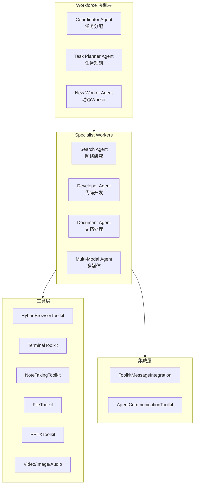

# eigent.py 架构全景索引

**文件路径**: `examples/workforce/eigent.py`  
**所属项目**: CAMEL-AI Framework v0.2.85  
**定位**: Workforce 多Agent协作最佳实践示例  
**代码行数**: ~1126行  
**分析日期**: 2026-02-08

---

## 什么是 eigent?

**eigent** = **E**nterprise **I**ntelligent A**gent** **T**eam

OWL 官方 README 明确推荐：
> "If you want to build the best performing agents powered by workforce, 
> please check out **eigent.py**"

这是 CAMEL 当前版本 (v0.2.85) 中 **Workforce 多Agent协作的标杆实现**。

---

## 核心架构



---

## 文档导航

| 序号 | 文档 | 核心内容 | 状态 |
|------|------|----------|------|
| 01 | [[01-eigent整体架构分析]] | 文件结构、执行流程、设计理念 |  |
| 02 | [[02-Agent工厂模式]] | 5个工厂函数、System Prompt设计、角色定义 |  |
| 03 | [[03-工具集成与消息系统]] | Toolkit集成、消息路由、Agent通信 |  |
| 04 | [[04-Workforce构建与协作]] | Workforce初始化、Worker注册、任务分配 |  |
| 05 | [[05-对ERNIE-SQL的启示]] | 架构借鉴、实现建议、迁移路径 |  |

---

## 快速参考

### Agent 类型对照表

| Agent | 角色 | 核心工具 | 职责 |
|-------|------|----------|------|
| Search Agent | Senior Research Analyst | Browser, Search, Terminal | 网络研究、信息收集 |
| Developer Agent | Lead Software Engineer | Terminal, Screenshot, Deploy | 代码开发、系统操作 |
| Document Agent | Documentation Specialist | File, PPTX, Excel, Markdown | 文档创建、报告生成 |
| Multi-Modal Agent | Creative Content Specialist | Video, Audio, Image, DALL-E | 多媒体处理、内容生成 |

### 关键代码段

```python
# Agent 工厂函数
search_agent = search_agent_factory(model_backend, task_id)
developer_agent = developer_agent_factory(model_backend, task_id)

# Workforce 构建
workforce = Workforce('A workforce', ...)
workforce.add_single_agent_worker("Search Agent", worker=search_agent)

# 任务执行
await workforce.process_task_async(human_task)
```

---

## 与 OWL 的对比

| 对比项 | OWL (旧版) | eigent.py (推荐) |
|--------|------------|------------------|
| CAMEL版本 | 旧版本 | v0.2.85 (最新) |
| 维护状态 | 可能滞后 | 官方推荐 |
| 架构复杂度 | 高 | 中等 |
| 学习曲线 | 陡峭 | 平缓 |
| 生产适用性 | 需评估 | 推荐 |

---

## 参考链接

- [CAMEL Workforce 文档](https://docs.camel-ai.org/)
- [eigent.py 源码](https://github.com/camel-ai/camel/blob/master/examples/workforce/eigent.py)
- [OWL 项目](https://github.com/camel-ai/owl)

---

*索引创建日期: 2026-02-08*  
*维护者: AI协作助手*
