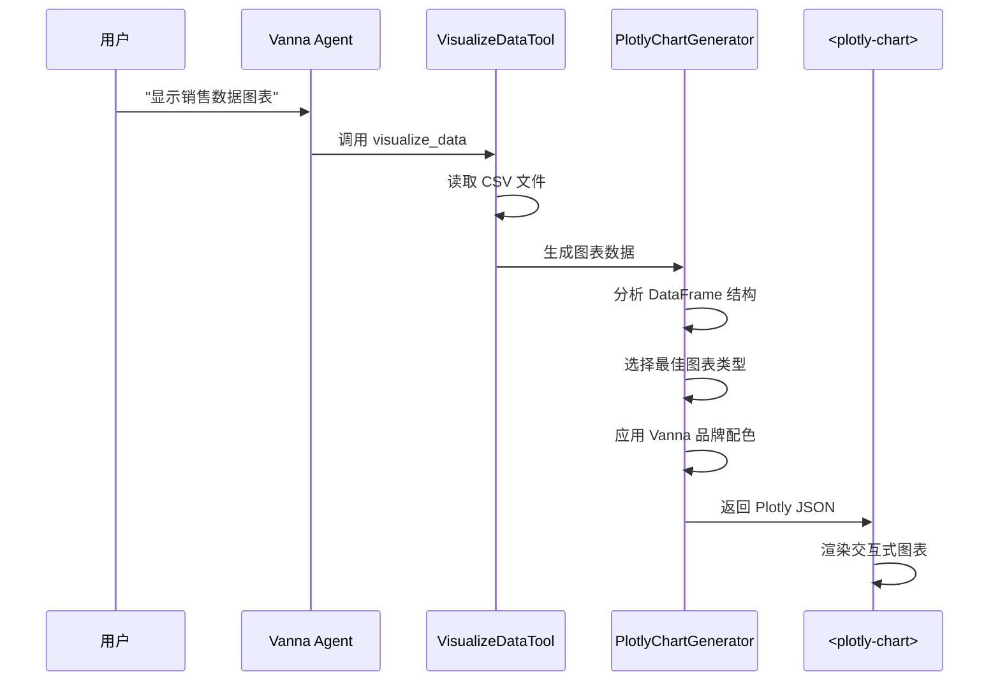

# Vanna 前端与可视化功能分析

## 概述

Vanna 2.0 采用了现代化的前后端分离架构，前端基于 **Lit Web Components** 构建，提供了一套完整的聊天界面和数据可视化能力。与 DB-GPT 和 RAGFlow 不同，Vanna 专注于 SQL 问答场景，提供了更专业、更轻量的前端方案。

---

## 1. 前端方案总览

### 1.1 技术栈

| 层级 | 技术 | 说明 |
|------|------|------|
| 组件框架 | **Lit** | Google 开发的轻量级 Web Components 库 |
| 构建工具 | **Vite** | 快速的前端构建工具 |
| 图表库 | **Plotly.js** | 强大的交互式图表库 |
| 样式方案 | **CSS Variables** | 基于 Design Token 的主题系统 |
| 类型系统 | **TypeScript** | 完整的类型支持 |

### 1.2 架构特点

```
┌─────────────────────────────────────────────────────────────┐
│                    前端架构 (Vanna WebComponent)             │
├─────────────────────────────────────────────────────────────┤
│  应用层  │  vanna-chat (主聊天组件)                           │
│          │  vanna-message (消息渲染)                          │
│          │  vanna-status-bar (状态栏)                         │
├──────────┼───────────────────────────────────────────────────┤
│  组件层  │  Rich Component System                             │
│          │  ├── CardComponentRenderer                         │
│          │  ├── TaskListComponentRenderer                     │
│          │  ├── ProgressBarComponentRenderer                  │
│          │  ├── NotificationComponentRenderer                 │
│          │  ├── DataFrameComponentRenderer                    │
│          │  ├── TextComponentRenderer                         │
│          │  └── PlotlyChart (图表组件)                         │
├──────────┼───────────────────────────────────────────────────┤
│  基础层  │  Design Tokens, API Client, Component Registry     │
└──────────┴───────────────────────────────────────────────────┘
```

### 1.3 输出格式

Vanna Web Components 编译为 **ES Module** 格式：
- 输出文件：`vanna-components.js`
- 格式：ES Module (ES2020+)
- 依赖内置：Lit 和 Plotly.js 被打包到单一文件
- 使用方式：直接通过 `<script type="module">` 引入

---

## 2. Jupyter Notebook 集成

### 2.1 集成方式

Vanna 提供了与 Jupyter/Colab 的无缝集成：

```python
# 在 Jupyter Notebook 中快速启动
from vanna import Agent, AgentConfig
from vanna.servers.fastapi import VannaFastAPIServer

# 创建 Agent
agent = Agent(...)

# 启动服务器（自动检测 Jupyter 环境）
server = VannaFastAPIServer(agent)
server.run()
```

### 2.2 环境适配特性

| 环境 | 处理方式 |
|------|----------|
| 标准 Python | 使用 `uvicorn.run()` 直接启动 |
| Jupyter Notebook | 应用 `nest_asyncio` 处理事件循环 |
| Google Colab | 自动配置端口转发，显示代理 URL |
| 异步环境 | 使用 `asyncio.run(server.serve())` |

### 2.3 Notebook 示例

```python
# notebooks/quickstart.ipynb 展示完整流程
from vanna import Agent, AgentConfig
from vanna.servers.fastapi import VannaFastAPIServer
from vanna.tools import RunSqlTool, VisualizeDataTool
from vanna.integrations.sqlite import SqliteRunner

# 1. 配置工具
tools = ToolRegistry()
tools.register_local_tool(
    RunSqlTool(sql_runner=SqliteRunner(database_path="./Chinook.sqlite")),
    access_groups=['admin', 'user']
)
tools.register_local_tool(VisualizeDataTool(), access_groups=['admin', 'user'])

# 2. 创建 Agent
agent = Agent(llm_service=llm, tool_registry=tools, ...)

# 3. 启动服务器（支持在 Notebook 中运行）
server = VannaFastAPIServer(agent)
server.run()
```

---

## 3. Web UI 分析

### 3.1 核心组件：`<vanna-chat>`

Vanna 的主界面是一个独立的 Web Component，具有以下特性：

**功能特性：**
-  流式响应显示（SSE/WebSocket/Polling）
-  窗口状态管理（正常/最大化/最小化）
-  明暗主题切换
-  响应式布局（移动端适配）
-  富组件渲染（表格、图表、进度条等）

**交互设计：**
```typescript
// vanna-chat.ts 核心属性
@property() title = 'Vanna AI Chat';
@property() placeholder = 'Ask me anything...';
@property({ attribute: 'api-base' }) apiBaseUrl = '';
@property({ attribute: 'sse-endpoint' }) sseEndpoint = '/api/vanna/v2/chat_sse';
@property({ reflect: true }) theme = 'light';
@property() startingState: 'normal' | 'maximized' | 'minimized' = 'normal';
```

### 3.2 UI 布局结构

```
┌─────────────────────────────────────────────────────┐
│  Header (渐变背景)                                    │
│  ├── Logo/Avatar                                      │
│  ├── Title + Subtitle                                 │
│  └── Window Controls (最小化/最大化/关闭)              │
├─────────────────────────────────────────────────────┤
│                    Chat Layout                       │
│  ┌─────────────────────┬─────────────────────────┐  │
│  │                     │                         │  │
│  │   Chat Messages     │       Sidebar           │  │
│  │   (富组件容器)        │  (状态追踪/进度显示)     │  │
│  │                     │                         │  │
│  │  ┌───────────────┐  │  ┌───────────────────┐  │  │
│  │  │ User Message  │  │  │ Status Bar        │  │  │
│  │  └───────────────┘  │  │ Progress Tracker  │  │  │
│  │  ┌───────────────┐  │  └───────────────────┘  │  │
│  │  │ AI Response   │  │                         │  │
│  │  │ - Text        │  │  (桌面端显示，           │  │
│  │  │ - Table       │  │   移动端隐藏)            │  │
│  │  │ - Chart       │  │                         │  │
│  │  └───────────────┘  │                         │  │
│  └─────────────────────┴─────────────────────────┘  │
├─────────────────────────────────────────────────────┤
│  Input Area                                          │
│  ├── Text Input (圆角输入框)                          │
│  └── Send Button (渐变背景圆形按钮)                   │
└─────────────────────────────────────────────────────┘
```

### 3.3 主题系统

Vanna 使用 **Design Tokens** 实现一致的主题：

```typescript
// styles/vanna-design-tokens.js
export const vannaDesignTokens = css`
  :host {
    /* Brand Colors */
    --vanna-navy: #023d60;
    --vanna-cream: #e7e1cf;
    --vanna-teal: #15a8a8;
    --vanna-orange: #fe5d26;
    --vanna-magenta: #bf1363;
    
    /* Semantic Colors */
    --vanna-accent-primary-default: #6366f1;
    --vanna-accent-primary-stronger: #4f46e5;
    --vanna-accent-negative-default: #ef4444;
    --vanna-accent-positive-default: #22c55e;
    
    /* Background */
    --vanna-background-root: #ffffff;
    --vanna-background-default: #f8fafc;
    --vanna-background-higher: #f1f5f9;
    
    /* Spacing */
    --vanna-space-1: 0.25rem;
    --vanna-space-2: 0.5rem;
    --vanna-space-4: 1rem;
    --vanna-space-6: 1.5rem;
    
    /* Animation */
    --vanna-duration-200: 200ms;
    --vanna-duration-300: 300ms;
  }
`;
```

### 3.4 响应式断点

| 断点 | 行为 |
|------|------|
| `< 880px` | 侧边栏隐藏，单栏布局 |
| `< 600px` | 紧凑布局，减小内边距 |
| 桌面端 | 双栏布局（聊天区 + 侧边栏） |

---

## 4. 可视化图表机制

### 4.1 图表生成流程



### 4.2 自动图表类型选择

Vanna 的 `PlotlyChartGenerator` 实现了智能的图表类型选择：

```python
# src/vanna/integrations/plotly/chart_generator.py

def generate_chart(self, df: pd.DataFrame, title: str = "Chart"):
    # 4+ 列 → 表格
    if len(df.columns) >= 4:
        return self._create_table(df, title)
    
    # 时间序列 → 折线图
    if is_timeseries and len(numeric_cols) > 0:
        return self._create_time_series_chart(df, datetime_cols[0], numeric_cols, title)
    
    # 1 个数值列 → 直方图
    elif len(numeric_cols) == 1 and len(categorical_cols) == 0:
        return self._create_histogram(df, numeric_cols[0], title)
    
    # 1 分类 + 1 数值 → 柱状图
    elif len(numeric_cols) == 1 and len(categorical_cols) == 1:
        return self._create_bar_chart(df, categorical_cols[0], numeric_cols[0], title)
    
    # 2 个数值列 → 散点图
    elif len(numeric_cols) == 2:
        return self._create_scatter_plot(df, numeric_cols[0], numeric_cols[1], title)
    
    # 3+ 数值列 → 相关性热力图
    elif len(numeric_cols) >= 3:
        return self._create_correlation_heatmap(df, numeric_cols, title)
```

### 4.3 支持的图表类型

| 图表类型 | 触发条件 | 用途 |
|----------|----------|------|
| 表格 | ≥4 列 | 展示大量结构化数据 |
| 直方图 | 1 数值列 | 数据分布分析 |
| 柱状图 | 1 分类 + 1 数值 | 分类比较 |
| 散点图 | 2 数值列 | 相关性分析 |
| 热力图 | ≥3 数值列 | 多变量相关性 |
| 折线图 | 含时间列 | 趋势分析 |
| 分组柱状图 | ≥2 分类列 | 多维度比较 |

### 4.4 品牌配色方案

```python
# Vanna 品牌色彩系统
THEME_COLORS = {
    "navy": "#023d60",      # 深蓝色
    "cream": "#e7e1cf",     # 奶油色
    "teal": "#15a8a8",      # 青色（主色）
    "orange": "#fe5d26",    # 橙色
    "magenta": "#bf1363",   # 洋红色
}

COLOR_PALETTE = ["#15a8a8", "#fe5d26", "#bf1363", "#023d60"]
```

### 4.5 前端图表组件

```typescript
// plotly-chart.ts - Web Component 封装
@customElement('plotly-chart')
export class PlotlyChart extends LitElement {
  @property({ type: Array }) data: PlotlyData[] = [];
  @property({ type: Object }) layout: PlotlyLayout = {};
  @property({ type: Object }) config = {};
  @property() theme: 'light' | 'dark' = 'dark';

  // Shadow DOM 中的 Plotly 渲染
  private async _renderChart() {
    const layout = this._getDefaultLayout();
    const config = this._getDefaultConfig();
    await Plotly.newPlot(this.plotlyDiv, this.data, layout, config);
  }

  // 响应式调整
  private _setupResizeObserver() {
    this.resizeObserver = new ResizeObserver(() => {
      const width = this.plotlyDiv.offsetWidth;
      Plotly.relayout(this.plotlyDiv, { width });
    });
  }
}
```

---

## 5. 自定义前端集成方式

### 5.1 使用预构建组件（最简单）

```html
<!-- 直接引入 CDN -->
<script src="https://img.vanna.ai/vanna-components.js"></script>

<!-- 在 HTML 中使用 -->
<vanna-chat
  sse-endpoint="https://your-api.com/api/vanna/v2/chat_sse"
  theme="dark"
  title="Data Assistant">
</vanna-chat>
```

### 5.2 React 集成

```jsx
import { useEffect, useRef } from 'react';

function VannaChatComponent() {
  const chatRef = useRef(null);

  useEffect(() => {
    // 动态加载 Vanna Web Components
    import('@vanna/webcomponent');
  }, []);

  return (
    <vanna-chat
      ref={chatRef}
      sse-endpoint="/api/vanna/v2/chat_sse"
      theme="dark"
      title="SQL Assistant"
    />
  );
}
```

### 5.3 Vue 集成

```vue
<template>
  <vanna-chat
    :sse-endpoint="apiEndpoint"
    theme="light"
    title="数据助手"
  />
</template>

<script setup>
import { onMounted } from 'vue';

const apiEndpoint = '/api/vanna/v2/chat_sse';

onMounted(() => {
  import('@vanna/webcomponent');
});
</script>
```

### 5.4 自定义服务器集成

```python
from fastapi import FastAPI
from vanna import Agent
from vanna.servers.fastapi.routes import register_chat_routes
from vanna.servers.base import ChatHandler

# 你的 FastAPI 应用
app = FastAPI()

# 创建 Agent
agent = Agent(...)

# 注册 Vanna 路由
chat_handler = ChatHandler(agent)
register_chat_routes(app, chat_handler)

# 现在有以下端点：
# - POST /api/vanna/v2/chat_sse    (SSE 流式)
# - POST /api/vanna/v2/chat_websocket (WebSocket)
# - POST /api/vanna/v2/chat_poll   (轮询)
```

### 5.5 前端 API 选项

| 属性 | 类型 | 说明 |
|------|------|------|
| `api-base` | string | API 基础 URL |
| `sse-endpoint` | string | SSE 端点路径 |
| `ws-endpoint` | string | WebSocket 端点路径 |
| `poll-endpoint` | string | 轮询端点路径 |
| `theme` | 'light' \| 'dark' | 主题 |
| `title` | string | 聊天窗口标题 |
| `subtitle` | string | 副标题 |
| `placeholder` | string | 输入框占位符 |
| `starting-state` | 'normal' \| 'maximized' \| 'minimized' | 初始状态 |
| `show-progress` | boolean | 是否显示进度 |
| `allow-minimize` | boolean | 允许最小化 |

---

## 6. 与 DB-GPT/RAGFlow 前端的对比

### 6.1 架构对比

| 特性 | Vanna | DB-GPT | RAGFlow |
|------|-------|--------|---------|
| **前端框架** | Lit (Web Components) | React | React |
| **组件形式** | 独立 Web Component | 完整 SPA | 完整 SPA |
| **打包输出** | ES Module (单文件) | 多 chunk 应用 | 多 chunk 应用 |
| **集成方式** | 嵌入任何网页 | 独立部署 | 独立部署 |
| **图表库** | Plotly.js | ECharts | ECharts |
| **状态管理** | 组件内部状态 | Redux/Zustand | Redux |

### 6.2 功能对比

| 功能 | Vanna | DB-GPT | RAGFlow |
|------|-------|--------|---------|
| **对话界面** |  内置 |  完整 |  完整 |
| **SQL 展示** |  可选（按权限） |  有 |  有 |
| **数据表格** |  富组件 |  有 |  有 |
| **图表生成** |  Plotly |  ECharts |  ECharts |
| **流式响应** |  SSE/WS/Polling |  SSE |  SSE |
| **多轮对话** |  支持 |  支持 |  支持 |
| **多语言支持** |  支持 |  支持 |  支持 |
| **Agent 工作流** |  内置 |  复杂 |  复杂 |
| **Canvas 画布** |  无 |  有 |  有 |

### 6.3 适用场景对比

| 场景 | 推荐方案 |
|------|----------|
| **快速集成到现有系统** | Vanna  (一行代码嵌入) |
| **需要 Canvas 可视化** | DB-GPT / RAGFlow |
| **深度定制 UI** | DB-GPT / RAGFlow |
| **SQL 专项问答** | Vanna  (专业优化) |
| **多数据源复杂分析** | DB-GPT / RAGFlow |
| **企业级权限控制** | 三者都支持 |

### 6.4 优劣势分析

#### Vanna 优势
1. **极简集成**：`<vanna-chat>` 一行代码即可嵌入任何网页
2. **框架无关**：Web Components 技术，不依赖 React/Vue/Angular
3. **专注 SQL**：针对 SQL 问答场景深度优化
4. **流式组件**：真正的富组件流式更新（不仅是文本）
5. **用户感知**：从底层设计支持用户权限和隔离

#### Vanna 劣势
1. **UI 定制受限**：Web Component 内部样式较难完全自定义
2. **无 Canvas**：不支持复杂的数据流可视化画布
3. **生态较小**：相比 React 生态，Web Components 工具链较少
4. **功能聚焦**：专注 SQL，其他数据操作能力有限

---

## 7. 关键文件位置

```
Projects/AI数据分析系统/参考项目/vanna/
├── frontends/
│   └── webcomponent/
│       ├── src/
│       │   ├── index.ts                    # 入口文件
│       │   ├── components/
│       │   │   ├── vanna-chat.ts           # 主聊天组件
│       │   │   ├── vanna-message.ts        # 消息组件
│       │   │   ├── plotly-chart.ts         # 图表组件
│       │   │   └── rich-component-system.ts # 富组件系统
│       │   ├── services/
│       │   │   └── api-client.ts           # API 客户端
│       │   └── styles/
│       │       └── vanna-design-tokens.js  # 设计令牌
│       ├── package.json
│       └── vite.config.ts
│
├── src/vanna/
│   ├── integrations/plotly/
│   │   └── chart_generator.py              # Plotly 图表生成
│   ├── tools/
│   │   └── visualize_data.py               # 可视化工具
│   ├── components/rich/data/
│   │   └── chart.py                        # 图表组件定义
│   ├── core/
│   │   └── rich_component.py               # 富组件基类
│   ├── servers/
│   │   ├── fastapi/
│   │   │   ├── app.py                      # FastAPI 服务器
│   │   │   └── routes.py                   # 路由定义
│   │   └── base/
│   │       └── chat_handler.py             # 聊天处理器
│   └── legacy/
│       └── flask/                          # Flask 旧版前端
│
└── notebooks/
    └── quickstart.ipynb                    # Jupyter 示例
```

---

## 8. 总结

Vanna 的前端方案采用了 **Web Components + Plotly** 的技术路线，专注于提供一个**即插即用**的 SQL 问答界面。其核心设计理念是：

1. **极简集成**：通过标准 Web 技术实现跨框架兼容
2. **富组件流式更新**：不只是文本，表格、图表、进度条都能实时流式呈现
3. **用户感知设计**：从 UI 到数据层都支持用户权限和隔离
4. **专注 SQL**：针对数据库问答场景深度优化

对于需要**快速集成 SQL 问答功能**到现有系统的项目，Vanna 的前端方案是一个极佳的选择。对于需要**复杂可视化画布**或**深度 UI 定制**的场景，可能需要考虑 DB-GPT 或 RAGFlow。
