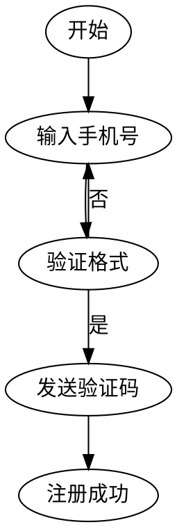

# SVG 探索重要结论：流程图不适合 SVG

## 背景

在探索用 SVG 绘制用户注册流程图时，发现即使经过多轮修复，仍存在大量坐标计算问题和视觉重叠问题。

## 关键结论

> **SVG 不适合做复杂流程图，Graphviz 是更好的选择**

## 原因分析

### 1. 坐标计算复杂

流程图需要精确计算：
- 每个步骤框的位置
- 连接线的起点和终点
- 返回线的复杂路径
- 分支线的交汇点

**示例问题**：
```svg
<!-- 返回线需要计算相对坐标 -->
<path d="M0,-25 L0,-100 L200,-100 L200,-125"/>
<!-- 任何一个坐标错误都会导致线连错地方 -->
```

### 2. 维护成本高

流程调整时需要：
- 重新计算所有受影响的坐标
- 调整多条连接线的路径
- 验证所有元素位置

**对比 Graphviz**：
```dot
// 只需声明关系，自动布局
A -> B -> C;
B -> D;
```

### 3. 已有更好工具

| 工具 | 优势 | 适用场景 |
|------|------|----------|
| **Graphviz** | 自动布局、语法简洁 | 流程图、状态图、类图 |
| **PlantUML** | 文本描述、多图类型 | 时序图、用例图 |
| **Mermaid** | Markdown 集成 | 文档内嵌图表 |

## 建议方案

### 简单流程（3-5步，无分支）
可以用 SVG，例如：
```
开始 → 输入 → 处理 → 输出 → 结束
```

### 复杂流程（有分支、循环）
**推荐使用 Graphviz**：


然后导出 SVG 嵌入：
```bash
dot -Tsvg input.dot -o output.svg
```

## SVG 的适用边界（更新版）

** 适合用 SVG**：
- 静态概念图（架构图、对比图）
- 简单图标和装饰元素
- 需要精确控制样式的配图
- PPT/文章中的装饰性图表
- 时间线、路线图

** 不适合用 SVG**：
- 复杂流程图 → **Graphviz**
- 复杂数据可视化 → **ECharts/D3.js**
- 时序图/类图 → **PlantUML/Mermaid**
- 需要交互的图表 → **D3.js + 框架**

## 教训总结

> "技术选型时，要选择最适合的工具，而不是最熟悉的工具。"

**反思**：
1. 为什么一开始选择 SVG 做流程图？
   - 惯性思维：前面几个图用 SVG 成功了
   - 没有考虑替代方案

2. 应该怎么做？
   - 需求分析阶段就评估工具
   - 复杂流程图优先考虑 Graphviz
   - SVG 用于 Graphviz 无法实现的视觉定制

## 行动项

- [x] 更新 SVG 配图方法论文档
- [x] 标记流程图为"不推荐"
- [x] 沉淀 Graphviz → SVG 的工作流
- [ ] 学习 Graphviz 高级用法
- [ ] 建立"技术选型检查清单"

## 关联文档

- [[svg-illustration-framework]] - SVG 配图方法论
- [[探索汇总-v2]] - 所有探索场景汇总
