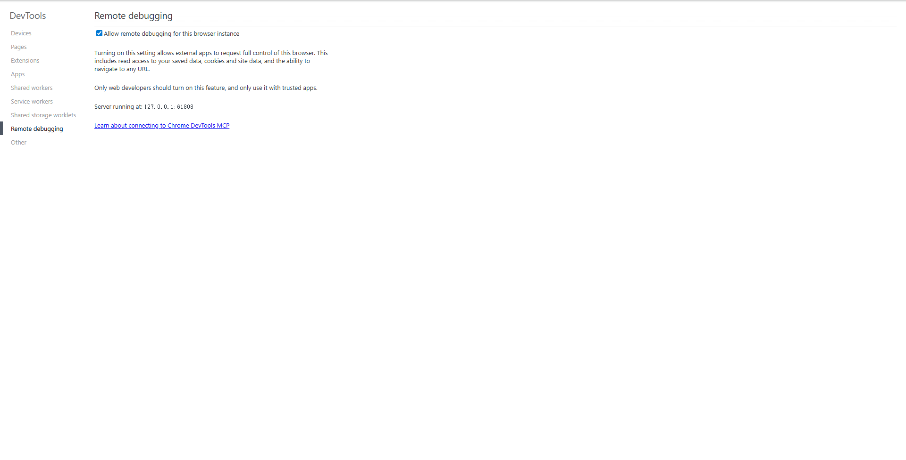

# browser-cli

`browser-cli` is a local control plane for the Chrome session you already have open.

It focuses on one job: attach to the current Chrome through native CDP, keep that connection behind a reusable local daemon, and expose the same workflow through both a CLI and a distributable skill.



## Why browser-cli

- Reuse the current logged-in Chrome instead of launching a fresh automation browser.
- Keep browser state behind a daemon you can inspect, reuse, and stop explicitly.
- Open named tab workers and send repeated actions through the same tab.
- Ship the same operating model as both a CLI project and a `SKILL.md` repo.

## Requirements

- Node.js 22+
- Google Chrome
- Remote debugging enabled for the current browser instance

Open `chrome://inspect/#remote-debugging` and enable `Allow remote debugging for this browser instance`.

## Quick Start

### Clone and run from the repo

```cmd
git clone https://github.com/li-xiu-qi/browser-cli.git
cd browser-cli
bin\browser-cli.cmd doctor
```

### Start or reuse a daemon

```cmd
bin\daemon-start.cmd 54000
bin\browser-cli.cmd status --port 54000
```

You can also run the daemon in the foreground:

```cmd
node src/cli.js serve --port 54000
```

### Open a worker tab

```cmd
bin\browser-cli.cmd tab-open --port 54000 --url https://example.com --id example
bin\browser-cli.cmd snapshot --port 54000 --worker example
```

### Stop the daemon

```cmd
bin\daemon-stop.cmd 54000
```

## Public Surfaces

This repository ships two public entry points:

- a CLI in `src/` with Windows launchers in `bin/`
- a root [SKILL.md](./SKILL.md) plus `agents/openai.yaml` for skill-style distribution

## Core Commands

- `doctor`
- `start`
- `serve`
- `status`
- `stop`
- `tools`
- `tab-open`
- `tab-workers`
- `tab-close`
- `tab-open-batch`
- `call-workers`
- `call-batch`

High-frequency aliases:

- `navigate`
- `snapshot`
- `click`
- `type`
- `press-key`
- `wait-for`
- `network-requests`
- `run-code`
- `screenshot`

## When To Use It

Choose `browser-cli` when the hard part is not generic browser automation, but stable reuse of the current Chrome session, explicit daemon control, and low-friction local workflows.

If you need the broader positioning against related tools, see [Comparison](./docs/comparison.md).

## Project Layout

```text
browser-cli/
├── README.md
├── SKILL.md
├── LICENSE
├── package.json
├── agents/
├── bin/
├── src/
└── docs/
```

## Limits

- Current-browser mode shares cookies, storage, login state, focus, and tab context.
- A fresh controller may trigger a Chrome approval prompt. Reusing the same daemon is the lowest-friction path.
- If Chrome restarts, the daemon session must be established again.
- This project focuses on a practical local control surface, not a full browser abstraction layer.

## Docs

- [Comparison](./docs/comparison.md)
- [Windows notes](./docs/windows-validation.md)
