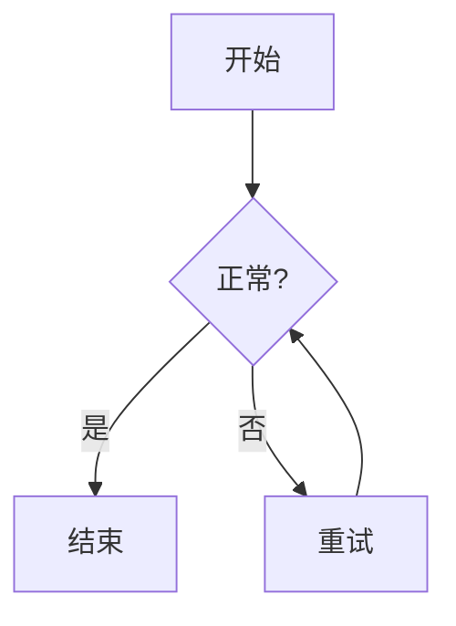
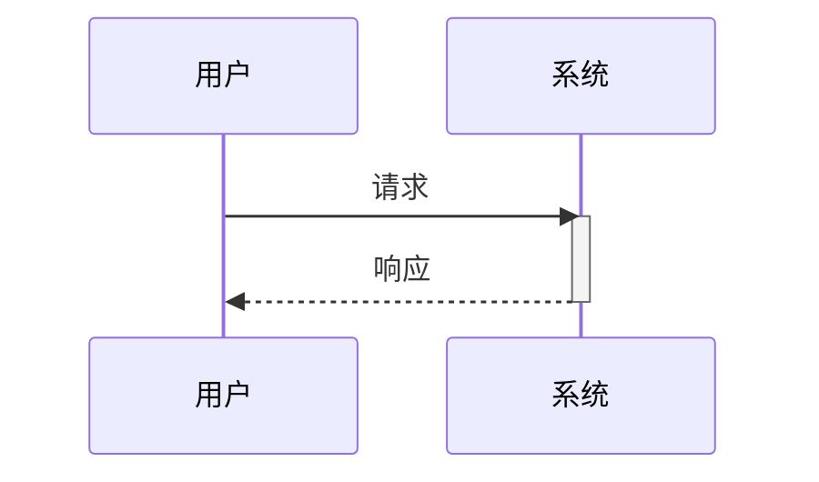
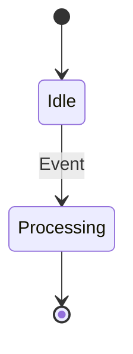
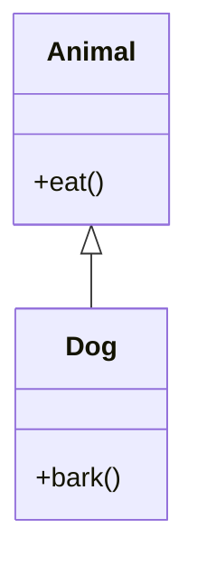
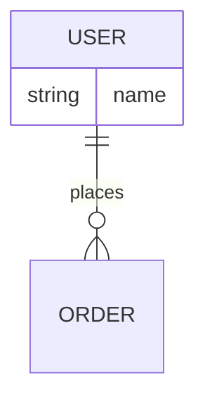

# Mermaid 图表技能 (Mermaid Diagram Skill)

此技能使 Claude Code 能够创建和编辑有效的 Mermaid 图表。

## 核心资源 (Core Resources)

详细的语法文档已保存至本地目录。**遇到不熟悉或复杂的图表类型时，请务必先读取相应的文档文件。**

| 图表类型 | 文档链接 | 关键词 |
| :--- | :--- | :--- |
| **流程图** | [flowchart.md](./docs/flowchart.md) | `graph` / `flowchart` |
| **时序图** | [sequenceDiagram.md](./docs/sequenceDiagram.md) | `sequenceDiagram` |
| **类图** | [classDiagram.md](./docs/classDiagram.md) | `classDiagram` |
| **状态图** | [stateDiagram.md](./docs/stateDiagram.md) | `stateDiagram-v2` |
| **实体关系图** | [entityRelationshipDiagram.md](./docs/entityRelationshipDiagram.md) | `erDiagram` |
| **甘特图** | [gantt.md](./docs/gantt.md) | `gantt` |
| **思维导图** | [mindmap.md](./docs/mindmap.md) | `mindmap` |
| **Git 分支图** | [gitgraph.md](./docs/gitgraph.md) | `gitGraph` |
| **C4 架构图** | [c4.md](./docs/c4.md) | `C4Context`, `C4Container`... |
| **象限图** | [quadrantChart.md](./docs/quadrantChart.md) | `quadrantChart` |
| **用户旅程图** | [userJourney.md](./docs/userJourney.md) | `journey` |
| **时间轴** | [timeline.md](./docs/timeline.md) | `timeline` |
| **饼图** | [pie.md](./docs/pie.md) | `pie` |
| **桑基图** | [sankey.md](./docs/sankey.md) | `sankey-beta` |
| **XY 图表** | [xyChart.md](./docs/xyChart.md) | `xychart-beta` |
| **雷达图** | [radar.md](./docs/radar.md) | `radar` |
| **块图** | [block.md](./docs/block.md) | `block` |
| **数据包图** | [packet.md](./docs/packet.md) | `packet` |
| **矩形树图** | [treemap.md](./docs/treemap.md) | `treemap` |
| **需求图** | [requirementDiagram.md](./docs/requirementDiagram.md) | `requirementDiagram` |
| **看板** | [kanban.md](./docs/kanban.md) | `kanban` |

## 最佳实践与常见陷阱 (Best Practices)

### 1. 特殊字符与引号 (关键)
当节点标签中包含特殊字符（冒号 `:`、中括号 `[]`、圆括号 `()`）时，**必须**使用双引号 `"` 包裹标签，并在内部字符串使用单引号 `'`。

**✅ 正确写法:** `A["User: 'I want red'"] --> B("Vector DB")`

### 2. 节点 ID 与 标签分离
推荐格式: `NodeID[显示文本]`。将 ID（变量名）与显示文本分开。

## 常见错误与修复 (Common Errors & Fixes)

| 错误现象 | 错误示例 (❌) | 修复方案 (✅) | 说明 |
| :--- | :--- | :--- | :--- |
| **保留字冲突** | `subgraph end` | `subgraph "end"` | `end` 是关键字，作为名称时必须加引号 |
| **流程图箭头错误** | `A -> B` | `A --> B` | 流程图标准连接线是 `-->` 或 `---` |
| **节点 ID 包含空格** | `My Node[Text]` | `MyNode[Text]` | ID 不允许空格，应使用驼峰或下划线 |
| **括号未转义** | `A[Text (with parens)]` | `A["Text (with parens)"]` | 文本包含 `()` `[]` `{}` 等符号时必须加双引号 |
| **子图未闭合** | `subgraph A ...` | `subgraph A ... end` | 每一个 `subgraph` 必须对应一个 `end` |
| **时序图箭头混淆** | `A --> B` | `A ->> B` | 时序图实线箭头通常使用 `->>` 或 `->` |
| **ID 以数字开头** | `1Node[Text]` | `Node1[Text]` | 建议 ID 以字母开头，避免解析引擎混淆 |

## 常用图表速查 (Quick Reference)

### 流程图 (Flowchart)

### 时序图 (Sequence Diagram)

### 状态图 (State Diagram)

### 类图 (Class Diagram)

### 实体关系图 (ER Diagram)

