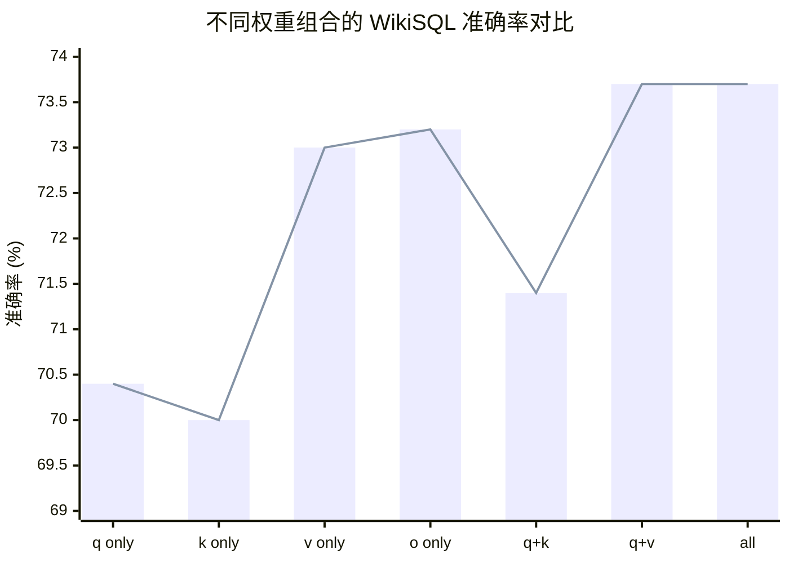

# 核心发现：应该微调哪些权重矩阵？

## 问题

在 Transformer 的自注意力模块中，有四个投影矩阵：
- `q_proj` / $W_q$ - 查询 (Query) 投影
- `k_proj` / $W_k$ - 键 (Key) 投影  
- `v_proj` / $W_v$ - 值 (Value) 投影
- `o_proj` / $W_o$ - 输出 (Output) 投影

**应该对哪些矩阵应用 LoRA？**

---

## 论文实验结论

根据论文 **Section 7.1** 的实验 (Table 5)，在 GPT-3 175B 上，相同参数预算 (18M) 下的对比：

| 权重组合 | WikiSQL 准确率 |
|---------|---------------|
| 只 $W_q$ (q_proj) | 70.4 |
| 只 $W_k$ (k_proj) | 70.0 |
| 只 $W_v$ (v_proj) | 73.0 |
| 只 $W_o$ (o_proj) | 73.2 |
| $W_q$ + $W_k$ | 71.4 |
| **$W_q$ + $W_v$** | **73.7** |
| 全部四个 | 73.7 |

### 可视化对比



**关键发现**：
- `q_proj + v_proj` （红色柱状）达到最高准确率 73.7%
- 与适配全部四个矩阵效果相同，但参数更少
- 单独 `v_proj` 表现也很好 (73.0%)

---

## 关键结论

### 1. 最佳组合：q_proj + v_proj

> "With r = 4 and **only the query and value projection matrices being adapted**, the checkpoint size is reduced by roughly 10,000×"

- **效果**: 与适配全部四个矩阵效果相同 (73.7)
- **效率**: 参数更少，更高效

### 2. 单独来看

- **v_proj 单独表现很好** (73.0) - 比 q_proj 单独 (70.4) 好很多
- **o_proj 单独也不错** (73.2)
- **k_proj 效果最差** (70.0)

### 3. 最差组合

- 只适配 q_proj + k_proj (71.4) 效果不佳

---

## 理论解释

论文 Section 7.2 和 Figure 3/4 的分析表明：

- $\Delta W_v$ (值矩阵的更新) 比 $\Delta W_q$ 具有更低的"内在秩"
- 这意味着 v_proj 的更新可以用更少的参数有效捕捉

---

## 实践建议

### 推荐配置

```python
from peft import LoraConfig

config = LoraConfig(
    r=4,                    # 秩
    lora_alpha=8,           # 缩放参数 (通常 2r)
    target_modules=[
        "q_proj",           # 查询投影（推荐）
        "v_proj",           # 值投影（推荐）
    ],
    lora_dropout=0.1,
    bias="none",
    task_type="CAUSAL_LM",
)
```

### 其他可选配置

| 场景 | target_modules | 说明 |
|------|---------------|------|
| 最小参数 | `["v_proj"]` | 如果只能选一个，选 v_proj |
| 更好效果 | `["q_proj", "v_proj", "o_proj"]` | 稍多参数，可能更好 |
| 全量 | `["q_proj", "k_proj", "v_proj", "o_proj"]` | 不推荐，参数效率低 |

---

## 参考

- 论文 Section 4.2: "we only apply LoRA to $W_q$ and $W_v$ in most experiments"
- 论文 Section 7.1: "Which weight matrices in Transformer should we apply LoRA to?"
- Table 5: Validation accuracy on WikiSQL and MultiNLI
