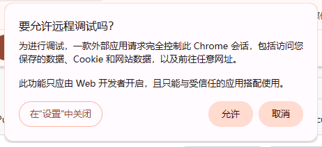

# Windows Notes

This document covers the practical details of using `browser-cli` with the current Chrome on Windows.

## Enable current-browser remote debugging

Open:

```text
chrome://inspect/#remote-debugging
```

Enable:

```text
Allow remote debugging for this browser instance
```

Chrome will show the local server address for that browser instance.


## What browser-cli reads

In current-browser mode, `browser-cli` prefers `DevToolsActivePort`.

On Windows, that file includes both:

- the port on the first line
- the browser WebSocket path on the second line

That second line matters:

```text
/devtools/browser/<uuid>
```

For current-browser attachment, this is more reliable than assuming an older fixed-port flow or relying on `/json/list`.

## Approval prompts and daemon reuse

Chrome may gate a fresh external controller behind an approval prompt.

That means two different workflows matter:

- the first successful attachment
- reusing an already approved daemon

If Chrome shows an approval dialog, allow access only for trusted local tools:



If a daemon is already healthy, prefer:

```cmd
bin\browser-cli.cmd status --port 54000
bin\browser-cli.cmd tab-open --port 54000 --url https://example.com --id example
bin\browser-cli.cmd snapshot --port 54000 --worker example
```

Reusing the same daemon avoids opening a second direct CDP attachment when Chrome is already attached to an approved controller.

## Troubleshooting

1. Check whether a daemon is already running.

```cmd
bin\browser-cli.cmd status --port 54000
```

2. If not, probe the current browser.

```cmd
bin\browser-cli.cmd doctor
```

3. If `doctor` reports a WebSocket timeout or a non-`101` response, check whether Chrome is waiting on an approval prompt.

4. If current-browser mode is enabled but direct probing is still noisy, prefer reusing the existing daemon instead of opening another direct controller.

5. If Chrome restarts and the old daemon becomes stale, stop it and start a new one.

```cmd
bin\daemon-stop.cmd 54000
bin\daemon-start.cmd 54000
```

## Why this mode is different

Current-browser remote debugging is not the same as launching a separate automation browser on a fixed CDP port.

`browser-cli` is built around that distinction:

- it reads `DevToolsActivePort`
- it tracks the browser WebSocket endpoint
- it keeps the session behind a reusable daemon
- it exposes the workflow through explicit CLI commands instead of hiding it behind a larger runtime
